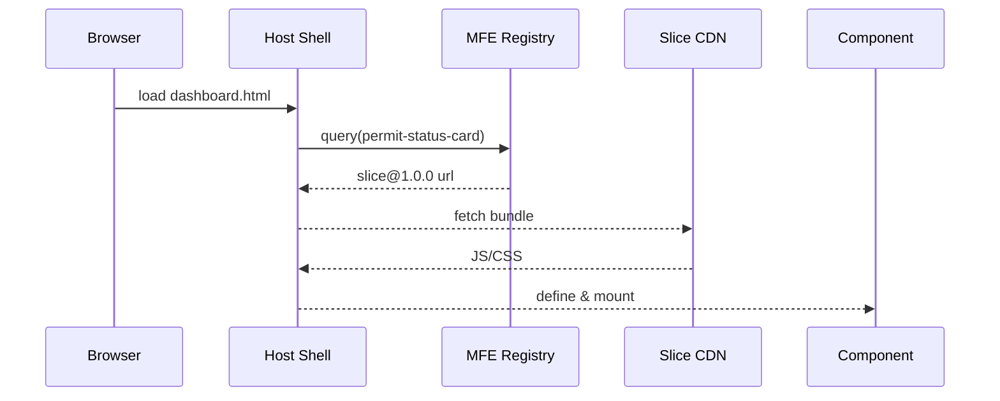

# Chapter 18: Micro-Frontend Interface Library (HMS-MFE)

*[Jump back to the previous chapter: Intent-Driven Navigation & AI-Guided Journeys](17_intent_driven_navigation___ai_guided_journeys_.md)*  

---

## 1. Why Another UI Framework?

Picture the **Department of Housing & Urban Development (HUD)**.  
Three different teams serve the same landlord:

| Team | Screen They Own | Pain Today |
|------|-----------------|------------|
| Rental-Assistance | “Apply for Voucher” wizard | Needs a new eligibility rule |
| Inspections | “Schedule Visit” calendar | Wants a drag-and-drop upgrade |
| Complaints | “File a Noise Complaint” form | Minor text fixes |

Re-deploying **the whole portal** every time one slice changes is like **closing an entire airport** just to repaint one gate.

**HMS-MFE** turns every screen into LEGO bricks (micro-frontends).  
Each team ships, tests, and rolls back **only its own brick**, while citizens enjoy one seamless site.

```
 Portal Shell  ─┬─ Voucher Wizard  (v2.3)
                ├─ Calendar Slice (v1.9)
                └─ Complaint Form (v3.0)
```

---

## 2. Key Concepts (One Bite Each)

| Term            | Everyday Analogy        | Why It Matters |
|-----------------|-------------------------|----------------|
| Micro-Frontend  | Single LEGO brick       | Small, independent UI piece |
| Web Component   | USB plug                | Works in any framework or plain HTML |
| Slice           | Serving tray of bricks  | Bundle of related components |
| Host Shell      | LEGO baseplate          | Loads & shows slices at runtime |
| Design Tokens   | Agency color palette    | Enforce one look across slices |
| Runtime Loader  | Toy box lid             | Fetches the right slice version on demand |

---

## 3. A 5-Minute Tour: Adding a “Permit Status Card”

Goal: The **City Permits** team wants to drop a new `<permit-status-card>` on the citizen dashboard **without** redeploying the whole portal.

### 3.1  Build & Publish the Component  (`permit_status_card.js`)

```javascript
// 1️⃣ Minimal Web Component (< 20 lines)
class PermitStatusCard extends HTMLElement {
  connectedCallback() {
    const id = this.getAttribute('permit-id')
    fetch(`/api/permits/${id}`)
      .then(r => r.json())
      .then(p => this.innerHTML =
        `<h3>${p.type}</h3>
         <p>Status: <b>${p.status}</b></p>`)
  }
}
customElements.define('permit-status-card', PermitStatusCard)

// 2️⃣  Expose as a slice (simplified)
export default { name: 'permit_status_slice', version: '1.0.0' }
```

**What just happened?**  
1. 15 lines create a **framework-agnostic** card.  
2. Default export lets HMS-MFE catalogue it.

### 3.2  Register the Slice

```bash
$ hms-mfe publish permit_status_slice@1.0.0 \
      --dist ./dist \
      --tags "permits,dashboard"
```

Output: `✅  Slice uploaded; available in 42s`

### 3.3  Drop It Into the Host Shell

```html
<!-- dashboard.html (already live) -->
<permit-status-card permit-id="CAFÉ-42"></permit-status-card>
<script src="https://mfe.cdn.gov/loader.js"></script>
```

The **loader** finds every unknown tag (`permit-status-card`), pulls the matching slice, and hydrates it—no full-site deploy, no code merge with other teams.

---

## 4. How Does This Magic Work?

1. **Citizen’s Browser** hits `dashboard.html`.  
2. **Host Shell** (`loader.js`) scans the DOM for unhydrated tags.  
3. For each tag it asks the **MFE Registry**:  
   “Which slice owns `permit-status-card` and what is the latest stable version?”  
4. **Slice Bundle** (JS/CSS) streams from the CDN.  
5. Component renders and calls APIs just like any other front-end.

### Sequence Diagram  (max 5 actors)



---

## 5. Peek Inside the Loader (Core 18 lines)

*File: `hms_mfe/loader.js`*

```javascript
(async function () {
  const tags = [...document.querySelectorAll('*')]
  for (const el of tags) {
    const tag = el.tagName.toLowerCase()
    if (customElements.get(tag)) continue   // already hydrated

    // 1. Ask registry for slice info
    const info = await fetch(`/mfe/registry/${tag}`).then(r => r.json())

    // 2. Dynamically import the slice bundle
    await import(info.url)                 // ES module magic

    // 3. Apply global design tokens once
    if (!window.__TOKENS) {
      const css = await fetch('/assets/design_tokens.css').then(r=>r.text())
      const style = Object.assign(document.createElement('style'),{textContent:css})
      document.head.appendChild(style)
      window.__TOKENS = true
    }
  }
})()
```

Beginners’ takeaways:  
* Detects tags → asks registry → `import()` → done.  
* One shared CSS file keeps fonts & colors consistent.

---

## 6. Where Does HMS-MFE Touch Other Layers?

| Layer | Interaction |
|-------|-------------|
| [HMS-SVC](10_core_backend_services__hms_svc__.md) | Components call REST/GraphQL endpoints. |
| [HMS-A2A Bus](08_inter_agency_communication_bus__hms_a2a__.md) | Slices can subscribe to live events (e.g., `permit.updated`). |
| [HMS-OPS](14_operations__monitoring___devops__hms_ops__.md) | Loader reports slice errors & load time metrics. |
| [Security Guardrails](15_security___privacy_guardrails__cross_cutting__.md) | Tokens injected by Host Shell; slices never store secrets. |
| [Marketplace (next chapter)](19_marketplace___discovery_hub__hms_mkt__.md) | Registry feeds the public Marketplace catalogue. |

---

## 7. Frequently Asked Questions

| Question | Quick Answer |
|----------|--------------|
| “Do slices have to use React, Vue, Svelte…?” | No—any code that ends in a **standard Web Component** works. |
| “Can two slices clash on CSS?” | Design tokens live in a shadow DOM scope; collisions are rare. |
| “How do I roll back a bad slice?” | `hms-mfe rollback permit_status_slice@0.9.2` – Host Shell auto-loads the prior version in ≤1 minute. |
| “What about accessibility?” | Registry runs WCAG checks; a failing slice cannot be published. |

---

## 8. Mini Exercise

1. Install the CLI: `npm i -g hms-mfe`.  
2. `hms-mfe init hello_banner` generates a starter slice.  
3. Edit `hello_banner.js` to display “Hello, DCAMA!”.  
4. `hms-mfe publish hello_banner@0.1.0`.  
5. Add `<hello-banner></hello-banner>` to any HTML page with `loader.js`.  
6. Refresh—your banner appears without touching other pages.

---

## 9. What You Learned

* HMS-MFE lets every team ship UI **like LEGO bricks**—isolated, versioned, and hot-swappable.  
* A 15-line Web Component + one CLI command is enough to reach production.  
* The Host Shell, Registry, and Design Tokens guarantee **one look & feel**, plus safe rollbacks.

Ready to **showcase, discover, and reuse** these slices across all agencies?  
Jump to the next chapter:  
[Marketplace & Discovery Hub (HMS-MKT)](19_marketplace___discovery_hub__hms_mkt__.md)

---


---

Generated by [AI Codebase Knowledge Builder](https://github.com/The-Pocket/Tutorial-Codebase-Knowledge)