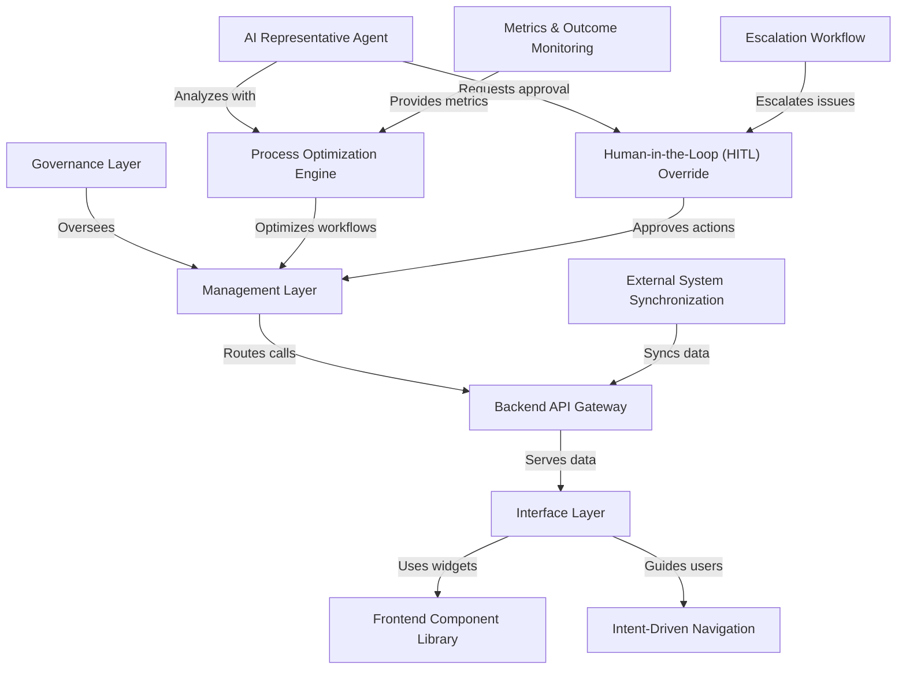

# Tutorial: HMS-ETL

The **HMS-ETL** platform is the *central data integration backbone* for the entire HMS ecosystem.  
It **extracts**, *transforms* and **loads** data from internal services and external sources, ensuring *consistent*, **high-quality** data flows.  
By powering the **API gateway**, **analytics engines**, and **UI layers**, HMS-ETL enables government use cases—from citizen service portals to policy management and agency operations—with *reliable*, *real-time* information.

**Source Repository:** [None](None)

## Chapters

1. [Governance Layer
](01_governance_layer_.md)
2. [Management Layer
](02_management_layer_.md)
3. [External System Synchronization
](03_external_system_synchronization_.md)
4. [Backend API Gateway
](04_backend_api_gateway_.md)
5. [Interface Layer
](05_interface_layer_.md)
6. [Frontend Component Library
](06_frontend_component_library_.md)
7. [Intent-Driven Navigation
](07_intent_driven_navigation_.md)
8. [Metrics & Outcome Monitoring
](08_metrics___outcome_monitoring_.md)
9. [Process Optimization Engine
](09_process_optimization_engine_.md)
10. [AI Representative Agent
](10_ai_representative_agent_.md)
11. [Human-in-the-Loop (HITL) Override
](11_human_in_the_loop__hitl__override_.md)
12. [Escalation Workflow
](12_escalation_workflow_.md)

---

Generated by [AI Codebase Knowledge Builder](https://github.com/The-Pocket/Tutorial-Codebase-Knowledge)