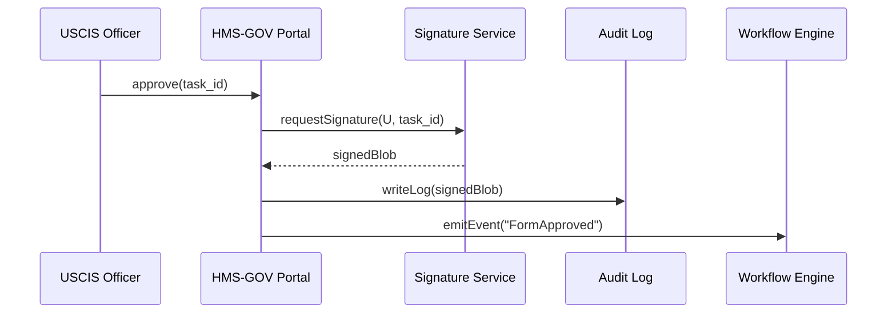

# Chapter 1: Governance Portal (HMS-GOV)

*“Okay, but where do the government people click?”*  
HMS-GOV is the answer.  
Think of it as the secure online **City Hall** for the whole HMS-NFO platform. It is the single place where elected officials, agency managers, auditors, and even outside inspectors sign-in to see what the system is doing and—when needed—tell it to stop, change course, or publish new policy.

---

## 1. Why Does HMS-GOV Exist?

Government software rarely fails for lack of algorithms; it fails when humans can’t see, trust, or correct what the algorithms are doing. HMS-GOV solves three recurring problems:

1. **Visibility** – Dashboards show live status of forms, workflows, and AI agents.  
2. **Control** – Human approvals or rejections are possible *before* an action goes live.  
3. **Accountability** – Every click is signed, timestamped, and stored for FedRAMP / FISMA audits.

---

## 2. A Day-in-the-Life Example

Imagine the **U.S. Citizenship and Immigration Services (USCIS)** wants to pilot a streamlined **“Startup Founder Visa”** form.

1. An AI agent inside [AI Agent Framework](06_ai_agent_framework__hms_agt___hms_agx__.md) drafts the new digital form.
2. Before the form appears to the public, the draft lands in HMS-GOV’s **Approval Queue**.
3. A USCIS policy officer logs in, reviews the proposal, asks legal to tweak a clause, and finally clicks **Approve**.
4. HMS-GOV signs the change, writes an immutable audit record, and notifies downstream services like [Micro-Frontend Interface Layer](04_micro_frontend_interface_layer__hms_mfe__.md) to publish the new form.

---

## 3. Key Concepts in Plain Words

| Concept | Beginner Analogy |
|---------|------------------|
| Dashboard | A traffic map that shows every road’s congestion in real-time. |
| Approval Queue | The inbox where new requests wait for a human “Yes / No”. |
| Policy Editor | A Word document with version-control and legal checks. |
| Digital Signature | A rubber stamp that proves *who* approved *what*, *when*. |
| Role-Based Access | Different door keys for mayor, clerk, and auditor. |

---

## 4. Quick-Start: Using HMS-GOV

### 4.1 Sign In & Fetch Your Tasks

```python
import hmsgov_sdk as gov

session = gov.login(username="jsanchez@uscis.gov", otp="123456")
tasks = session.tasks.list()

print(f"You have {len(tasks)} items waiting for review.")
```
The call `login` obtains a secure token (behind the scenes it enforces multi-factor auth). `tasks.list()` pulls only the items allowed by your role.

### 4.2 Approve the “Startup Founder Visa” Draft

```python
task = tasks.first()                 # choose top-most task
task.comment("Looks good, aligns w/ Sec.301(b).")
task.approve()                       # one-click approval
```
The `approve()` method automatically:

1. Records your decision.  
2. Applies a cryptographic signature.  
3. Triggers downstream publication flows.

### 4.3 What You Just Did (In Outputs)

• The form version changed from *draft* ➜ *approved-v1*.  
• An event `LicenseFormApproved` landed in [Activity & Workflow Orchestrator](08_activity___workflow_orchestrator__hms_act___hms_oms__.md).  
• An audit log entry became visible to inspectors within 2 s.

---

## 5. Under the Hood (Step-By-Step)


Only five moving parts ensure clarity. If the signature fails, the workflow halts and nothing publishes.

---

## 6. Peek Inside the Code

### 6.1 Minimal API Endpoint (Flask-style)

```python
# hms_gov/routes.py
@router.post("/tasks/<id>/approve")
@requires_role("policy_officer")
def approve_task(id: str, body: CommentBody, user: User):
    task = Task.get(id)
    task.add_comment(user, body.text)
    signed = signature_service.sign(user, task)
    audit.log("APPROVE", user, task.id, signed.hash)
    orchestrator.emit("FormApproved", task.to_event())
    return {"status": "approved", "signature": signed.hash}
```
Notice:  
• Fewer than 15 lines.  
• Separation of duties—only `policy_officer` can hit this endpoint.  
• The `audit.log` call writes to an append-only store inside [Central Data Repository](19_central_data_repository__hms_dta__.md).

### 6.2 Capturing the Audit Entry

```python
# hms_gov/audit.py
def log(action, user, ref_id, sig):
    record = {
        "ts": utc_now(),
        "actor": user.id,
        "action": action,
        "ref": ref_id,
        "signature": sig
    }
    db.insert("audit_trail", record)
```
A single insert ensures traceability. Nothing fancy, just disciplined logging.

---

## 7. What About Security Standards?

HMS-GOV is designed to meet:

• **FedRAMP Moderate** controls (encryption at rest & in transit).  
• **FISMA** reporting—every change yields a machine-readable log.  
• **Separation of Duties**—no single role can both propose *and* approve.

For stricter needs, plug in an external Hardware Security Module (HSM); HMS-GOV already supports PKCS#11 drivers.

---

## 8. Summary & What’s Next

You learned:

1. The purpose of HMS-GOV—visibility, control, accountability.  
2. How an officer approves a new policy draft in 3 lines of code.  
3. The simple moving parts behind the scenes (signature, audit, workflow).

In the next chapter we’ll dive into the constitutional heart of the platform—how democratic rules are codified so that AI agents and humans follow the same playbook. Ready? Hop over to [Codified Democracy Foundation Engine (HMS-CDF)](02_codified_democracy_foundation_engine__hms_cdf__.md).

---

Generated by [AI Codebase Knowledge Builder](https://github.com/The-Pocket/Tutorial-Codebase-Knowledge)