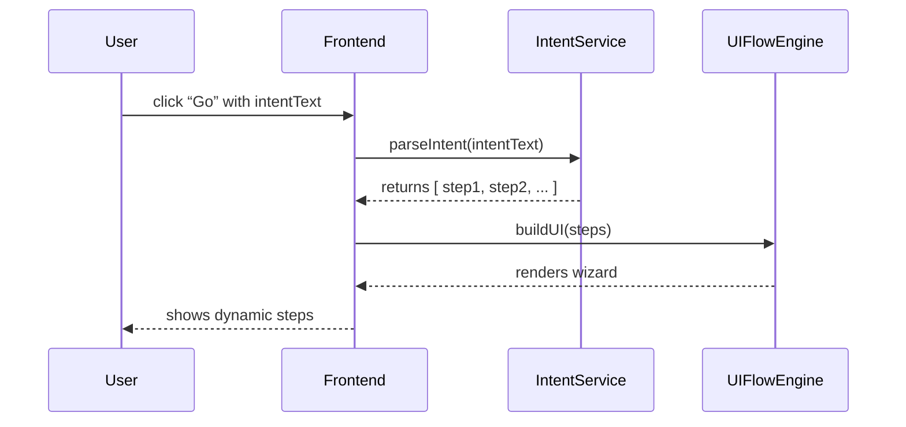

# Chapter 1: Intent-Driven Navigation

Welcome to HMS-GOV! In this first chapter, we’ll learn how Intent-Driven Navigation helps users express their goals (for example, “I want to expedite permit approvals”) and then guides them through tailored steps. This friendly, wizard-style pattern is like an online benefits portal asking “What service do you need?” and narrowing your options.

---

## 1. Why Intent-Driven Navigation?

Imagine a public works officer at the U.S. Coast Guard who needs to speed up harbor permit approvals. Instead of hunting through menus, she types or selects “expedite permit approvals.” The system then shows only the steps, forms, and hints she needs—no more clicking around.

Goals of this pattern:
- Speak in user goals, not menu names.
- Dynamically build forms or wizards based on that goal.
- Offer AI hints (e.g., “You might need form CG-4256 next”).

---

## 2. Key Concepts

We break Intent-Driven Navigation into four simple pieces:

1. **Intent**  
   A short description of what a user wants (e.g., `"expedite permit approvals"`).

2. **Intent Parser**  
   A service that reads the intent and returns a “flow definition”: a list of steps, forms, or menu options.

3. **UI Flow Engine**  
   Takes the flow definition and renders a wizard or dynamic menus.

4. **AI Hints**  
   Optional extra tips or autofill suggestions based on context (agency rules, past data).

---

## 3. Using Intent-Driven Navigation

Let’s walk through a minimal example in a Vue component.

```html
<!-- File: src/components/IntentNavigator.vue -->
<template>
  <div>
    <!-- 1. User enters an intent -->
    <input v-model="intentText" placeholder="What do you need?" />
    <button @click="startFlow">Go</button>

    <!-- 2. Render steps dynamically -->
    <div v-for="step in steps" :key="step.id">
      <h3>{{ step.title }}</h3>
      <!-- simplified: each step shows a form field -->
      <input :placeholder="step.placeholder" />
    </div>
  </div>
</template>

<script>
import IntentService from '../services/IntentService'

export default {
  data() {
    return { intentText: '', steps: [] }
  },
  methods: {
    async startFlow() {
      // Ask IntentService for the flow definition
      this.steps = await IntentService.parseIntent(this.intentText)
    }
  }
}
</script>
```

Explanation:
- The user types a goal.
- We call `IntentService.parseIntent(...)`.
- We render each returned “step” as a simple input form.

---

## 4. What Happens Under the Hood?

Before looking at code, here’s a high-level sequence when the user clicks **Go**:



1. **Frontend** calls **IntentService**  
2. **IntentService** looks up rules or AI model, returns a step list  
3. **UIFlowEngine** builds the wizard UI  
4. **Frontend** displays the steps to the user  

---

## 5. Inside IntentService

Here’s a simplified `IntentService`:

```js
// File: src/services/IntentService.js
export default {
  async parseIntent(intentText) {
    // 1. Very basic keyword map
    const map = {
      'expedite permit approvals': [
        { id: 1, title: 'Select Permit Type', placeholder: 'e.g. Harbor Permit' },
        { id: 2, title: 'Upload Supporting Docs', placeholder: 'Choose file' }
      ]
      // add more intent → flow mappings here
    }
    // 2. Fallback if not found
    return map[intentText.toLowerCase()] || [
      { id: 0, title: 'General Inquiry', placeholder: 'Describe your need' }
    ]
  }
}
```

Explanation:
- We keep a simple map from intent text to an array of steps.
- Each step has an `id`, `title`, and `placeholder`.
- If the intent is unknown, we show a general inquiry step.

---

## 6. Adding AI Hints

You can easily extend each step with a `hint` property:

```js
// In parseIntent(), extend the flow items:
{ id: 2, 
  title: 'Upload Supporting Docs', 
  placeholder: 'Choose file',
  hint: 'Use PDF format for faster processing.'
}
```

Then in your Vue template show `step.hint` under the input.

---

## 7. Real-World Analogy

Think of a DMV kiosk: it first asks “What service?” then shows only the relevant screens for license renewals, address changes, or duplicate IDs. Intent-Driven Navigation brings that kiosk style into your admin frontend.

---

## 8. Summary and Next Steps

You’ve learned:
- How users express intents
- How we parse an intent into a sequence of steps
- How the UIFlowEngine renders a dynamic wizard
- Where to add AI hints

In the next chapter we’ll dive into the [Interface Layer](02_interface_layer_.md), building reusable UI components that power these dynamic flows.

---

Generated by [AI Codebase Knowledge Builder](https://github.com/The-Pocket/Tutorial-Codebase-Knowledge)