# Chapter 1: Policy Management Dashboard 📊

Welcome to HMS-GOV!  
In this opening chapter we meet the “mission-control screen” used by program managers, clerks, and analysts across government: **the Policy Management Dashboard**. Think of it as the radar tower at an airport—everyone can see where rules are flying, which are delayed, and which need manual clearance before landing.

---

## 1. Why Do We Need a Dashboard?

Imagine you are a benefits officer at the **Office of Child Support Services (OCSS)**.  
Every day dozens of regulations govern how payments are calculated, when notices are sent, and what medical coverage is enforced.  

Without a single view you would:

* search in email threads for the latest rule text,  
* wonder if yesterday’s auto-update actually deployed,  
* and hope no policy silently failed overnight.

The Policy Management Dashboard solves this by giving you one colorful panel that answers:

* Is the **“Medical Support Adjustment”** rule healthy?  
* Did the AI draft a change that needs my approval?  
* Which policies haven’t been reviewed in 12 months?

---

## 2. Key Concepts (Plain English)

| Concept | What it means (beginner version) |
|---------|----------------------------------|
| Policy Card | A tile that represents one regulation, e.g., “Title IV-D Payment Schedule”. |
| Health Light | Green = working, Yellow = needs review soon, Red = error or expired. |
| AI Proposal Badge | A blue dot that says “✍️ AI drafted edits – please inspect”. |
| Filter Bar | Quick search by agency, tag, or status. |
| Action Drawer | Where you click → “Open in Editor”, “Rollback”, or “Request Legal Review”. |

---

## 3. First Look at the Code

Below is the **tiny Vue component** that powers the page header. We will extend it later.

```vue
<!-- File: components/PolicyDashboard.vue -->
<template>
  <div class="policy-dashboard">
    <h1>Policy Management Dashboard</h1>
  </div>
</template>

<script>
export default { name: 'PolicyDashboard' }
</script>
```

Explanation (1-minute):

1. `<template>` is the HTML-like part.  
2. A root `<div>` wraps all dashboard content (currently just a heading).  
3. The `<script>` exports a basic Vue component so it can be reused inside the HMS-GOV front-end.

Even if you’ve never touched Vue, you can read this as: “Render a box that says **Policy Management Dashboard**”.

---

## 4. Using the Dashboard – A Mini Walk-through

### 4.1 Starting the Dev Server

Assuming you have the repository cloned:

```bash
npm install      # install dependencies
npm run dev      # start local server at http://localhost:5173
```

Open the browser. You should see the big heading. We’ll now add a *mock* policy list.

### 4.2 Rendering Three Sample Policies

```vue
<!-- components/PolicyDashboard.vue (add below the <h1>) -->
<ul>
  <li><span class="green">●</span> Medical Support Adjustment</li>
  <li><span class="yellow">●</span> Parenting-Time Notice – *AI draft pending*</li>
  <li><span class="red">●</span> Data Retention Schedule</li>
</ul>
```

What happens?

* A green, yellow, and red dot visually convey health.  
* The second item hints that the AI subsystem (covered in [AI Representative Agent](04_ai_representative_agent__hms_agt___hms_agx__.md)) produced a draft.  
* Users can click a row (later) to open the **Policy Editor** (see [Policy Editor Interface](03_policy_editor_interface_.md)).

---

## 5. Behind the Scenes – How Does Data Flow?

High-level story:

1. Dashboard mounts.  
2. It fetches `/api/policies` from the [Backend Policy API](08_backend_policy_api__hms_svc___hms_api__.md).  
3. The API returns JSON with status, last-run metrics, and AI proposal flags.  
4. Vue renders colored indicators.  
5. Clicking a policy routes to the editor micro-frontend.

### 5.1 Sequence Diagram (simplified)

```mermaid
sequenceDiagram
    participant UI as Policy Dashboard
    participant API as Backend Policy API
    participant HITL as Human-In-The-Loop
    UI->>API: GET /policies
    API-->>UI: 200 + JSON list
    UI->>HITL: Show “AI draft pending” badge
    HITL-->>UI: Manager clicks “Approve”
    UI->>API: POST /policies/{id}/approve
```



---

## 6. Peeking Into the Fetch Logic

```js
// File: composables/usePolicies.js
import { ref, onMounted } from 'vue'
export function usePolicies() {
  const policies = ref([])
  onMounted(async () => {
    const res = await fetch('/api/policies')
    policies.value = await res.json()
  })
  return { policies }
}
```

Explanation:

* `onMounted` runs once the component is visible.  
* `fetch('/api/policies')` calls the server.  
* The returned JSON fills `policies`, which the template loops over.

### Template Snippet (using the hook)

```vue
<script setup>
import { usePolicies } from '../composables/usePolicies'
const { policies } = usePolicies()
</script>

<template>
  <ul>
    <li v-for="p in policies" :key="p.id">
      <span :class="p.status">{{ indicator(p.status) }}</span>
      {{ p.name }} <em v-if="p.aiDraft">– AI draft pending</em>
    </li>
  </ul>
</template>
```

`indicator()` is a tiny helper that returns ● in the right color—implementation left for later.

---

## 7. Extending the Dashboard with Micro-Frontends

Today we edited a **single** Vue component. In production, each large agency (Nuclear Regulatory Commission, Mediation and Conciliation Service, etc.) plugs its own widget into the page without stepping on someone else’s code.  

That plug-in approach is called a **micro-frontend**, the topic of the next chapter: [Micro-Frontend Architecture (HMS-MFE)](02_micro_frontend_architecture__hms_mfe__.md).

---

## 8. Summary

In this chapter you:

1. Learned why a unified Policy Dashboard matters in government operations.  
2. Rendered a simple Vue component and three status lights.  
3. Saw how the front-end talks to the backend and Human-In-The-Loop reviewers.  
4. Got a teaser of AI proposal badges and micro-frontend plug-ins.

Ready to see how multiple independent teams can extend this interface without collisions? Continue to [Micro-Frontend Architecture (HMS-MFE)](02_micro_frontend_architecture__hms_mfe__.md).

---

Generated by [AI Codebase Knowledge Builder](https://github.com/The-Pocket/Tutorial-Codebase-Knowledge)