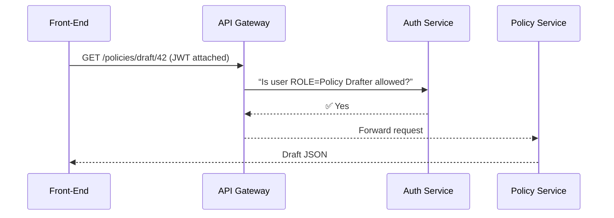

# Chapter 1: Role-Based Access & Authorization Model


---

## 1 . Why do we need roles at all?

Imagine Maria, a Policy Drafter at the **Bureau of Land Management (BLM)**, logs into HMS-GOV to update grazing-permit language.  
At the same moment, Lee, an **External Auditor**, is reviewing last year’s mineral-royalty report, while an **AI Agent** is summarizing public comments for an **Agency Admin**.

Everyone is in the *same* application, looking at *different* data, and allowed to press *different* buttons.  
Without strong role checks:

* Sensitive citizen PII could leak to outsiders.  
* Draft legislation might be edited by unauthorized users.  
* Audit trails become unreliable.

Hence: **Role-Based Access Control (RBAC)** – think of it as a digital version of a military clearance badge.

---

## 2 . Key concepts (in plain English)

| Idea | “Plain-language” Analogy |
|------|--------------------------|
| **Role** | Your job badge (e.g., “Agency Admin”) |
| **Permission** | The colored stickers on that badge (e.g., “Can Approve Policy”) |
| **Resource** | The room you want to enter (screen, button, or API route) |
| **Guard** | The security officer who checks your badge |
| **Policy** | The rulebook the guard follows |

---

## 3 . Core HMS-GOV roles

| Role | Typical Actions |
|------|-----------------|
| Agency Admin | Approve, publish, delete policies |
| Policy Drafter | Create & edit drafts |
| AI Agent | Generate summaries, suggest edits |
| External Auditor | Read-only access to finalized policies |
| Citizen | Submit feedback; never sees internal drafts |

*(You can add or remove roles later, but start simple.)*

---

## 4 . A 60-second tour: how a role check works



1. The JWT token says the user is a *Policy Drafter*.  
2. Auth Service compares role vs. required permission (“READ_DRAFT”).  
3. On success, the request proceeds; otherwise the API returns **403 Forbidden**.

---

## 5 . Trying it out on the front-end

Below is a *very* trimmed‐down Vue navigation guard.  
(Real production code lives elsewhere, but this is enough to see the idea.)

```js
// src/router/authGuard.js
export function authGuard(to, from, next) {
  const user = JSON.parse(localStorage.getItem('hmsUser'))
  const allowed = to.meta?.roles?.includes(user.role)
  allowed ? next() : next('/unauthorized')
}
```

Explanation (line-by-line):

1. Pull the logged-in user from `localStorage` (pretend a JWT was stored).  
2. Each route declares which roles may enter (`to.meta.roles`).  
3. If the user’s role appears in that list → `next()`; otherwise redirect.

Add the guard to a route:

```js
{
  path: '/policy-editor',
  component: () => import('@/pages/PolicyEditor.vue'),
  meta: { roles: ['Agency Admin', 'Policy Drafter'] },
  beforeEnter: authGuard
}
```

Now only admins and drafters can open the editor screen.

---

## 6 . Server-side guard (Node/Express example)

Front-end checks are **not** enough; never trust browsers.  
A 12-line Express middleware keeps the API safe:

```js
// api/middleware/requireRole.js
module.exports = requiredRole => (req, res, next) => {
  const { role } = req.user       // ← decoded from JWT
  if (role === requiredRole) return next()
  return res.status(403).json({ error: 'Forbidden' })
}
```

Apply it to a route:

```js
const requireRole = require('./middleware/requireRole')

app.post('/api/policies/:id/publish',
         requireRole('Agency Admin'),
         publishController)
```

Result: only Agency Admins can publish policies.

---

## 7 . What’s happening under the hood?

1. **Login** – User authenticates; HMS-GOV issues a JWT containing their role.  
2. **Request** – Every HTTP call carries that JWT in the `Authorization` header.  
3. **API Gateway** – Quickly rejects invalid or expired tokens.  
4. **Auth Service** – Maps role → permissions; answers “yes/no”.  
5. **Service Layer** – Executes business logic only after approval.

Behind the scenes the mapping might live in a simple JSON file at first:

```json
{
  "Agency Admin":   ["READ_DRAFT", "PUBLISH_POLICY", "DELETE_POLICY"],
  "Policy Drafter": ["READ_DRAFT", "EDIT_DRAFT"],
  "External Auditor": ["READ_FINAL"]
}
```

Later chapters will show how this ties into the [Backend API Gateway (HMS-API / HMS-MKT)](09_backend_api_gateway__hms_api___hms_mkt__.md) and the [Governance Layer (Ethics, Transparency, Safety)](08_governance_layer__ethics__transparency__safety__.md).

---

## 8 . Common questions

**Q: Can one user have multiple roles?**  
A: Yes. Store `roles: ['Policy Drafter', 'Citizen']` in the JWT and adjust the checks (`some()` vs. `includes()`).

**Q: Where are roles managed?**  
A: In the upcoming [Policy Dashboard (Admin HQ)](02_policy_dashboard__admin_hq__.md) admins can assign roles with a click.

**Q: Do I need OAuth, SAML, etc.?**  
A: Start with simple JWTs for prototypes; swap in enterprise SSO later without changing route guards.

---

## 9 . Mini exercise

1. Add a new role called **“Court Clerk”** who can only *read* finalized policies from the **Court of International Trade**.  
2. Update both the front-end route meta and the backend permission JSON.  
3. Try accessing `/policy-editor` while logged in as Court Clerk – you should be blocked.

*(Answers in the repo’s `exercises/01` folder.)*

---

## 10 . Conclusion & what’s next

You now know how HMS-GOV:

* Tags every user with a *role*,
* Checks that role on every screen and API call, and
* Keeps citizen data and legislative drafts safe.

In the next chapter we’ll walk through the control center where these roles are assigned and where agency staff monitor their policies:  
[Policy Dashboard (Admin HQ)](02_policy_dashboard__admin_hq__.md)

---

Generated by [AI Codebase Knowledge Builder](https://github.com/The-Pocket/Tutorial-Codebase-Knowledge)