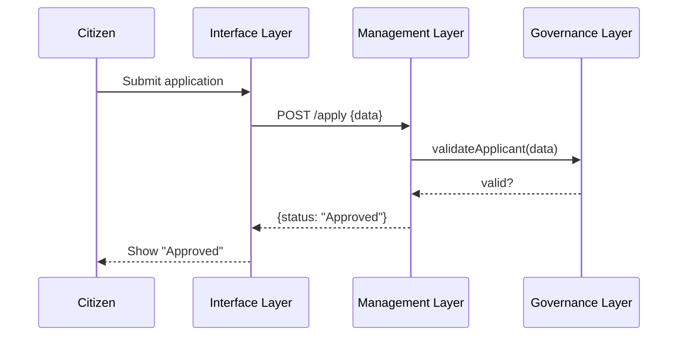

# Chapter 1: Three-Layer Architecture

Welcome to HMS-GOV! In this chapter, we’ll learn how we split our system into three clear layers—Governance, Management, and Interface—so it feels just like how government branches work: lawmakers, enforcers, and communicators.

---

## 1. Why Three Layers?  
Imagine a citizen applying online for a fishing license:

1. **What laws apply?**  
   – Age limit, residency, fees (legislative).  
2. **Who checks and processes the request?**  
   – A service verifies documents, takes payments (executive).  
3. **How does the citizen see progress?**  
   – A website shows status and messages (communications).

By separating these concerns, each layer can grow independently, stay organized, and make maintenance easier.

---

## 2. Key Concepts

### 2.1 Governance Layer  
- Think of this as the “legislative branch.”  
- Holds **policy rules** and **validation logic**.  
- Example: “Applicant must be ≥18 years old” or “Fee = $20.”

### 2.2 Management Layer  
- Acts like the “executive branch.”  
- Consists of **microservices** and **APIs** that apply rules, coordinate workflows, and store data.  
- Example: `ApplicationService` that calls the policy engine, processes payments, and writes to the database.

### 2.3 Interface Layer  
- The “communications branch.”  
- Front-end UIs (web portals, dashboards) where users interact.  
- Example: React form that collects applicant info and shows approval status.

---

## 3. Real-World Use Case Walkthrough

**Scenario:** A New York resident applies for a boating permit.  
1. User fills out an online form (Interface).  
2. The portal calls our API (Management).  
3. The API asks the policy engine if the applicant meets state rules (Governance).  
4. Decision returns “Approved,” fee is charged, and status updates on the site.

---

## 4. Sequence Diagram



---

## 5. Inside Each Layer

### 5.1 Governance Layer: Policy Engine  
- File: `governance/policy_engine.py`

```python
class PolicyEngine:
    def __init__(self, rules):  
        self.rules = rules  # e.g., {"min_age":18, "residency":"NY"}
    def validate(self, applicant):
        if applicant.age < self.rules["min_age"]:
            return False, "Must be at least 18"
        if applicant.state != self.rules["residency"]:
            return False, "Must reside in NY"
        return True, "OK"
```
*Here, we check age and residency. You could add more rules (fees, documents).*

### 5.2 Management Layer: Application Service  
- File: `management/services/application_service.py`

```python
from governance.policy_engine import PolicyEngine

class ApplicationService:
    def __init__(self):
        self.policy = PolicyEngine({"min_age":18, "residency":"NY"})
    def apply(self, data):
        valid, message = self.policy.validate(data)
        if not valid:
            return {"status":"Denied", "reason": message}
        # ... charge fee, save to DB (omitted) ...
        return {"status":"Approved"}
```
*We ask the PolicyEngine first, then handle payment and storage.*

### 5.3 Interface Layer: Simple Frontend Call  
- File: `interface/src/apply.js`

```javascript
async function submitApplication(formData) {
  const resp = await fetch("/api/apply", {
    method: "POST",
    body: JSON.stringify(formData)
  });
  const result = await resp.json();
  alert("Status: " + result.status);
}
```
*This small JavaScript fetches the API and shows a popup with the result.*

---

## 6. How It All Fits Together

1. **Frontend** posts data ➔  
2. **API** calls the **Service** ➔  
3. **Service** queries the **Policy Engine** ➔  
4. **Policy Engine** returns approval or denial ➔  
5. **Service** finishes processing and replies to UI.

By keeping each layer focused, it’s easy to update policy rules without touching your frontend, or swap out the UI without rewriting business logic.

---

## Conclusion  

You’ve learned how HMS-GOV mirrors a government:  
- **Governance Layer** writes and enforces rules.  
- **Management Layer** executes processes and workflows.  
- **Interface Layer** communicates with users.  

Next up, we’ll dive into how our microservices talk to each other and scale.  
[Microservices Infrastructure](02_microservices_infrastructure_.md)

---

Generated by [AI Codebase Knowledge Builder](https://github.com/The-Pocket/Tutorial-Codebase-Knowledge)