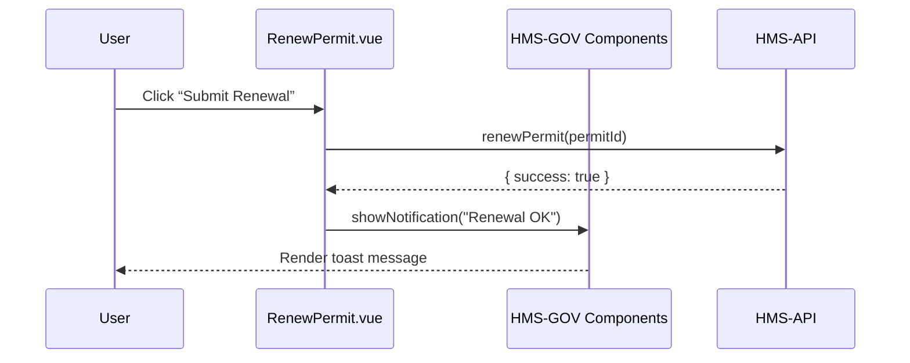

# Chapter 2: Interface Layer

Welcome back! In [Chapter 1: Intent-Driven Navigation](01_intent_driven_navigation_.md) we saw how users express their goals and how the system turns them into dynamic flows. Now we’ll build the actual screens—the **Interface Layer**—that people interact with.

---

## 2.1 Why the Interface Layer?

Imagine a citizen at a DMV kiosk renewing a driver’s license, or a policy analyst at the Susquehanna River Basin Commission logging into a secure portal. They need:

- A consistent look and feel across all forms  
- Clear, big buttons and inputs that work with keyboards and screen readers  
- The same color palette, typography, and branding no matter which agency screen they visit  

The **Interface Layer** is a collection of frontend modules and shared component libraries (like `HMS-MFE` and `HMS-GOV`) that deliver these user-facing screens. It ensures:

- **Usability**: Intuitive components (buttons, forms, menus) that guide users  
- **Accessibility**: WCAG-compliant markup and ARIA roles  
- **Styling Consistency**: One theme, one CSS framework across all portals  

---

## 2.2 Key Concepts

1. **Micro-Frontend Modules (HMS-MFE)**  
   Independent chunks of UI (e.g., a Policy Dashboard app) that ship their own routes and data fetching.

2. **Shared Component Library (HMS-GOV)**  
   A central package of reusable Vue components (`<GovButton>`, `<GovInput>`, etc.) and global styles.

3. **Usability & Accessibility**  
   Each component comes with keyboard navigation, focus states, and proper ARIA attributes.

4. **Theming & Branding**  
   A single SCSS theme file defines colors, fonts, and spacing so every micro-frontend “looks” the same.

---

## 2.3 Building a Use Case: “Renew a Permit”

Let’s walk through a minimal example: a small “Renew Permit” form for a fictional Office of Cuba Broadcasting kiosk.

### 2.3.1 Using HMS-GOV Components

In your Vue page:

```vue
<!-- File: src/pages/RenewPermit.vue -->
<template>
  <div class="renew-permit">
    <h1>Renew Your Permit</h1>
    <GovInput
      v-model="permitId"
      label="Permit ID"
      placeholder="e.g. BCB-2023-001"
    />
    <GovButton @click="submitRenewal">Submit Renewal</GovButton>
  </div>
</template>

<script>
import { GovInput, GovButton } from 'hms-gov'

export default {
  components: { GovInput, GovButton },
  data() { return { permitId: '' } },
  methods: {
    submitRenewal() {
      // call your API to renew the permit
      this.$api.renewPermit(this.permitId)
    }
  }
}
</script>
```

Explanation:
- We import `GovInput` and `GovButton` from the shared library.
- The `<GovInput>` component includes a label and ties into WCAG-friendly markup.
- The `<GovButton>` includes hover and focus styles for accessibility.

### 2.3.2 What Happens Under the Hood



1. **User** clicks the button.  
2. **Frontend page** calls the backend via `$api`.  
3. Response returns, then the page uses an HMS-GOV component (e.g., `<GovToast>`) to show feedback.

---

## 2.4 Inside the HMS-GOV Library

Let’s peek at how a basic button is implemented.

### File: lib/hms-gov/components/GovButton.vue

```vue
<template>
  <button class="gov-btn" @click="$emit('click')">
    <slot />
  </button>
</template>

<script>
export default {
  name: 'GovButton'
}
</script>

<style lang="scss">
.gov-btn {
  background: $gov-primary-color;
  color: white;
  padding: 0.75rem 1.5rem;
  border: none;
  border-radius: 4px;
  &:focus { outline: 2px dashed $gov-focus-color; }
}
</style>
```

Explanation:
- A simple `<button>` with our theme color variables.
- A focus outline for keyboard users to see which element is active.

### File: lib/hms-gov/index.js

```js
import GovButton from './components/GovButton.vue'
import GovInput from './components/GovInput.vue'
// ...import more components

export default {
  install(app) {
    app.component('GovButton', GovButton)
    app.component('GovInput', GovInput)
    // register others globally
  }
}
```

Explanation:
- We bundle all components into a single plugin.
- In your main.js you do:  
  `import HMSGov from 'hms-gov'; app.use(HMSGov)`

---

## 2.5 Ensuring Accessibility

Every component in HMS-GOV is built with:

- Proper `<label for="">` tags  
- ARIA roles (e.g., `role="alert"` on toasts)  
- Keyboard-only navigation checks  

This way, whether it’s a public portal for the U.S. Senate or a kiosk at the DMV, everyone can use it.

---

## 2.6 Wrapping Up

You’ve learned:

- The **role** of the Interface Layer in HMS-GOV  
- How to **consume** shared components (`GovButton`, `GovInput`)  
- A peek **under the hood** at how these components are built and registered  
- The importance of **accessibility** and **styling consistency**

Next up, we’ll explore how to build a full **Policy Dashboard** using these components in [Chapter 3: Policy Dashboard](03_policy_dashboard_.md).

---

Generated by [AI Codebase Knowledge Builder](https://github.com/The-Pocket/Tutorial-Codebase-Knowledge)