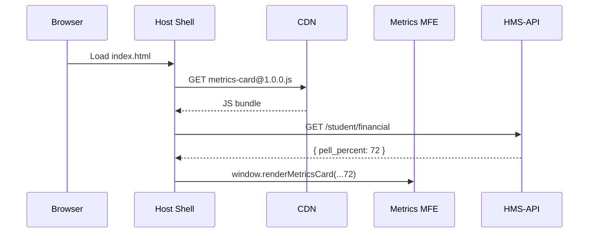

# Chapter 3: Front-end Micro-Frontend Framework (HMS-MFE)

*(follow-up to [Chapter 2: Backend API Gateway (HMS-SVC / HMS-API)](02_backend_api_gateway__hms_svc___hms_api__.md))*  

---

## 1. Why Do We Need Yet *Another* Front-end Framework?

### A Citizen Story — “Fix My FAFSA”

1. Emma logs into the Department of Education’s **Student-Aid Portal** to correct her FAFSA.  
2. The portal shows a **date picker** for the school year, a **metrics card** about her Pell-Grant usage, and a **policy diff viewer** explaining rule changes.  
3. Those three widgets were written by **three different agencies** and deployed yesterday, last month, and six months ago—yet they work together seamlessly.

How?  
Because each widget is a micro-frontend—*a Lego brick for UIs*—mounted by **HMS-MFE**.  
The Education team ships new bricks without waiting for the Department of Justice or the Nuclear Regulatory Commission to re-test their sites.

---

## 2. What *Is* HMS-MFE?

Think of a federal courthouse:

| Courthouse Analogy             | HMS-MFE Equivalent                         |
|--------------------------------|-------------------------------------------|
| Courtroom A, B, C              | Independent micro-frontends               |
| Shared security checkpoint     | Global auth from [HMS-API Gateway](02_backend_api_gateway__hms_svc___hms_api__.md) |
| Same architectural style       | One design system & CSS tokens            |
| Renovate one room at a time    | Ship a new widget without redeploying all |

HMS-MFE glues these rooms together:

```
Host Shell  (HTML)
 ├─ <mfe-date-picker>           <-- DOJ team
 ├─ <mfe-metrics-card>          <-- Edu team
 └─ <mfe-policy-diff-viewer>    <-- NRC team
```

Each tag is:

* self-contained (code, CSS, translations)  
* loaded on-demand  
* versioned & deployed from its own pipeline  

---

## 3. Key Concepts (Plain English)

| Term                     | Beginner-friendly meaning                                |
|--------------------------|----------------------------------------------------------|
| Host Shell               | The “main page” that decides **where** bricks plug in.  |
| Micro-Frontend (MFE)     | One Lego brick: a mini-web-app that renders a feature.  |
| Shared Design System     | Color & font tokens so all bricks look federal-friendly.|
| Runtime Bridge           | Tiny JS library that loads bricks and shares data.      |
| Independent Deployment   | Push version 2 of *one* brick without touching others.  |

---

## 4. Your First Brick in 18 Lines

We will create a *Metrics Card* brick with React. (Vue, Svelte, plain JS all work; pick your flavor later.)

```javascript
// metrics-card/src/index.jsx
import React from "react";
import ReactDOM from "react-dom";

// 1. main component
function MetricsCard({ data }) {
  return (
    <div className="mfe-card">
      <h3>Pell Grant Used</h3>
      <p>{data.percent}% of lifetime max</p>
    </div>
  );
}

// 2. expose to host
window.renderMetricsCard = (el, props) =>
  ReactDOM.render(<MetricsCard {...props} />, el);
```

Explanation  
1. `MetricsCard` renders one card.  
2. We attach `window.renderMetricsCard` so the host can call it, passing the DOM element plus props (e.g., `{ percent: 72 }`).

---

### 4.1 Building & Publishing (CLI Glimpse)

```bash
npm run build            # bundles to ./dist/metrics-card.js
aws s3 cp dist/... s3://cdn.hms.gov/mfe/metrics-card@1.0.0.js
```

The file now lives on a CDN, versioned by **@1.0.0**.

---

## 5. Mounting Bricks in the Host Shell

```html
<!-- host/index.html (snippet) -->
<div id="slot-student-metrics"></div>

<script src="https://cdn.hms.gov/mfe/metrics-card@1.0.0.js"></script>
<script>
  fetch("/api/student/financial")
    .then(r => r.json())
    .then(data => {
      // load brick into the slot
      window.renderMetricsCard(
        document.getElementById("slot-student-metrics"),
        { percent: data.pell_percent }
      );
    });
</script>
```

What happens?  
1. The host downloads the brick’s JS bundle.  
2. Fetches data through [HMS-API](02_backend_api_gateway__hms_svc___hms_api__.md).  
3. Calls the exposed `renderMetricsCard` to paint the UI.

---

## 6. How the Magic Works (5-Step Walkthrough)



No other bricks are touched. If tomorrow we release `metrics-card@1.1.0`, only the `<script>` URL changes.

---

## 7. Styling Without Collisions

All bricks import the **HMS Design Tokens** package:

```css
/* metrics-card/src/card.css */
.mfe-card {
  background: var(--hms-surface);
  color: var(--hms-on-surface);
  border-radius: 4px;
}
```

Tokens (`--hms-surface`, `--hms-on-surface`) ensure every agency’s brick follows the same federal palette, even if they use different frameworks.

---

## 8. Talking Between Bricks (Event Bus Lite)

Need the date picker to refresh the metrics card? Use the global bus:

```javascript
// in date-picker brick
window.dispatchEvent(new CustomEvent("yearChanged", { detail: 2024 }));
```

```javascript
// in metrics-card brick
window.addEventListener("yearChanged", e => reloadData(e.detail));
```

Small, framework-agnostic, and zero extra libraries.

---

## 9. Under the Hood — Runtime Bridge

Inside the **Host Shell** lives a 2 KB script:

```javascript
// host/runtime-bridge.js (simplified)
export function loadBrick(url) {
  return new Promise(res => {
    const s = document.createElement("script");
    s.src = url;
    s.onload = res;
    document.head.appendChild(s);
  });
}
```

Every brick is just another `loadBrick()` call—no iframes, no webpack configs to align.

---

## 10. Deploying a Brick (CI Pipeline Sketch)

1. Push to `main` branch of `metrics-card` repo.  
2. GitHub Action runs `npm test && npm run build`.  
3. Uploads bundle to `cdn.hms.gov/mfe/metrics-card@<sha>.js`.  
4. Creates a *release manifest*:

```json
{
  "name": "metrics-card",
  "version": "1.2.3",
  "url": "https://cdn.hms.gov/mfe/metrics-card@1.2.3.js"
}
```

5. Host Shell watches manifests and hot-swaps versions at midnight (configurable per agency).

Each team owns its pipeline. Global outages vanish because *only* the faulty brick rolls back.

---

## 11. Frequently Asked (Beginner) Questions

**Q: Does every brick download React again?**  
A: No. React (or Vue, etc.) lives in the Host Shell as an external. Bricks refer to `window.React`, cutting duplicate bytes.

**Q: Can bricks be written in different frameworks?**  
A: Yes—just expose a `render*` function. One page can mix React, Svelte, and plain JS bricks.

**Q: How do we keep accessibility standards?**  
A: The design system ships ARIA-compliant base components. CI checks bricks with `axe-core` before publishing.

**Q: What about older browsers in rural areas?**  
A: Bundles are transpiled to ES2017, and Host Shell loads a polyfill only if `window.Promise` is missing.

---

## 12. What You Learned

• HMS-MFE lets agencies ship UI “Lego bricks” that plug into any portal.  
• Bricks load independently, share a design system, and call back-ends through [HMS-API Gateway](02_backend_api_gateway__hms_svc___hms_api__.md).  
• Deployment is per-brick—one team’s update never blocks another.  
• A tiny runtime bridge wires everything together with minimal code.

Next we’ll build a full page *using* these bricks: the [Policy Management Dashboard](04_policy_management_dashboard_.md).

---

Generated by [AI Codebase Knowledge Builder](https://github.com/The-Pocket/Tutorial-Codebase-Knowledge)