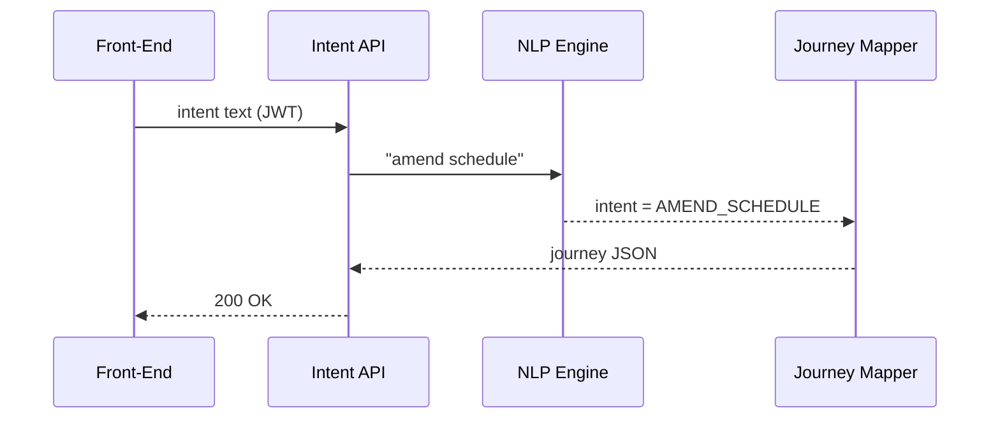

# Chapter 3: Intent-Driven Navigation & Guided Journeys
*(a.k.a. “GPS for Government Workflows”)*

> If you missed the control-center UI we built, jump back to  
> [Policy Dashboard (Admin HQ)](02_policy_dashboard__admin_hq__.md).

---

## 1 Why bother?  
Meet **Sarah**, Schedule Officer at the **Department of Agriculture**.  
At 4 p.m. a union rep asks her to **“amend the 2024 telework schedule policy.”**

Traditional UI:  
1. Click *Policies* → *HR* → *Telework* → *2024*.  
2. Hunt for *Edit* button.  
3. Pray she remembers every compliance doc to attach.

Intent-Driven UI:  
1. Sarah types **“amend 2024 telework schedule.”**  
2. HMS-GOV replies: “I’ll guide you—6 steps, ~5 min.”  
3. Each screen auto-opens; AI nudges “Upload OPM Form 71” before she can miss it.

Result: zero guesswork, no forgotten attachments, happier auditors.

---

## 2 Key ideas in plain English

| Term | Think of… |
|------|-----------|
| **Intent** | What Sarah *wants* (“amend schedule”). |
| **Journey** | The turn-by-turn plan (6 steps). |
| **Step** | One screen or form (“Edit policy header”). |
| **AI Hint** | A roadside sign: “Speed limit 55” → “Attach Form 71”. |
| **Compliance Gate** | A toll booth that checks you paid (all docs present) before the next step. |

---

## 3 A 30-second look at the UI

```text
╔════════  What would you like to do?  ════════╗
║ ✎ amend 2024 telework schedule policy       ║ <- user types intent
╚═════════════════════════════════════════════╝

┌──── Guided Journey ────┐
│ Step 1/6  Edit Header  │ ✓ Saved
│ Step 2/6  Update Dates │ ● Current
│ Step 3/6  Attach Docs  │ ☐
│ …                      │
└────────────────────────┘
```

A progress bar shows exactly where Sarah is—no mystery clicks.

---

## 4 Hands-on: capturing an intent (front-end)

```vue
<!-- src/components/IntentBox.vue -->
<template>
  <input v-model="q" @keyup.enter="start" placeholder="What would you like to do?"/>
</template>

<script setup>
import { ref } from 'vue'
const q = ref('')

async function start(){
  const r = await fetch('/api/intent', {
    method:'POST',
    headers:{'Content-Type':'application/json'},
    body: JSON.stringify({ text:q.value })
  })
  const journey = await r.json()
  // emit event so parent can render the journey UI
}
</script>
```

Explanation:  
1. User presses Enter.  
2. We POST `{ text:"amend 2024 telework ..." }` to `/api/intent`.  
3. Server returns a *journey* definition (next section).  

---

## 5 What comes back? Sample journey JSON

```json
{
  "title": "Amend 2024 Telework Schedule",
  "steps": [
    { "id": "edit_header", "label": "Edit Header" },
    { "id": "update_dates", "label": "Update Dates" },
    { "id": "attach_docs",
      "label": "Attach Documents",
      "required": ["OPM_Form_71.pdf"] },
    { "id": "run_checks", "label": "Compliance Check" },
    { "id": "summary", "label": "Review & Submit" }
  ]
}
```

Think of it as a mini GPS route encoded in JSON.

---

## 6 Driving the route (router guard)

```js
// src/router/journeyGuard.js
export const journeyGuard = (to, from, next) => {
  const journey = JSON.parse(sessionStorage.getItem('journey'))
  const allowed = journey?.steps.find(s => s.id === to.name)
  allowed ? next() : next('/journey-not-found')
}
```

Each route (step page) is allowed *only* if it appears in the current journey—otherwise users can’t skip ahead.

---

## 7 Under the hood: Intent Service flow



1. **NLP Engine** labels the intent (AMEND_SCHEDULE).  
2. **Journey Mapper** picks a stored template, tweaks it for user’s agency.  
3. Response is cached in **sessionStorage** for guard checks.

---

## 8 Peeking inside the server (14 lines!)

```js
// api/intent.js
router.post('/intent', async (req, res)=>{
  const { text } = req.body
  const intent = classify(text)            // e.g. "AMEND_SCHEDULE"
  const journey = templates[intent]        // load JSON template
  journey.steps = filterByRole(journey.steps, req.user.role) // RBAC!
  res.json(journey)
})
```

Line-by-line:  
• `classify` is a tiny OpenAI call or regex list.  
• `templates` are plain JSON files under `journeys/`.  
• We remove steps the user’s role can’t perform (ties back to [Role-Based Access](01_role_based_access___authorization_model_.md)).  

---

## 9 AI Hints & compliance gates

```js
// services/hints.js
export function getHints(stepId){
  return {
    attach_docs : ["Remember OPM Form 71", "Max file size 10 MB"]
  }[stepId] || []
}
```

Front-end shows these hints inline.  
A **Compliance Gate** is just a quick API call before allowing *Next*:

```js
// POST /gate/attach_docs
if (!docs.includes('OPM_Form_71.pdf'))
  return res.status(400).json({error:'Missing Form 71'})
```

Miss a document? The UI won’t let you proceed—no more angry auditors.

---

## 10 Try it yourself 🏋️

1. Create a new intent: **“terminate outdated grazing permit.”**  
2. Copy `AMEND_SCHEDULE.json` to `TERMINATE_PERMIT.json`.  
3. Ensure RBAC removes the *“Financial Review”* step for *Policy Drafter*.  
4. Type the sentence in the Intent Box—watch the journey appear.

*(Solutions live in `exercises/03`.)*

---

## 11 Common questions

**Q: What if NLP mis-classifies?**  
A: User can pick from a fallback list of top-3 intents before the journey starts.

**Q: Can I bookmark Step 3 URL?**  
A: Yes, but the `journeyGuard` will redirect you to Step 1 unless Steps 1-2 are already completed.

**Q: Does this replace the normal menu?**  
A: No. Menu stays; intent box is a shortcut for power users.

---

## 12 Summary & next stop

You learned how HMS-GOV turns plain English (“amend policy”) into a safe, guided, turn-by-turn workflow—complete with AI hints and compliance toll booths.

Next we’ll dive into the screen where those policy changes actually happen:  
[Policy Editor (Rule Authoring Studio)](04_policy_editor__rule_authoring_studio__.md)

---

Generated by [AI Codebase Knowledge Builder](https://github.com/The-Pocket/Tutorial-Codebase-Knowledge)