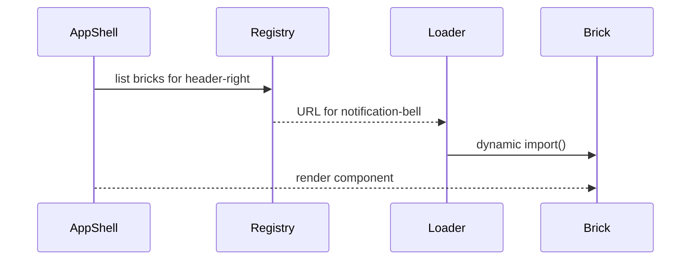

# Chapter 3: Micro-Frontend Framework (HMS-MFE)

*(Jumping in from the previous chapter? Catch up here → [Intent-Driven Navigation](02_intent_driven_navigation_.md))*  

---

> “Instead of refitting one giant cruise ship, we dock tiny ferries side-by-side.”  
> Each ferry (micro-app) sails on its own schedule but still shares the same harbor.

---

## 1. Why break the UI into LEGO bricks?

Imagine three federal agencies using HMS-GOV:

1. **Access Board** wants a high-contrast theme to meet strict accessibility rules.  
2. **Agricultural Marketing Service** needs a live **“Commodity Prices”** chart on its dashboard.  
3. **Fossil Energy** simply hides the chart—oil prices are a political minefield today.

If HMS-GOV were one huge monolith, every tiny change would require:

* A full re-build  
* Cross-agency coordination  
* Night-time deployments  

With **HMS-MFE** each widget—the chart, the notification bell, even `PolicyEditor.vue`—is its own **micro-frontend (“brick”)**. Agencies can:

* Drop a brick in (or yank it out) at run-time.  
* Skin it with CSS variables.  
* Swap it for a custom version **without touching other code**.  

---

## 2. Key Concepts (in plain English)

| Term | Analogy |
|------|---------|
| Brick (Micro-App) | A single LEGO piece—e.g. `NotificationBell.vue`. |
| Shell | The empty LEGO baseplate where pieces snap on. |
| Registry | The parts catalog: which bricks exist and where to fetch them. |
| Contract | The two knobs that let bricks snap together: **props in**, **events out**. |
| Sandbox | A glass box around each brick so it can’t knock over its neighbors. |

---

## 3. Your first brick: `NotificationBell`

Let’s add a tiny bell to the dashboard in **five minutes**.

### 3.1 Create the brick

```vue
<!-- bricks/NotificationBell.vue -->
<template>
  <button @click="ding()">🔔 {{ count }}</button>
</template>

<script setup>
import { ref } from 'vue'
const count = ref(0)
function ding () { count.value++ }
</script>
```

Explanation  
• A button shows a bell and a counter.  
• `ding()` bumps the counter—perfect “hello world” for HMS-MFE.

### 3.2 Describe the brick (manifest)

```js
// bricks/notificationBell.mfe.js
import Bell from './NotificationBell.vue'

export default {
  name: 'notification-bell',   // id in the registry
  component: Bell,             // what to render
  slots: ['header-right']      // where it can appear in the shell
}
```

Explanation  
A brick is just a **manifest object** exporting:

* `name` – unique id  
* `component` – the Vue file  
* `slots` – allowed docking points (think *port numbers* on the harbor).

### 3.3 Register it with the shell

```js
// shell/mfeRegistry.js
export const registry = {
  'notification-bell': () => import('../bricks/notificationBell.mfe.js'),
  'policy-editor'    : () => import('../pages/PolicyEditor.vue'),
  'policy-dashboard' : () => import('../components/PolicyDashboard.vue')
}
```

Explanation  
The value is a **dynamic import** so the code is only downloaded when needed.

### 3.4 Mount everything

```vue
<!-- shell/AppShell.vue -->
<template>
  <header>
    <slot name="header-right"></slot>     <!-- ← bell docks here -->
  </header>
  <router-view />                         <!-- other pages -->
</template>
```

```js
// shell/boot.js
import { createApp, h } from 'vue'
import AppShell from './AppShell.vue'
import { registry } from './mfeRegistry.js'

const app = createApp(AppShell)

// auto-mount every brick assigned to "header-right"
Object.values(registry).forEach(async load => {
  const { default: brick } = await load()
  if (brick.slots.includes('header-right'))
    app.component(brick.name, brick.component) // register globally
})

app.mount('#app')
```

What happens:  
1. `boot.js` loads each manifest **on the fly**.  
2. If a brick fits the `header-right` slot, it is globally registered.  
3. `<slot name="header-right">` in `AppShell` now renders the bell.

Result: refresh the browser → a working bell appears next to the title. 🚀

---

## 4. Swapping or Skinning a Brick

### 4.1 Override without redeploy

```js
// agency-Overrides.js  (loaded BEFORE the default registry)
import FancyBell from 'https://agency.gov/assets/FancyBell.mfe.js'

export const overrides = {
  'notification-bell': FancyBell    // replace stock bell
}
```

The shell merges `overrides` **at runtime**, so Access Board sees a high-contrast bell while Fossil Energy can disable it by setting the value to `null`.

### 4.2 Apply a theme

```css
/* agency-theme.css */
:root {
  --bell-color: #FFD700;  /* gold */
}

button {
  color: var(--bell-color);
}
```

Because each brick uses CSS variables, an agency can theme all bricks with one stylesheet—no code changes.

---

## 5. A Peek Under the Hood



Four simple actors—easy to reason about and test.

---

## 6. How Do Bricks Talk to Each Other?

All communication flows through **simple events** so bricks stay decoupled.

```js
// inside NotificationBell.vue
emit('intent', { type: 'open-inbox' })
```

The shell listens and delegates to the resolver you met in  
[Intent-Driven Navigation](02_intent_driven_navigation_.md).  
No brick ever calls another brick directly.

---

## 7. FAQ (For Busy Civil Servants)

1. **Q:** Does every brick need its own Git repo?  
   **A:** No. Early projects can keep multiple bricks in one monorepo; split later if needed.

2. **Q:** Do bricks share global state?  
   **A:** Only via explicit props/events or the central store defined in [Governance API Layer](04_governance_api_layer__hms_svc___hms_api__.md).

3. **Q:** Is sandboxing (iframes) required?  
   **A:** Optional. For high-security contexts (e.g., tax data) wrap the brick in an iframe; HMS-MFE supplies a helper.

---

## 8. Recap

You now know:

✓ Why micro-frontends let agencies mix-and-match UI pieces.  
✓ The five core concepts: Brick, Shell, Registry, Contract, Sandbox.  
✓ How to create, register, and override a brick in <20 lines each.  
✓ How HMS-MFE loads bricks on demand and keeps them isolated.

Next we’ll leave the browser and dive into the servers that feed these bricks:  
[Governance API Layer (HMS-SVC / HMS-API)](04_governance_api_layer__hms_svc___hms_api__.md)

---

Generated by [AI Codebase Knowledge Builder](https://github.com/The-Pocket/Tutorial-Codebase-Knowledge)