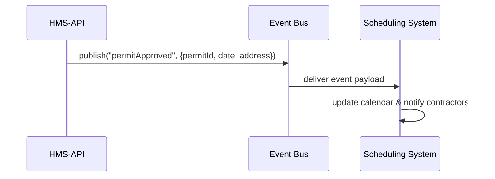

# Chapter 4: External System Sync

Welcome back! In [Chapter 3: Backend API (HMS-API)](03_backend_api__hms_api__.md), we saw how HMS-API routes requests to our core services. Now let’s learn how HMS-GOV keeps external systems—like scheduling tools or data-management platforms—in sync in **real time**.

---

## 4.1 Why External System Sync?

Imagine the city’s contractor scheduling system needs to know **immediately** when a building permit is approved. If we waited minutes or hours, crews might show up before they’re allowed on site. To avoid that, HMS-GOV uses a “live news feed” style update:

- HMS-GOV publishes an **event** the moment something important changes.
- External systems **subscribe** and get that update instantly.
- They react—update calendars, run reports—without manual polling.

This keeps everyone up-to-date like reading breaking news online.

---

## 4.2 Central Use Case: Permit Approval

1. A clerk approves a building permit via HMS-GOV’s Admin Portal.  
2. HMS-API processes the approval and **publishes** a `permitApproved` event.  
3. The City Scheduling System (an external service) **receives** that event and adds a job to its calendar.  
4. Contractors see their updated schedules in real time.

---

## 4.3 Key Concepts

1. **Event Publisher**  
   A component in HMS-API that sends messages when something changes.

2. **Event Bus**  
   A message broker (like RabbitMQ or Kafka) that routes events to subscribers—think of it as the city’s public announcement system.

3. **Subscriber**  
   External systems register interest in certain events (topics) and get notified instantly.

4. **Topics**  
   Named channels (e.g., `permitApproved`) that group related events.

---

## 4.4 How It Works End-to-End



1. HMS-API calls the **publisher**.  
2. The **Event Bus** delivers the message.  
3. Subscriber (City) acts on it immediately.

---

## 4.5 Publishing an Event

In HMS-API, when a permit is approved, we call our publisher:

File: `hms-api/events/publisher.js`
```javascript
import EventBus from './event-bus-client.js'

export function publishPermitApproved(data) {
  // topic name + JSON payload
  EventBus.publish('permitApproved', JSON.stringify(data))
}
```
*This function wraps the Event Bus client to send our event.*

Now in your approval route:

File: `hms-api/routes/permits.js`
```javascript
import express from 'express'
import { publishPermitApproved } from '../events/publisher.js'
const router = express.Router()

router.post('/:id/approve', async (req, res) => {
  // ... code to mark permit approved in DB ...
  const eventData = { permitId: req.params.id, date: new Date() }
  publishPermitApproved(eventData)
  res.json({ status: 'Approved', ...eventData })
})

export default router
```
*After updating the database, we fire off our event so subscribers get it right away.*

---

## 4.6 Subscribing to Events

An external system (e.g., City Scheduling) listens for `permitApproved`:

File: `scheduling-service/subscriber.js`
```javascript
import EventBus from './event-bus-client.js'

EventBus.subscribe('permitApproved', async (msg) => {
  const data = JSON.parse(msg)
  // Call internal function to update calendar
  await addJobToCalendar(data.permitId, data.date)
})
```
*Whenever our bus delivers a `permitApproved` event, the callback runs and updates the schedule.*

---

## 4.7 Under the Hood

1. **Publish**  
   - HMS-API serializes the event and calls `EventBus.publish(topic, message)`.  
   - The Event Bus stores or immediately forwards the message.

2. **Delivery**  
   - Subscribed clients have open connections or pull messages.  
   - The bus pushes events to each subscriber matching the topic.

3. **Processing**  
   - Subscribers parse the payload and run their own business logic (e.g., update calendar, send email).

This decouples HMS-GOV from any one external system—you just add more subscribers for other needs (reporting, analytics, SMS alerts).

---

## 4.8 Configuration & Setup

- Ensure everyone agrees on **topic names** (e.g., `permitApproved`).  
- Configure your broker URL in `event-bus-client.js`.  
- Give each service credentials so only authorized systems can publish or subscribe.

Example client initialization:
```javascript
// event-bus-client.js
import { connect } from 'amqplib'        // or your broker SDK
const url = process.env.EVENT_BUS_URL

export default {
  async publish(topic, message) {
    const conn = await connect(url)
    const ch = await conn.createChannel()
    await ch.assertExchange(topic, 'fanout')
    ch.publish(topic, '', Buffer.from(message))
    await ch.close()
    await conn.close()
  },

  async subscribe(topic, handler) {
    const conn = await connect(url)
    const ch = await conn.createChannel()
    await ch.assertExchange(topic, 'fanout')
    const q = await ch.assertQueue('', { exclusive:true })
    await ch.bindQueue(q.queue, topic, '')
    ch.consume(q.queue, msg => handler(msg.content.toString()), { noAck:true })
  }
}
```
*This client wraps a RabbitMQ fanout exchange—any subscriber gets every message.*

---

## Conclusion

You’ve learned how HMS-GOV pushes real-time updates to outside systems using an event-driven, publish-subscribe model—like a city’s live news wire for permit approvals. With this pattern, any external tool (scheduling, analytics, notifications) can stay in sync instantly.

Next up, let’s explore how we track and visualize system health in [Chapter 5: Real-Time Metrics Monitoring](05_real_time_metrics_monitoring_.md).

---

Generated by [AI Codebase Knowledge Builder](https://github.com/The-Pocket/Tutorial-Codebase-Knowledge)