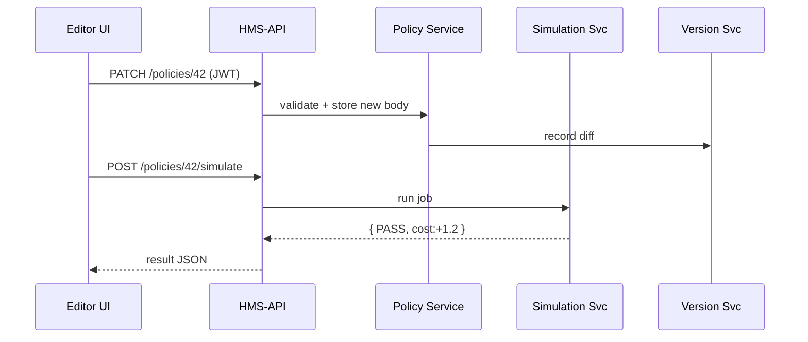

# Chapter 4: Policy Editor (Rule Authoring Studio)

*(jumped here straight from the GPS-like workflow in  
[Intent-Driven Navigation & Guided Journeys](03_intent_driven_navigation___guided_journeys_.md))*  

---

## 1 Why do we need a “Rule Authoring Studio”?

Picture **Layla**, Policy Drafter at the **Employment and Training Administration (ETA)**.  
Congress just raised the maximum weekly unemployment benefit from **\$550 → \$600**.  
Layla must:

1. Change § 320.12(b) of the regulation.  
2. Attach the new Public Law citation.  
3. Verify the change will not crash downstream **payments** and **schedule** microservices.  
4. Send it for approval—all before tomorrow’s press release.

She opens **Policy Editor**—a single screen that feels like **Google Docs + Visio + GitHub + “Play” button”**, purpose-built for government rules.

---

## 2 Key Concepts (plain English)

| Concept | Beginner Analogy |
|---------|------------------|
| **Document Pane** | Word processor where you type the legal text. |
| **Flow Pane** | Lego-like blocks showing how the rule branches (“if wage > \$600 then …”). |
| **Citation Sidebar** | Sticky notes listing every law or court case you must reference. |
| **Simulation Engine** | A sandbox that runs the rule on fake data—like “preview print” but for code and money. |
| **Version Timeline** | Time-machine slider to compare edits, just like “track changes.” |
| **Publish Button** | The red phone that sends the final rule through [HMS-API](09_backend_api_gateway__hms_api___hms_mkt__.md) to every microservice. |

*(Role checks from [Role-Based Access](01_role_based_access___authorization_model_.md) decide who can see each button.)*

---

## 3 30-Second Walk-Through

```text
┌──────────────────── Policy Editor ────────────────────┐
│ Document Pane        │  Flow Pane      │ Simulation   │
│ 1. Increase max …    │ [Start]─┬──>Yes │ PASS ✔️       │
│                      │        └──>No  │ Cost: +1.2%   │
├────────────────────────────────────────────────────────┤
│ Citations:  Pub. L. 118-04,  29 USC §330             │
│ Version:  draft v2   (compare with v1)                │
│                           [Simulate]  [Publish]       │
└────────────────────────────────────────────────────────┘
```

Layla edits text, drags a branch to the *Flow Pane*, hits **Simulate**, sees the cost impact, then **Publish**.

---

## 4 Hands-On: Basic Draft Update

Below is the tiniest possible front-end call to load a draft and save an edit.

```js
// src/pages/PolicyEditor.vue (excerpt)
async function loadDraft(id){
  const res = await fetch(`/api/policies/${id}?view=draft`)
  draft.value = await res.json()
}

async function save(){
  await fetch(`/api/policies/${draft.value.id}`, {
    method:'PATCH',
    headers:{'Content-Type':'application/json'},
    body: JSON.stringify({ body: draft.value.body })
  })
}
```

Explanation (4 lines each):

1. `loadDraft` fetches the current draft JSON.  
2. `save` sends a `PATCH` with the new text.  
3. Both routes are protected by the *Policy Drafter* role guard we built in Chapter 1.  
4. No rocket science—just REST and JSON.

---

## 5 Attaching a Legal Citation

```js
// addPubLaw.js
async function addCitation(plNumber){
  await fetch(`/api/policies/${draft.value.id}/citations`, {
    method:'POST',
    headers:{'Content-Type':'application/json'},
    body: JSON.stringify({ type:'PublicLaw', value: plNumber })
  })
}
```

Call `addCitation("118-04")`.  
The back-end stores it in the `citations` array; the sidebar re-renders automatically.

---

## 6 Running a Simulation (Preview Impact)

```js
// simulate.js
async function runSimulation(){
  const res = await fetch(`/api/policies/${draft.value.id}/simulate`)
  simulation.value = await res.json()      // {result:"PASS", cost:+1.2}
}
```

The UI paints the result: green if **PASS**, red if **FAIL**, and shows cost delta.

---

## 7 Publishing the Rule

```js
// publish.js  (only admins can call!)
async function publish(){
  await fetch(`/api/policies/${draft.value.id}/publish`, { method:'POST' })
  alert('✅ Regulation sent to HMS-API!')
}
```

After success, downstream services (payments, schedules, records) receive the update automatically through the mesh you will explore in Chapter 10.

---

## 8 What Happens Under the Hood?



1. **Store Edit** – Policy Service saves text and asks Version Service to keep a diff.  
2. **Simulate** – Simulation Service replays 500 test cases.  
3. **Publish** – (not shown) Policy Service sends the frozen text to HMS-API Gateway, which broadcasts to microservices.

All under 300 ms on a laptop dev stack.

---

## 9 A Peek into Back-End Code

`services/policy/updateBody.js` (11 lines):

```js
module.exports = async ({ id, body, user }) => {
  // 1. RBAC double-check
  if (user.role !== 'Policy Drafter' && user.role !== 'Agency Admin')
    throw new Error('Forbidden')

  // 2. Save
  await db('policies').where({ id }).update({ body })

  // 3. Record version
  await versionSvc.record(id, user.id, body)   // async fire-and-forget
}
```

`services/policy/publish.js` (13 lines):

```js
module.exports = async ({ id, user }) => {
  if (user.role !== 'Agency Admin') throw new Error('Forbidden')

  const policy = await db('policies').where({ id }).first()
  await gateway.pushToMesh(policy)   // heads to HMS-SYS, HMS-ACH, …

  await db('policies').where({ id }).update({ status:'PUBLISHED' })
}
```

Both snippets reuse:

* RBAC guard from [Role-Based Access](01_role_based_access___authorization_model_.md).  
* `gateway.pushToMesh` which we’ll dissect in [Backend API Gateway](09_backend_api_gateway__hms_api___hms_mkt__.md).

---

## 10 Try It Yourself 🏋️‍♀️

1. Clone the repo and run `npm run dev`.  
2. Log in as **Policy Drafter** (`demo/draft`).  
3. Open **Policy Editor**, change “\$550” → “\$600”.  
4. Click **Simulate**—make sure the result is *PASS*.  
5. Switch user to **Agency Admin** (`demo/admin`) and press **Publish**.  
6. Check the **Dashboard**: status should change from *Draft* → *Published*.

*(If simulation fails, the UI blocks the Publish button—no accidental law breakage!)*

---

## 11 Common Questions

**Q: What file types can I attach?**  
A: PDF, DOCX, and public web links. Virus scanning occurs automatically in the upload route.

**Q: Can I revert to an earlier version?**  
A: Yes, click the Timeline slider, pick a past hash, and press **Restore**. The Version Service handles the rollback.

**Q: How does this differ from normal CMS editors?**  
A: The Flow Pane + Simulation Engine tie legal text to executable logic—critical for real-time payment and scheduling systems.

---

## 12 Summary & What’s Next

You’ve seen how HMS-GOV turns a plain text amendment into a fully-simulated, version-tracked, legally-cited, and safely-published regulation—all in one studio.

In the next chapter you’ll meet the tireless helper that can draft whole sections for you, answer “what if” questions, and even suggest citations:  
[AI Representative Agent (A2A Service)](05_ai_representative_agent__a2a_service__.md)

Happy drafting!

---

Generated by [AI Codebase Knowledge Builder](https://github.com/The-Pocket/Tutorial-Codebase-Knowledge)