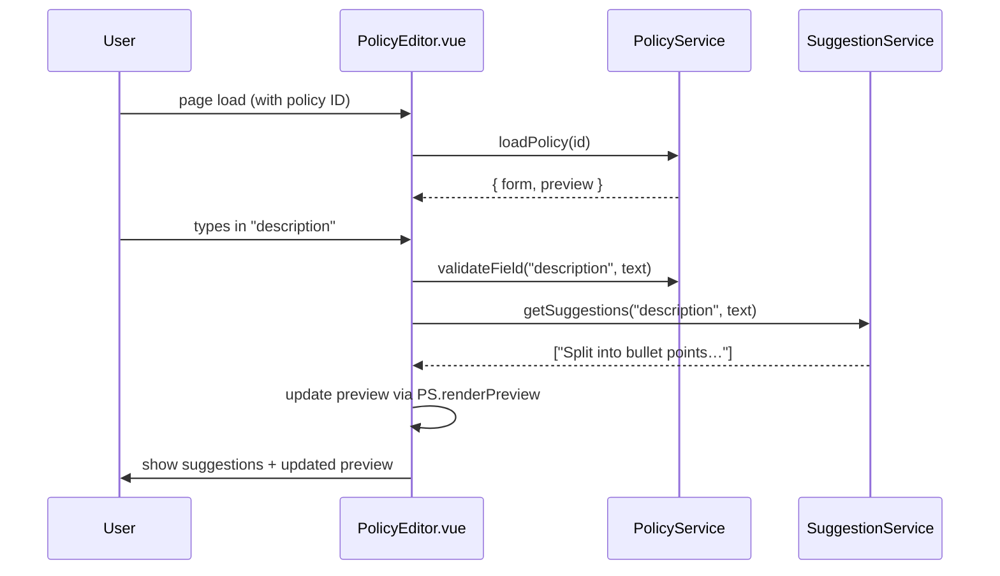

# Chapter 4: Policy Editor

Welcome back! In [Chapter 3: Policy Dashboard](03_policy_dashboard_.md), we built a bird’s-eye view of your policies. Now it’s time to dive into the **Policy Editor**—the drafting room where you write, revise, and polish your policy text before it goes live.

---

## 4.1 Why a Policy Editor?

Imagine you work at the Cybersecurity and Infrastructure Security Agency (CISA). You need to update the “Incident Response Policy” with new guidelines. You want:

- Form fields for **Title**, **Description**, **Effective Date**  
- Validation checks (no empty titles, valid dates)  
- Live AI suggestions (“Clarify scope of critical assets…”)  
- A preview of the formatted legal text  

The **Policy Editor** in HMS-GOV gives you all that in one focused screen, just like legislators drafting an amendment in a committee room.

---

## 4.2 Key Concepts

1. **Form Schema**  
   A JSON definition of each field: label, type, validation rules.

2. **Validation Rules**  
   Checks that run as you type (e.g., “Title is required”, “Date must be future”).

3. **Live AI Suggestions**  
   An assistant that reads your draft and offers text hints or citations.

4. **Preview Pane**  
   Renders the final policy text in near-legal formatting before you save.

---

## 4.3 Building the Policy Editor UI

Let’s start with a minimal Vue component: `src/pages/PolicyEditor.vue`.

```vue
<template>
  <div class="policy-editor">
    <h1>Edit Policy</h1>

    <GovInput
      v-model="form.title"
      label="Policy Title"
      @input="onFieldChange('title')"
    />
    <GovTextArea
      v-model="form.description"
      label="Description"
      @input="onFieldChange('description')"
    />
    <GovInput
      v-model="form.effectiveDate"
      label="Effective Date"
      type="date"
      @change="onFieldChange('effectiveDate')"
    />

    <div class="suggestions" v-if="suggestions.length">
      <strong>AI Suggestions:</strong>
      <ul><li v-for="s in suggestions" :key="s">{{ s }}</li></ul>
    </div>

    <GovButton @click="saveDraft">Save Draft</GovButton>

    <h2>Preview</h2>
    <div class="preview" v-html="previewHtml"></div>
  </div>
</template>
```

Explanation:  
- We use `<GovInput>` and `<GovTextArea>` from HMS-GOV.  
- `onFieldChange` triggers validation and AI suggestions.  
- We show a **Preview** pane rendered as HTML.

```js
<script>
import { GovInput, GovTextArea, GovButton } from 'hms-gov'
import PolicyService from '../services/PolicyService'
import SuggestionService from '../services/SuggestionService'

export default {
  components: { GovInput, GovTextArea, GovButton },
  data() {
    return {
      form: { title: '', description: '', effectiveDate: '' },
      suggestions: [],
      previewHtml: ''
    }
  },
  async mounted() {
    // Load existing policy or start new
    const data = await PolicyService.loadPolicy(this.$route.params.id)
    this.form = data.form
    this.previewHtml = data.preview
  },
  methods: {
    async onFieldChange(field) {
      // 1. Validate locally
      PolicyService.validateField(field, this.form[field])
      // 2. Ask AI for suggestions
      this.suggestions = await SuggestionService.getSuggestions(
        field, this.form[field]
      )
      // 3. Update preview
      this.previewHtml = PolicyService.renderPreview(this.form)
    },
    async saveDraft() {
      await PolicyService.saveDraft(this.form)
      alert('Draft saved!')
    }
  }
}
</script>
```

Explanation:  
1. **mounted()** loads a policy by ID via `PolicyService`.  
2. **onFieldChange()** runs a simple validation and calls `SuggestionService`.  
3. The **Preview** updates as you type.

---

## 4.4 What Happens Under the Hood?



1. The editor loads form data from `PolicyService`.  
2. On every change, it validates and fetches AI hints.  
3. The preview HTML is re-rendered locally.

---

## 4.5 Inside the Services

### File: src/services/PolicyService.js

```js
export default {
  async loadPolicy(id) {
    // fetch form data and initial preview from backend
    const res = await fetch(`/api/policies/${id}`)
    const data = await res.json()
    return { form: data.form, preview: data.previewHtml }
  },
  validateField(field, value) {
    // simple rules
    if (!value) {
      console.warn(`${field} is empty`)
    }
  },
  renderPreview(form) {
    // naive markdown → HTML or template interpolation
    return `<h1>${form.title}</h1><p>${form.description}</p>
            <small>Effective: ${form.effectiveDate}</small>`
  },
  async saveDraft(form) {
    await fetch('/api/policies/draft', {
      method: 'POST', body: JSON.stringify(form),
      headers: { 'Content-Type': 'application/json' }
    })
  }
}
```

### File: src/services/SuggestionService.js

```js
export default {
  async getSuggestions(field, text) {
    // Imagine calling an AI endpoint
    const res = await fetch('/api/ai/suggest', {
      method: 'POST',
      body: JSON.stringify({ field, text }),
      headers: { 'Content-Type': 'application/json' }
    })
    const { suggestions } = await res.json()
    return suggestions  // e.g. ["Add scope of assets…"]
  }
}
```

---

## 4.6 Summary

In this chapter you learned how to:

- Set up a **Policy Editor** with form fields and a preview pane  
- Wire in **validation rules** and **live AI suggestions**  
- See a **sequence diagram** of the user flow  
- Peek under the hood at **PolicyService** and **SuggestionService**

Next up, we’ll see how policies move through states—draft, review, publish—in [Chapter 5: Policy Lifecycle Workflow](05_policy_lifecycle_workflow_.md).

---

Generated by [AI Codebase Knowledge Builder](https://github.com/The-Pocket/Tutorial-Codebase-Knowledge)