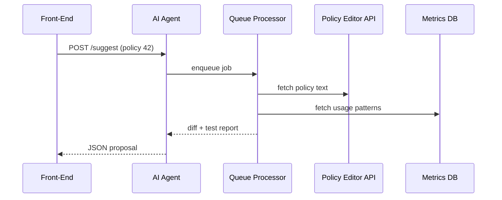

# Chapter 5: AI Representative Agent (A2A Service)

*(If you just finished polishing rules in the studio, jump back here from  
[Policy Editor (Rule Authoring Studio)](04_policy_editor__rule_authoring_studio__.md).)*

---

## 1 · Why do we need a sleepless policy analyst?

Imagine the National Transportation Safety Board (NTSB) just updated aircraft-maintenance rules.  
During the hectic week that follows…

* Dozens of **Policy Drafters** tweak sections in parallel.  
* A complex *Human-in-the-Loop* approval chain slows things down.  
* Minor bottlenecks (a missing citation, an unassigned reviewer, an outdated test case) stall the release.

Enter the **AI Representative Agent (A2A Service)** –  
a micro-service that watches everything 24 × 7, learns patterns, and quietly fixes the “paper cuts” before humans even notice.

Think of it as a **Roomba** for bureaucracy: continuously scanning the floor for crumbs, vacuuming them up, and calling you only when it gets stuck.

---

## 2 · Key concepts in plain English

| Term | Beginner Analogy |
|------|------------------|
| **Observation Feed** | A security camera recording every click & edit |
| **Heuristic** | A sticky note: “If PR idle > 48 h → ping reviewer” |
| **Improvement Draft** | A pull-request auto-created by the agent |
| **Escalation Trigger** | The agent raising its hand: “Human help needed!” |
| **Replacement Trigger** | Agent temporarily takes over if a human approver vanishes |

---

## 3 · Central use case: fixing a blocked pull-request

0 1 2  

1. A Policy Drafter for **Uniformed Services University of the Health Sciences (USU)** submits *PR-17* to raise medical stipend limits.  
2. The reviewer is on leave; the PR sits idle for 72 hours.  
3. The **AI Representative Agent** notices the delay, runs tests, finds everything green, and:

   * Adds a comment summarizing the tests.  
   * Assigns an alternate reviewer (based on role & workload).  
   * Starts a two-hour timer – if still no action, it escalates to the **Agency Admin**.

Result: policies ship on time, no angry students, and nobody had to check email threads.

---

## 4 · How you interact with the Agent (extremely simple!)

The Agent exposes only two REST endpoints for most teams:

```http
POST /a2a/suggest
GET  /a2a/alerts
```

### 4.1 `POST /a2a/suggest`

```bash
curl -X POST /a2a/suggest \
     -H "Authorization: Bearer $JWT" \
     -d '{"policyId":42}'
```

What happens?

1. Agent reviews policy **42**.  
2. Returns a JSON proposal with suggested diffs and test results.  
3. If you like it, forward the diff to the [Policy Editor](04_policy_editor__rule_authoring_studio__.md).

### 4.2 `GET /a2a/alerts`

```bash
curl /a2a/alerts?status=pending
```

Returns an array of escalations that still need human attention (“PR-17 idle > 2 h; auto-tests green; awaiting sign-off”).

---

## 5 · Let’s try it – a 10-line front-end helper

```js
// src/composables/useA2A.js
export async function askAgent(policyId){
  const res = await fetch('/a2a/suggest', {
    method:'POST',
    headers:{'Content-Type':'application/json'},
    body: JSON.stringify({ policyId })
  })
  return res.json()     // ← { diff:"...", tests:{pass:18, fail:0} }
}
```

Explanation (🔍):

1. Front-end sends the policy ID.  
2. The Agent replies with a `diff` string plus high-level test stats.  
3. Caller decides to accept, tweak, or ignore.

---

## 6 · What magic happens behind the curtain?



Step-by-step:

1. API call lands on **A2A**; job is queued.  
2. **Queue Processor** pulls the latest policy text & historical metrics.  
3. It runs heuristic + ML models → produces a diff.  
4. Result is sent back to the user.

---

## 7 · A peek into the Agent’s simple internals

### 7.1 Job handler (12 lines)

```js
// services/a2a/suggest.js
module.exports = async function suggest(policyId){
  const policy = await getPolicy(policyId)        // current draft
  const metrics = await getMetrics(policyId)      // runtime signals

  const diff = createOptimizedDiff(policy, metrics) // ✨ ML magic
  const tests = await runSimulation(policyId, diff)

  return { diff, tests }
}
```

Highlights:

* `createOptimizedDiff` may call GPT-4 or a local model – it’s pluggable.  
* `runSimulation` reuses the Simulation Engine from the **Policy Editor**.

### 7.2 Escalation watcher (15 lines)

```js
// cron/escalateStalledPRs.js
cron.schedule('*/15 * * * *', async () => {
  const stalled = await findStalledPRs(48)      // hours
  for (const pr of stalled){
    await comment(pr.id, 'Auto-tests GREEN. Reassigning.')
    await reassignReviewer(pr.id)
    await notifyAdmin(pr.id)
  }
})
```

Every 15 minutes the agent:

1. Looks for pull-requests idle > 48 h.  
2. Comments with test summary.  
3. Reassigns reviewer & notifies admins (email + entry in `/a2a/alerts`).

All logic lives in a single cron script – easy to tweak.

---

## 8 · Frequently asked questions

**Q: Will the Agent ever publish a policy on its own?**  
A: No. It can only create drafts or PRs. The final **Publish** button remains a human privilege enforced by RBAC (see [Role-Based Access & Authorization Model](01_role_based_access___authorization_model_.md)).

**Q: How does it “learn” usage patterns?**  
A: It stores anonymized metrics (file size, approval time, number of comments) in a tiny SQLite DB. A nightly job retrains heuristics – no fancy GPU cluster needed.

**Q: Can agencies opt-out?**  
A: Yes. Disable the “A2A Suggestions” toggle in the [Policy Dashboard (Admin HQ)](02_policy_dashboard__admin_hq__.md). The Agent will still create *alerts* for critical stalls, but won’t alter drafts.

---

## 9 · Mini exercise 🏋️‍♂️

1. Open **Policy Editor** and deliberately leave a draft un-reviewed for 50 minutes.  
2. Inspect `/a2a/alerts` – you should see an auto-generated escalation.  
3. Accept the Agent’s suggestion and merge the PR.  
4. Watch the alert disappear.

*(Sample solution in `exercises/05`)*

---

## 10 · What you learned

You now know:

* **Why** a tireless AI agent is useful in government policy workflows.  
* **How** to call its two simple endpoints to get suggestions & view alerts.  
* **What** happens inside: queue, heuristics, simulation, escalation.  
* **Where** the guardrails live so humans stay in charge.

Next up, we’ll explore how those automatically generated diffs flow into a fully auditable CI/CD-style stream:  
[Process Proposal Pipeline](06_process_proposal_pipeline_.md)

Happy automating!

---

Generated by [AI Codebase Knowledge Builder](https://github.com/The-Pocket/Tutorial-Codebase-Knowledge)