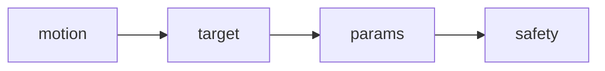
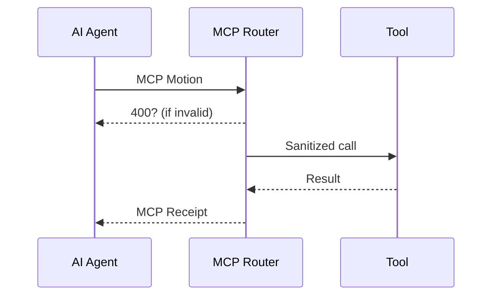

# Chapter 5: Model Context Protocol (HMS-MCP)


*Coming from [AI Representative Agent (HMS-AGT / HMS-AGX)](04_ai_representative_agent__hms_agt___hms_agx__.md)?  
Great! You just met the helpful AI intern.  
Now we teach that intern **how to politely ask for tools** without breaking anything.*

---

## 0. Why Do We Need a “Polite Script” for AI?

Picture the **International Trade Administration (ITA)**.  
Their AGT agent wants to:

1. Pull the latest export-tariff sheet.  
2. Translate it to Spanish.  
3. Email a draft bulletin to managers.

If the agent simply blurts out: “Hey, run the tariff API and maybe email Mary,” we have problems:

* **Inconsistent** wording → hard to automate.  
* **Unsafe** calls → agent might hit the wrong API or wrong recipient.  
* **Unauditable** history → compliance teams can’t see who did what.

**Model Context Protocol (HMS-MCP)** solves this by forcing agents to speak a *parliamentary* language, e.g.,  
> “I **move** to call **TariffAPI.getLatest** with `{country:'MX'}`.”

One tidy sentence = one secure, loggable action.  
Thousands of agents, one grammar.

---

## 1. Key Ideas in Plain English

| MCP Term | Beginner-friendly meaning |
|----------|--------------------------|
| Motion   | The verb (“call”, “query”, “emitE-mail”). |
| Target   | The exact tool or API name. |
| Params   | The input data, always JSON. |
| Safety Tag | A label like `needsApproval` or `lowRisk`. |
| Receipt  | The response envelope sent back to the agent. |

Think of an MCP message like filling out a **purchase order**—all boxes must be present, or Finance (the router) rejects it.

---

## 2. A 60-Second Example

Goal: ITA agent fetches tariffs for Mexico.

```yaml
# MCP Motion
motion: call
target: TariffAPI.getLatest
params: { country: "MX" }
safety: lowRisk
```

If approved, the router responds:

```yaml
# MCP Receipt
status: 200
data: |
  { "MX": { "steel": 0.12, "agriculture": 0.05 } }
traceId: d4f9…
```

Humans can audit both YAML blobs later.

---

## 3. Anatomy of an MCP Message



1. **motion** – always an approved verb: `call`, `query`, `emitEmail`, `update`.  
2. **target** – fully-qualified name from the **Tool Registry** (`TariffAPI.getLatest`).  
3. **params** – key/value JSON, <= 10 KB.  
4. **safety** – enum: `lowRisk`, `needsApproval`, `blocked`.

If *any* part is missing or malformed, the request is bounced.

---

## 4. Using MCP in Practice

### 4.1 Agent-side helper (8 lines)

```js
// File: helpers/mcpRequest.js
export async function mcpRequest(motion, target, params, safety='lowRisk'){
  const body = { motion, target, params, safety }
  const res  = await fetch('/api/mcp', {
    method: 'POST',
    body: JSON.stringify(body),
    headers:{'Content-Type':'application/json'}
  })
  return await res.json()        // the Receipt
}
```

Explanation (beginner):

1. Build the object.  
2. POST it to the MCP router endpoint.  
3. Return whatever the router sends back.

### 4.2 Call the helper

```js
import { mcpRequest } from './helpers/mcpRequest.js'

const tariffs = await mcpRequest(
  'call',
  'TariffAPI.getLatest',
  { country:'MX' }
)

console.log(tariffs.data)  // prints steel/agriculture rates
```

One line, one safe call.

---

## 5. Under the Hood – What Happens?



1. Agent sends Motion.  
2. Router validates grammar + safety.  
3. If ok, Router invokes the real **Tool**.  
4. Router wraps output as **Receipt** and returns.

Everything is logged with `traceId`.

---

## 6. Inside the Router (Node, 16 lines)

```js
// File: router/mcp.js
import tools from './toolRegistry.js'
export async function handle(req, res){
  const m = await req.json()          // the Motion
  if(!isValid(m)) return res.status(400).end()

  const toolFn = tools[m.target]
  if(!toolFn)   return res.status(404).end()

  // optional approval check
  if(m.safety==='needsApproval')
      return queueForHuman(m, res)

  const data = await toolFn(m.params) // run the tool
  res.json({ status:200, data, traceId:crypto.randomUUID() })
}
```

Key points:

* `isValid()` checks the four fields + verb whitelist.  
* Dangerous motions (`needsApproval`) are put in a review queue.  
* Only 16 lines to keep it readable!

---

## 7. Tool Registry Stub (10 lines)

```js
// File: router/toolRegistry.js
import { getLatest } from '../tools/tariffApi.js'

export default {
  'TariffAPI.getLatest': getLatest,
  // 'EmailService.send': sendEmail,
  // 'BudgetAPI.patch': patchBudget,
}
```

One map = one source of truth.  
Adds traceability and prevents name typos.

---

## 8. Advanced: Chaining Motions

Agents often need *multiple* steps. MCP supports arrays:

```yaml
- motion: call
  target: TariffAPI.getLatest
  params: { country:"MX" }
  safety: lowRisk

- motion: emitEmail
  target: EmailService.send
  params:
    to: "manager@trade.gov"
    subject: "MX Tariffs"
    body: "{{1.data | pretty}}"
  safety: needsApproval
```

Notice placeholder `{{1.data}}` – means “use data from step 1”.  
Router executes sequentially; any `needsApproval` step pauses the chain until a human okays it (see [Human-in-the-Loop Oversight](11_human_in_the_loop_oversight__hitl__.md)).

---

## 9. How MCP Touches Other Chapters

* **Agents** generate Motions (see [AI Representative Agent](04_ai_representative_agent__hms_agt___hms_agx__.md)).  
* **Workflow Manager** orchestrates long chains (coming in [Agent-Orchestrated Workflow Manager](07_agent_orchestrated_workflow_manager__hms_act__.md)).  
* **Security Layer** enforces verb/target ACLs (see [Security & Authorization Layer](09_security___authorization_layer__hms_sys__zero_trust__.md)).  
* **Marketplace** lists new tool targets for agencies (see [Agent Marketplace](06_agent_marketplace__hms_mkt__.md)).

---

## 10. Quick FAQ

**Q:** Can I use plain English instead of YAML?  
**A:** No. Free-form text is unpredictable. MCP keeps it machine-parseable.

**Q:** What happens if the tool crashes?  
**A:** Router captures the error and returns `status:500` in the Receipt.

**Q:** How big can `params` be?  
**A:** Default limit 10 KB to discourage file uploads—use a storage link instead.

---

## 11. Summary & Next Steps

You learned:

1. Why agents need a standardized “parliamentary” script.  
2. The 4 required MCP fields: motion, target, params, safety.  
3. How an agent issues a Motion and receives a Receipt.  
4. Internals of the Router and Tool Registry.  
5. How MCP integrates with safety reviews and other HMS-GOV layers.

Next, we’ll explore **how agencies can share, buy, or sell new agents and tools** in an open bazaar: [Agent Marketplace (HMS-MKT)](06_agent_marketplace__hms_mkt__.md).

---

---

Generated by [AI Codebase Knowledge Builder](https://github.com/The-Pocket/Tutorial-Codebase-Knowledge)