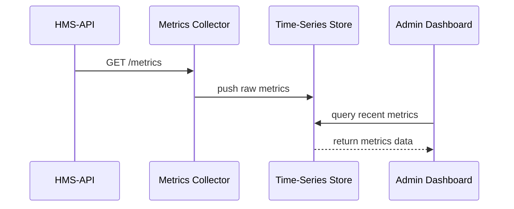

# Chapter 5: Real-Time Metrics Monitoring

Welcome back! In [Chapter 4: External System Sync](04_external_system_sync_.md), we learned how HMS-GOV publishes events to outside systems like a “live news feed.” Now it’s time to look inward—how do we keep an eye on our own system health and user outcomes **in real time**? That’s what **Real-Time Metrics Monitoring** does: it’s the Inspector General of HMS-GOV, continuously tracking KPIs, satisfaction scores, and conflict-resolution rates.

---

## 5.1 Why Real-Time Monitoring?

Imagine the Department of Transportation rolls out a new digital parking permit policy. We want to know, **right away**:

- How many citizens are completing the application form per minute?
- Are users abandoning the form at the payment step?
- How quickly support tickets about “license denied” complaints are resolved?

Without real-time metrics, we’d discover problems hours or days later—too late to react. With monitoring, we catch issues as they happen and keep our system healthy.

---

## 5.2 Central Use Case: Tracking a New Parking Permit Policy

1. A citizen submits a parking permit request via the User Portal.  
2. The HMS-API and back-end services process the request.  
3. Our Monitoring subsystem records:
   - A counter: `requests_processed_total`
   - A gauge: `active_connections`
   - A histogram: `request_latency_seconds`
4. Every 15 seconds, the Metrics Collector scrapes these values and stores them.  
5. The Admin Dashboard shows graphs of throughput, latency, and user satisfaction.  
6. If `request_latency_seconds` jumps above 2s, an alert emails the ops team.

This loop ensures policies run smoothly and service levels stay high.

---

## 5.3 Key Concepts

1. **Metrics Types**  
   - Counter: ever-increasing value (e.g., total requests).  
   - Gauge: variable value (e.g., current active users).  
   - Histogram: distribution of values (e.g., response times).

2. **Instrumentation**  
   Add tiny code snippets to each service so it **exposes** its metrics on an HTTP endpoint.

3. **Collector (Scraper)**  
   A scheduled job that **pulls** metrics from each service (e.g., every 15s).

4. **Aggregator / Time-Series Storage**  
   Stores metrics over time (e.g., Prometheus, InfluxDB, or a simple in-memory DB).

5. **Dashboard & Alerting**  
   Visualize trends and configure threshold-based alerts.

---

## 5.4 Instrumenting Your Service

Let’s add a `/metrics` endpoint to our HMS-API (Express.js):

File: `hms-api/metrics.js`
```javascript
import express from 'express'
import client from 'prom-client'       // A popular metrics library

// 1. Create metrics
const requestCount = new client.Counter({
  name: 'requests_processed_total',
  help: 'Total HTTP requests'
})
const latency = new client.Histogram({
  name: 'request_latency_seconds',
  help: 'Request latency in seconds'
})

const router = express.Router()

// 2. Middleware to measure each request
router.use((req, res, next) => {
  const end = latency.startTimer()
  res.on('finish', () => {
    requestCount.inc()
    end()
  })
  next()
})

// 3. Expose metrics
router.get('/metrics', async (req, res) => {
  res.set('Content-Type', client.register.contentType)
  res.send(await client.register.metrics())
})

export default router
```
Explanation:
- We define a **Counter** and a **Histogram**.  
- Middleware wraps every request to record latency and increment the counter.  
- GET `/metrics` returns all metrics in Prometheus format.

---

## 5.5 Scraping Metrics

A simple collector scrapes every service’s `/metrics`:

File: `metrics/collector.js`
```javascript
import fetch from 'node-fetch'
import { pushToDB } from './aggregator.js'

const SERVICES = ['http://hms-api:3000', 'http://hms-svc:4000']
async function scrapeAll() {
  for (let url of SERVICES) {
    const resp = await fetch(`${url}/metrics`)
    const text = await resp.text()
    await pushToDB(text)
  }
}

// Run every 15 seconds
setInterval(scrapeAll, 15000)
```
Explanation:
- `SERVICES` is the list of URLs we monitor.  
- Every 15s we GET `/metrics`, then hand raw text to our aggregator.

---

## 5.6 Storing & Visualizing

File: `metrics/aggregator.js`
```javascript
// A minimal in-memory store for demo purposes
const store = []

export async function pushToDB(rawMetrics) {
  const timestamp = Date.now()
  store.push({ timestamp, rawMetrics })
  // In production, you'd write to Prometheus, InfluxDB, etc.
}

// For the Dashboard, expose recent metrics
export function getRecent() {
  return store.slice(-100)  // last 100 scrapes
}
```
Explanation:
- We collect `{timestamp, rawMetrics}` in memory.  
- A real system would use a time-series database.

---

## 5.7 From Data to Dashboard


1. **API** exposes `/metrics`.  
2. **Collector** scrapes and stores.  
3. **Dashboard** queries stored data to draw graphs.

---

## 5.8 Alerts & Thresholds

You can add a simple alert rule in your dashboard code:

```javascript
const data = getRecent()
if (data.some(d => d.rawMetrics.includes('request_latency_seconds_bucket{le="2"} 0'))) {
  sendEmail('Latency Alert', 'Some requests exceed 2s')
}
```
Explanation:
- Checks if any bucket for latency ≤2s is zero (meaning every request was slower).  
- Sends an email if the threshold is crossed.

---

## Conclusion

In this chapter, you learned how to:

- Instrument services to **expose** metrics.  
- Use a **Collector** to scrape metrics periodically.  
- Store data in a time-series store.  
- Build a **Dashboard** and simple **alerts** for real-time visibility.

With Real-Time Metrics Monitoring, you’ll catch performance spikes, user frustrations, or policy conflicts as they happen—just like an Inspector General watching over the system.

Next up: dive into the core data structures that define our policies in [Chapter 6: Policy (Domain Entity)](06_policy__domain_entity__.md).

---

Generated by [AI Codebase Knowledge Builder](https://github.com/The-Pocket/Tutorial-Codebase-Knowledge)