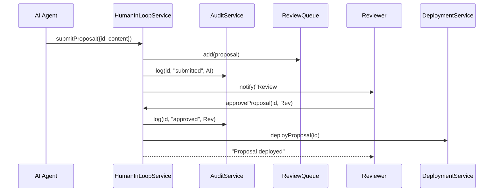

# Chapter 6: Human-in-the-Loop Override

Welcome back! In [Chapter 5: Policy Lifecycle Workflow](05_policy_lifecycle_workflow_.md) we saw how policies move from **Draft** to **Deployed** through automated state transitions. Now we’ll add a critical safety net: every AI-generated proposal must be reviewed and signed off by a human expert before it goes live. This is our **Human-in-the-Loop Override**, the chairman’s gavel that ensures oversight over automated actions.

---

## 6.1 Why Human-in-the-Loop Override?

Imagine the National Institute for Occupational Safety and Health (NIOSH) uses an AI agent to draft updates to workplace safety guidelines. Before those updates reach tens of thousands of factories, a senior safety officer must review the proposal. This prevents subtle errors or misinterpretations that an AI might introduce.

Goals of this mechanism:
- Catch mistakes or edge-case issues  
- Ensure accountability (who approved what, and when)  
- Maintain an audit trail for compliance  

---

## 6.2 Key Concepts

1. **Review Queue**  
   A list of AI proposals awaiting human inspection.  
2. **Approval Workflow**  
   Defines who reviews (roles), how many approvals are needed, and the actions (approve/reject).  
3. **Audit Logs**  
   Records every step: submission, approval, rejection, with timestamps and user IDs.  
4. **Role-Based Access Control (RBAC)**  
   Only users with the correct role (e.g., `SeniorOfficer`) can hit the gavel and approve.

---

## 6.3 Using the Override in Your Code

Below is a minimal example where an AI module submits a proposal, and then a human reviewer approves it.

```js
// File: src/services/HumanInLoopService.js
export default {
  async submitProposal(proposal) {
    // 1. Add to review queue
    await ReviewQueue.add(proposal)
    // 2. Log submission
    await AuditService.log(proposal.id, 'submitted', proposal.author)
    // 3. Notify reviewers
    NotificationService.notifyRole('SeniorOfficer',
      `New proposal #${proposal.id} ready for review`)
  },

  async approveProposal(proposalId, reviewer) {
    // 1. Check reviewer has the role
    AccessControlService.checkRole(reviewer, 'SeniorOfficer')
    // 2. Mark as approved
    await ReviewQueue.update(proposalId, { status: 'approved' })
    // 3. Log approval
    await AuditService.log(proposalId, 'approved', reviewer)
    // 4. Trigger deployment
    DeploymentService.deployProposal(proposalId)
  }
}
```

Explanation:
- `submitProposal` sends the AI draft into the human queue, logs it, and pings all `SeniorOfficer` users.
- `approveProposal` enforces RBAC, updates status, logs the sign-off, and then deploys the proposal.

---

## 6.4 What Happens Under the Hood?



1. **AI Agent** calls `submitProposal()`.  
2. **Service** enqueues, logs, and notifies reviewers.  
3. A **Reviewer** approves via `approveProposal()`.  
4. The action is logged, and **DeploymentService** publishes the change.

---

## 6.5 Inside the Supporting Services

### ReviewQueue (simplified)

```js
// File: src/services/ReviewQueue.js
const queue = []
export default {
  add(proposal) { queue.push({ ...proposal, status:'pending' }) },
  update(id, changes) {
    const item = queue.find(p => p.id === id)
    Object.assign(item, changes)
  }
}
```

### AuditService (simplified)

```js
// File: src/services/AuditService.js
export default {
  logs: [],
  log(id, action, user) {
    this.logs.push({
      proposalId: id,
      action,
      by: user.name,
      at: new Date().toISOString()
    })
  }
}
```

### AccessControlService (simplified)

```js
// File: src/services/AccessControlService.js
export default {
  checkRole(user, neededRole) {
    if (!user.roles.includes(neededRole)) {
      throw new Error('Access denied: insufficient role')
    }
  }
}
```

These tiny services show the essentials: a queue for tasks, an array to record audit entries, and a role check to gate approvals.

---

## 6.6 Summary

You’ve learned how to:
- Create a **Review Queue** for all AI proposals  
- Build an **Approval Workflow** enforcing roles (`SeniorOfficer`)  
- Record every step in **Audit Logs**  
- Connect approval to the **DeploymentService**  

This ensures no AI action slips through unchecked—every motion needs the human gavel. Next up, we’ll see how to generate those process proposals in [Chapter 7: Process Proposal Generation](07_process_proposal_generation_.md).

---

Generated by [AI Codebase Knowledge Builder](https://github.com/The-Pocket/Tutorial-Codebase-Knowledge)