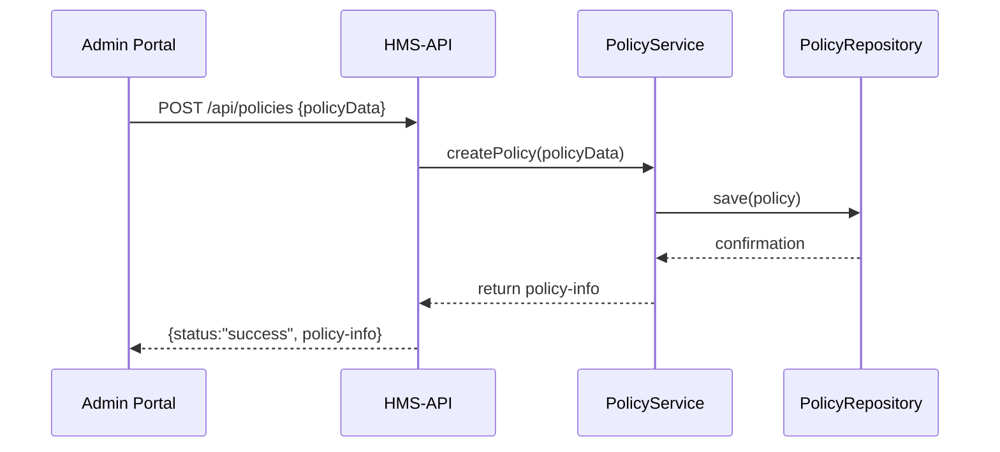

# Chapter 6: Policy (Domain Entity)

Welcome back! In [Chapter 5: Real-Time Metrics Monitoring](05_real_time_metrics_monitoring_.md), we learned how HMS-GOV watches its own health and performance in real time. Now, let’s dive into the heart of our **Governance Layer**: the **Policy** domain entity.

---

## 1. Why a Policy Entity?

Imagine the Federal Register, where every new law, regulation, or rule is published. In HMS-GOV, a **Policy** is that “law in code.” It encapsulates:
- What actions are **allowed** or **required**  
- Who must comply (agencies, citizens, teams)  
- When the rule is active

**Central Use Case:** A state clerk needs to publish a new fishing regulation:
1. Clerk opens the Admin Portal and defines “Max fish weight = 30 lbs.”  
2. HMS-API receives this definition and calls the Policy Service.  
3. The new Policy is stored and given a unique ID.  
4. Other services and UIs can now retrieve and enforce it.

By modeling Policy as a first-class entity, we keep rules versioned, discoverable, and enforceable across the system.

---

## 2. Key Concepts

1. **Policy ID & Metadata**  
   - Unique identifier (e.g., `fish-001`)  
   - Name, description, version, status (`Draft`, `Active`, `Retired`)

2. **Rule Definition**  
   - Often a simple JSON or expression (e.g., `{ "maxWeight": 30 }`)  
   - Could be more complex logic in a real policy engine

3. **Status & Lifecycle**  
   - **Draft**: being edited  
   - **Active**: currently enforced  
   - **Retired**: no longer applies

4. **Versioning**  
   - Each update can create a new version for audit

---

## 3. Using the Policy Entity

### 3.1 Create a New Policy

Request (Admin Portal → HMS-API):
```
POST /api/policies
Content-Type: application/json

{
  "id": "fish-001",
  "name": "Fishing Weight Limit",
  "description": "Max weight per catch",
  "rules": { "maxWeight": 30 }
}
```

Response:
```json
{
  "status": "success",
  "policy": {
    "id": "fish-001",
    "status": "Draft"
  }
}
```

> The service returns a `Draft` Policy ready for review in the [Legislative Workflow](07_legislative_workflow_.md).

### 3.2 Retrieve a Policy

```
GET /api/policies/fish-001
```

Returns:
```json
{
  "id": "fish-001",
  "name": "Fishing Weight Limit",
  "description": "Max weight per catch",
  "rules": { "maxWeight": 30 },
  "status": "Active",
  "version": 1
}
```

---

## 4. Under the Hood: Sequence Diagram



1. **Admin Portal** sends JSON.  
2. **HMS-API** routes to **PolicyService**.  
3. Service calls **PolicyRepository** to save.  
4. The new Policy is returned to the Portal.

---

## 5. Core Code Walkthrough

Below is a minimal in-memory implementation. In real life, you’d swap the repository for a database.

### 5.1 Policy Entity

File: `domain/entities/policy.py`
```python
class Policy:
    def __init__(self, id, name, description, rules, status='Draft', version=1):
        self.id = id
        self.name = name
        self.description = description
        self.rules = rules        # e.g., {"maxWeight":30}
        self.status = status      # Draft, Active, Retired
        self.version = version
```
*This class holds our policy data and default lifecycle values.*

### 5.2 Policy Repository

File: `domain/repositories/policy_repository.py`
```python
class PolicyRepository:
    def __init__(self):
        self._store = {}  # simple in-memory store

    def save(self, policy):
        self._store[policy.id] = policy

    def get(self, policy_id):
        return self._store.get(policy_id)
```
*We save and retrieve Policies by ID. Swap this for a real DB in production.*

### 5.3 Policy Service

File: `domain/services/policy_service.py`
```python
from entities.policy import Policy
from repositories.policy_repository import PolicyRepository

class PolicyService:
    def __init__(self):
        self.repo = PolicyRepository()

    def create_policy(self, data):
        policy = Policy(
            id=data['id'],
            name=data['name'],
            description=data['description'],
            rules=data['rules']
        )
        self.repo.save(policy)
        return policy

    def get_policy(self, policy_id):
        return self.repo.get(policy_id)
```
*The service mediates between controllers (like HMS-API) and the repository.*

---

## 6. What’s Next?

- Policies you **create** can be sent through our [Legislative Workflow](07_legislative_workflow_.md) for approval.  
- Once **Active**, other services (e.g., the Policy Engine from [Chapter 1](01_three_layer_architecture_.md)) enforce these rules during application processing.

---

## Conclusion

In this chapter you learned:
- What a **Policy** entity is and why it mirrors a law in the Federal Register.  
- How to **create**, **retrieve**, and **store** Policies with code examples.  
- The lifecycle of a policy (Draft → Active → Retired).  

Next up, we’ll see how Policies travel through a formal approval process in the [Legislative Workflow](07_legislative_workflow_.md).

---

Generated by [AI Codebase Knowledge Builder](https://github.com/The-Pocket/Tutorial-Codebase-Knowledge)