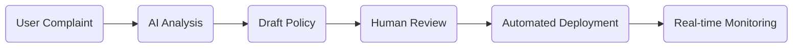
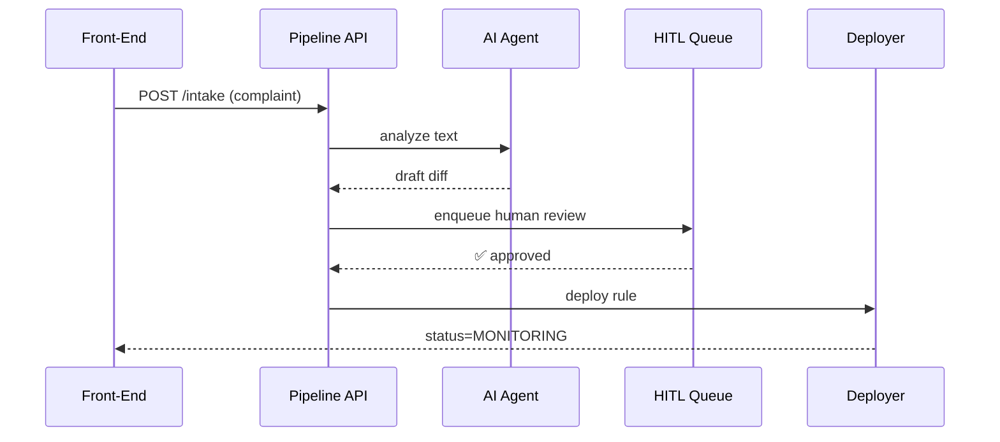

# Chapter 6: Process Proposal Pipeline<a name="chapter-6"></a>

*(just arrived from the helpful robot in  
[AI Representative Agent (A2A Service)](05_ai_representative_agent__a2a_service__.md))*  


---

## 1 Why another pipeline?  

Picture the **Executive Office for Immigration Review (EOIR)**.  
Latino families keep waiting **700 + days** for a court hearing and flood the public comment box with *“please speed this up!”* complaints.

EOIR wants a **repeatable conveyor belt** that:

1. **Catches** each complaint,
2. **Turns** it into a concrete draft rule (e.g., “create weekend dockets”),
3. **Lets humans approve** (or reject) the draft,
4. **Ships** the change to all downstream services **without rewriting code** each time,
5. **Watches** real-world metrics to see if the fix actually helped.

That conveyor belt is the **Process Proposal Pipeline**.  
Master it once → reuse for potholes, stipend limits, or any policy tweak.

---

## 2 A bird’s-eye view  



Think of six little conveyor belts welded together—swap any belt without stopping the factory.

---

## 3 Key concepts in plain English  

| Stage | “Factory” Analogy | What appears in HMS-GOV |
|-------|-------------------|-------------------------|
| Complaint Intake | Raw ore arriving | A ticket in **Inbox** |
| AI Analysis | Crushing & sorting ore | A **suggestion diff** from A2A |
| Draft Policy | Molten metal poured | New **Draft #321** in the [Policy Editor](04_policy_editor__rule_authoring_studio__.md) |
| Human Review | Quality inspectors | A task in [Human-in-the-Loop Oversight](07_human_in_the_loop_oversight_workflow_.md) |
| Automated Deployment | Conveyor to shipping dock | Event sent through [HMS-API Gateway](09_backend_api_gateway__hms_api___hms_mkt__.md) |
| Monitoring | Barcode scanner at exit | Live charts in [Real-Time Metrics & Feedback Loop](12_real_time_metrics___feedback_loop_.md) |

---

## 4 Hands-on tour with one curl command  

Below is a *toy* end-to-end run—only **19 lines** total.

```bash
# 1. Citizen files complaint
curl -X POST /pipeline/intake \
  -d '{"text":"Hearings take too long!"}'

# 2. Reviewer peeks at pipeline status
curl /pipeline/42/status
# → {stage:"DraftPolicy", owner:"AI-Agent"}
```

Explanation:

1. The first call creates **Pipeline #42** and parks it at *AI Analysis*.  
2. Second call returns the current stage and who’s responsible.

*You didn’t touch a database; the pipeline orchestrator did the heavy lifting.*

---

## 5 What happens under the hood?  



1. **Pipeline API** is the traffic cop.  
2. **A2A** (from previous chapter) supplies the first draft.  
3. **HITL** queues a policy officer for approval.  
4. **Deployer** publishes to production and kicks off monitoring hooks.

---

## 6 Minimal code tour (all blocks ≤ 20 lines)

### 6.1 Orchestrator entry point  

```js
// api/pipeline/intake.js  (18 lines)
router.post('/intake', async (req, res) => {
  const { text } = req.body
  const id = await db('pipeline').insert({ stage:'AI', complaint:text })

  queue.add('aiAnalysis', { id })      // ← hand off to next belt
  res.json({ id })
})
```

*Beginners’ notes:*  
– Store a row, tag it `stage:'AI'`, push a job called **aiAnalysis**.  
– No business logic here—keep each belt tiny.

### 6.2 AI-analysis worker  

```js
// workers/aiAnalysis.js  (14 lines)
queue.process('aiAnalysis', async job => {
  const { id } = job.data
  const complaint = await db('pipeline').where({ id }).first()

  const draft = await a2a.suggestText(complaint.text) // GPT-4 call
  await db('policies').insert({ pipeline_id:id, body:draft, status:'DRAFT' })

  await db('pipeline').where({ id }).update({ stage:'HITL' })
  queue.add('hitlReview', { id })
})
```

– Calls the **A2A** helper you met last chapter.  
– Moves the stage to *HITL* and queues the next worker.

### 6.3 Human-review worker  

```js
// workers/hitlReview.js  (12 lines)
queue.process('hitlReview', async job => {
  const { approved } = await waitForHuman(job.data.id) // blocking helper
  if (!approved) return db('pipeline').update({ stage:'REJECTED' })

  queue.add('deployRule', { id: job.data.id })
  await db('pipeline').update({ stage:'DEPLOY' })
})
```

– Wrapper `waitForHuman` opens a card in the oversight screen and waits for ✅ / ❌.  
– On approval, stage switches to *DEPLOY*.

### 6.4 Deployment worker  

```js
// workers/deployRule.js  (16 lines)
queue.process('deployRule', async job => {
  const policy = await db('policies').where({ pipeline_id:job.data.id }).first()
  await gateway.publish(policy)     // heads to mesh
  await db('pipeline').where({ id:job.data.id })
         .update({ stage:'MONITOR' })
})
```

– `gateway.publish` is a thin wrapper around the [Backend API Gateway](09_backend_api_gateway__hms_api___hms_mkt__.md).

---

## 7 Viewing & pausing a pipeline  

The **Policy Dashboard** gets a new tab called **“Pipelines”**.  
Click any row → modal shows:

```text
Pipeline #42  •  Stage: HITL Review
─────────────
Complaint      Hearings take too long!
Draft link     /policy/321
Timer          18h remaining before auto-escalate
[Pause] [Skip AI] [Terminate]
```

Press **Pause**—the orchestrator simply sets `stage:'PAUSED'`; workers ignore it until resumed. No code change elsewhere.

---

## 8 Swapping a belt without breaking the factory  

Want to test a fancy **“Gen-AI-v2”** analysis?  

1. Add a new worker file `aiAnalysisV2.js`.  
2. Change one line in `intake.js`:  

```diff
- queue.add('aiAnalysis', { id })
+ queue.add('aiAnalysisV2', { id })
```

3. Everything downstream (HITL, Deploy, Monitor) stays untouched.  
4. Toggle back if metrics show v2 is slower—**zero** migration pain.

---

## 9 Try it yourself 🏋️‍♀️  

1. Open *Inbox* in the demo app and file a complaint:  
   *“The stipend process takes months.”*  
2. Watch **Pipeline #1** appear at *AI Analysis*, then quickly move to *HITL*.  
3. As *Policy Drafter*, approve the draft.  
4. See status flip to *MONITORING*.  
5. Open the metrics screen—latency chart starts tracking the new rule.

*(Sample walk-through in `exercises/06`.)*

---

## 10 Common questions  

**Q: What if two complaints are almost identical?**  
A: The intake worker runs a 3-line similarity check; if 90 % alike, it merges them into the same pipeline to avoid duplicate work.

**Q: Can an agency skip the AI stage?**  
A: Yes. In the Dashboard toggle “Skip AI Drafts”. Intake will queue *hitlReview* directly.

**Q: How is security enforced between stages?**  
A: Every worker calls the same RBAC helper from [Role-Based Access & Authorization Model](01_role_based_access___authorization_model_.md) before touching data.

---

## 11 What you learned  

You now know how HMS-GOV:

* Treats a raw citizen complaint as the *first gear* in a 6-gear machine.  
* Hands the baton from AI → humans → robots without losing audit trails.  
* Lets you replace any gear (stage) in minutes, not months.

Ready to zoom into the **Human-Review** gear itself?  
Jump to the next chapter:  
[Human-in-the-Loop Oversight Workflow](07_human_in_the_loop_oversight_workflow_.md)

---

---

Generated by [AI Codebase Knowledge Builder](https://github.com/The-Pocket/Tutorial-Codebase-Knowledge)