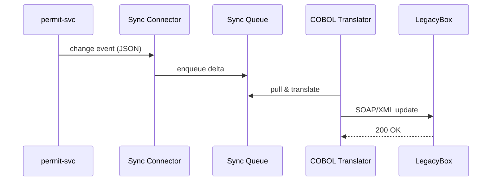

# Chapter 7: External System Synchronization Connector  

*(Follow-up to [HMS-GOV – Government Integration Gateway](06_hms_gov____government_integration_gateway_.md))*  

---

## 1. Why Do We Need One More “Translator”?

Imagine this true-to-life scene inside a county office:

1. Clerk Rosa updates a **building permit** in the shiny HMS web app.  
2. Downstairs, an *aging* COBOL system (built in 1998) still feeds nightly reports to the state.  
3. If that COBOL database is not updated **immediately**, inspectors arrive with wrong data and citizens get fined.

For years, the fix was manual CSV uploads at 5 p.m.  
The **External System Synchronization Connector** (we’ll just say “Sync Connector”) kills that pain.  
It:

* Detects every change in real time  
* Converts modern JSON → legacy SOAP / flat file / whatever  
* Stores changes in a queue and retries until the old system says “✅ Got it!”  

No more “Did you remember the 5 p.m. CSV?” drama.

---

## 2. Key Ideas in Plain English

| Term                         | Meaning for Beginners                                        |
|------------------------------|--------------------------------------------------------------|
| Change Watcher               | Tiny listener that spots *what* changed (e.g., permit #123). |
| Diff Engine                  | Compares **old vs. new** objects and extracts only the delta.|
| Sync Queue                   | A to-do list of deltas waiting to be delivered.              |
| Translator Plug-in           | Knows how to say the delta in the legacy system’s language. |
| Replay Worker                | Keeps re-sending failed items until they succeed (eventual consistency). |

Keep this five-piece picture in mind; every example below uses it.

---

## 3. Quick-Start: Sync a Building Permit in 10 Lines

Suppose `permit-svc` already writes JSON documents to its own DB.  
We add one **watcher** file:

```javascript
// permit-svc/sync.js  (10 lines)
import { onChange } from 'hms-change-watcher'
import { enqueue } from 'hms-sync-queue'

onChange('permits', async (oldDoc, newDoc) => {
  const diff = makeDiff(oldDoc, newDoc) // 🚦 tiny delta
  await enqueue('county-cobol', diff)   // add to queue
})
```

Explanation:  

1. `onChange` fires whenever a permit row changes.  
2. `makeDiff` keeps only the changed fields (e.g., `{ status: "APPROVED" }`).  
3. `enqueue` puts the delta on the **Sync Queue** tagged for the *county-cobol* translator.

Nothing else inside your service changes—no risk of breaking live traffic.

---

### What Does the Legacy System Receive?

If the new status is “APPROVED”, the COBOL box finally sees:

```xml
<PermitUpdate>
  <PermitNumber>123</PermitNumber>
  <Field name="status">APPROVED</Field>
</PermitUpdate>
```

…even though HMS spoke pure JSON the whole time.

---

## 4. The Journey of a Delta (5 Steps)



If `LegacyBox` times out, the delta stays in `Q` and `TP` tries again later—**no data loss**.

---

## 5. Under the Hood (No Code Yet)

1. **Change Watcher** subscribes to internal events (Kafka topic, Dynamo streams, etc.).  
2. **Diff Engine** (pure JavaScript) returns a *minimal* object to keep payloads small.  
3. **Sync Queue** is just a durable table (`sync_queue` in Postgres).  
4. **Translator Plug-ins** live in `/connectors/<system>/`. One per legacy system.  
5. **Replay Worker** wakes up every 30 s, sends the oldest pending item, marks success/failure.

You rarely touch #3 or #5—they’re provided by the HMS Utilities library.

---

## 6. Peek Inside the Implementation

### 6.1 Diff in 6 Lines

```javascript
// utils/diff.js
export function makeDiff(oldObj, newObj){
  const diff = {}
  for (const k in newObj)
    if (oldObj[k] !== newObj[k]) diff[k] = newObj[k]
  return diff
}
```

Beginner Notes:  

* Loops every key; if the value changed, add it to `diff`.  
* This 6-line helper is reused by ALL services.

---

### 6.2 Queue Table Schema (for the Curious)

```sql
CREATE TABLE sync_queue(
  id SERIAL PRIMARY KEY,
  target VARCHAR,          -- e.g., 'county-cobol'
  payload JSONB,
  attempts INT DEFAULT 0,
  last_error TEXT
);
```

Nothing fancy—just rows waiting to travel.

---

### 6.3 Translator Skeleton

```python
# connectors/county_cobol/translate.py  (≤15 lines)
from dicttoxml import dicttoxml

def to_soap(diff):
    xml_body = dicttoxml(diff, custom_root='PermitUpdate', attr_type=False)
    soap = f"<soap:Envelope><soap:Body>{xml_body.decode()}</soap:Body></soap:Envelope>"
    return soap
```

Line-by-line:

1. Convert the diff dict to XML.  
2. Wrap it into a SOAP envelope—COBOL’s happy place.

---

### 6.4 Replay Worker (core logic)

```javascript
// replay-worker/index.js (18 lines)
import { fetchOne, markDone, markFail } from 'hms-sync-queue'
import { send } from 'hms-translators'

setInterval(async () => {
  const job = await fetchOne()   // oldest pending row
  if(!job) return                // queue empty
  try {
    await send(job.target, job.payload) // translator decides protocol
    await markDone(job.id)
  } catch(err){
    await markFail(job.id, err.message)
  }
}, 30_000)
```

Explanation:

* Runs every 30 s.  
* On success → remove row.  
* On error → keep row, increment `attempts`, store `last_error`.

Eventually **everything** syncs—even after outages.

---

## 7. How Do I Add a New Legacy System?

1. Scaffold:

```bash
npx hms-sync new county-housing
```

2. Fill `connectors/county_housing/translate.js` (JSON → CSV maybe 12 lines).  
3. Add watcher in the relevant service (`housing-svc/sync.js`).  
4. Done. Queue and retry logic work automatically.

Beginners often finish a new connector in under **30 minutes**.

---

## 8. Common Beginner Questions

**Q: What if two updates happen before the first one syncs?**  
A: The Diff Engine collapses them—only the newest state is sent, so the legacy DB is always *eventually current*, never spammed.

**Q: Is there a danger of infinite retries?**  
A: After 20 failed attempts, the row moves to a “dead-letter” table. Ops get an alert with `last_error` so they can investigate.

**Q: Can I see a dashboard of pending jobs?**  
A: Yes—[Policy Management Dashboard](04_policy_management_dashboard_.md) has a “Sync Status” widget you can enable.

**Q: Does this replace HMS-GOV?**  
A: No. HMS-GOV (Chapter 6) speaks to *other agencies*. The Sync Connector speaks to *our own* older internal systems.

---

## 9. What You Learned

• The **Sync Connector** guarantees that every legacy box stays up-to-date without nightly CSVs.  
• Five simple pieces—Watcher, Diff, Queue, Translator, Replay—do the heavy lifting.  
• Code you write is tiny: one `onChange` hook plus a small translator.  
• Retries, audits, and dashboards come out-of-the-box.

Next we’ll secure these system-to-system pipes with mutual TLS and digital signatures inside the [Secure Inter-agency Communication Layer (HMS-A2A)](08_secure_inter_agency_communication_layer__hms_a2a__.md).

---

Generated by [AI Codebase Knowledge Builder](https://github.com/The-Pocket/Tutorial-Codebase-Knowledge)