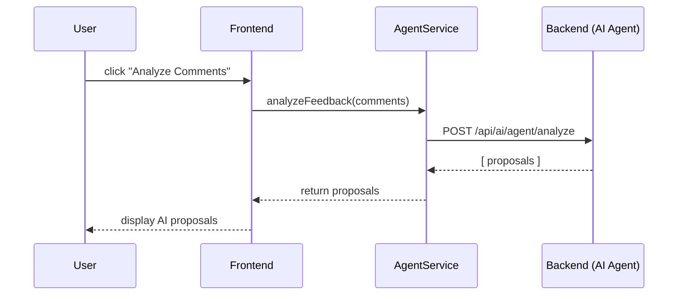

# Chapter 8: AI Agent Integration

Welcome back! In [Chapter 7: Process Proposal Generation](07_process_proposal_generation_.md) we saw how HMS-GOV can create optimized process proposals from metrics and feedback. Now let’s learn how the **AI Representative Agent** hooks into our admin interface, analyzes real user feedback, and suggests improved workflows automatically.

---

## 8.1 Why AI Agent Integration?

Imagine a digital legislative aide for the Federal Trade Commission. You’ve published a draft regulation on data privacy and received hundreds of public comments. Manually reading them all takes days. Instead, the AI Agent can:

1. Ingest every comment.  
2. Summarize the main points and highlight conflicts.  
3. Propose text revisions to resolve issues.  
4. Present suggestions directly in your policy editor.

This chapter shows you how to wire up that AI Agent so it feels like part of your app—standardizing data models, API calls, and UI callbacks.

---

## 8.2 Key Concepts

1. **Agent Hook Points**  
   Places in the UI (buttons, page load) where you trigger the AI Agent.

2. **Standard Data Models**  
   Common types like `FeedbackItem` and `AgentProposal` that travel between frontend and backend.

3. **API Endpoints**  
   A simple route (e.g. `POST /api/ai/agent/analyze`) that runs the AI logic.

4. **UI Callbacks**  
   Functions in your Vue components that call the agent and render its suggestions.

---

## 8.3 Hooking the AI Agent into a Vue Component

Below is a tiny example. We add an “Analyze Comments” button to our feedback review page.

```vue
<!-- File: src/components/FeedbackReview.vue -->
<template>
  <div>
    <h2>Public Comments</h2>
    <!-- list comments here… -->
    <button @click="runAgent">Analyze Comments</button>

    <div v-if="proposals.length">
      <h3>AI Proposals</h3>
      <ul>
        <li v-for="p in proposals" :key="p.id">
          {{ p.summary }}
        </li>
      </ul>
    </div>
  </div>
</template>

<script>
import AgentService from '../services/AgentService'

export default {
  data() {
    return { comments: [], proposals: [] }
  },
  methods: {
    async runAgent() {
      // Send all comments to the AI agent
      this.proposals = await AgentService.analyzeFeedback(this.comments)
    }
  }
}
</script>
```

Explanation:  
- We call `AgentService.analyzeFeedback(comments)` when the button is clicked.  
- The service returns an array of `AgentProposal` objects.  
- We render each proposal’s `summary` in a list.

---

## 8.4 What Happens Under the Hood?



1. **Frontend** calls **AgentService**.  
2. **AgentService** makes an HTTP call to our backend AI endpoint.  
3. **Backend** ingests comments, runs models, returns proposals.  
4. **Frontend** displays suggestions to the user.

---

## 8.5 The AgentService in Frontend

Let’s peek at the simple client-side code that talks to the AI endpoint.

```js
// File: src/services/AgentService.js
import axios from 'axios'

export default {
  async analyzeFeedback(comments) {
    // comments: array of { id, text, author }
    const res = await axios.post('/api/ai/agent/analyze', { comments })
    // returns array of { id, summary, revisedText }
    return res.data.proposals
  }
}
```

Explanation:  
- We send the `comments` array in the request body.  
- The response’s `proposals` field is an array of suggested edits.

---

## 8.6 The Backend AI Route

On the server side, we expose a minimal Express route that plugs into your AI pipeline.

```js
// File: src/api/agentRoutes.js
import express from 'express'
import AIAgent from '../ai/AIAgent'

const router = express.Router()

router.post('/analyze', async (req, res) => {
  const { comments } = req.body
  // 1. Build standardized model
  const feedbackItems = comments.map(c => ({
    id: c.id, text: c.text
  }))
  // 2. Ask the AI agent for proposals
  const proposals = await AIAgent.generateProposals(feedbackItems)
  res.json({ proposals })
})

export default router
```

Explanation:  
- We map raw comments into `feedbackItems`.  
- We call our AI logic (`AIAgent.generateProposals`).  
- We return the array of proposals back to the frontend.

---

## 8.7 Inside the AI Agent Logic

Here’s a super-simplified AI agent stub. In reality, you’d call an ML model or service.

```js
// File: src/ai/AIAgent.js
export default {
  async generateProposals(feedbackItems) {
    // Imagine advanced NLP here; we return a fake example:
    return feedbackItems.slice(0,3).map(item => ({
      id: item.id,
      summary: `Conflict spotted in comment ${item.id}`,
      revisedText: `Revised regulation text to address issue ${item.id}.`
    }))
  }
}
```

Explanation:  
- We pretend to analyze the first three comments.  
- For each, we return a `summary` and a `revisedText` suggestion.

---

## 8.8 Putting It All Together

With these pieces in place:

1. A **button** in your Vue component triggers the agent.  
2. **AgentService** ships data to `POST /api/ai/agent/analyze`.  
3. **agentRoutes.js** standardizes inputs and calls your core AI code.  
4. **AIAgent.js** returns proposals with summaries and revised text.  
5. The **frontend** shows those proposals for a human to review or incorporate.

This pattern ensures your AI logic is decoupled from UI details, uses clear data models, and fits seamlessly into HMS-GOV’s admin frontend.

---

## 8.9 Summary and Next Steps

In this chapter you learned how to:

- Define **hook points** in your UI for running the AI agent.  
- Standardize **data models** (`FeedbackItem`, `AgentProposal`).  
- Call a **backend AI endpoint** from the frontend.  
- Implement a minimal **Express route** and an **AIAgent** stub.  
- Display AI-generated proposals directly in your admin interface.

Next up, we’ll explore how to create more focused assistants for specific tasks in [Chapter 9: Specialized AI Agents](09_specialized_ai_agents_.md).

---

Generated by [AI Codebase Knowledge Builder](https://github.com/The-Pocket/Tutorial-Codebase-Knowledge)