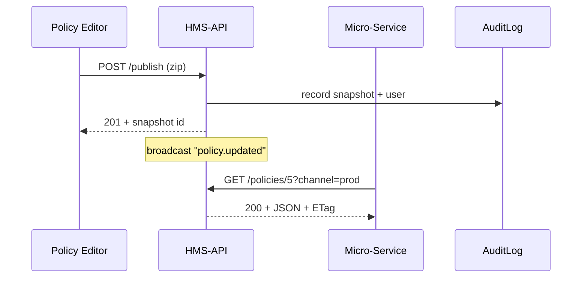

# Chapter 8: Backend Policy API (HMS-SVC / HMS-API) 🚇  

*(Jumping in from [Agent-Orchestrated Workflow Manager (HMS-ACT)](07_agent_orchestrated_workflow_manager__hms_act__.md)?  
Welcome! ACT just decided *what* must happen; **HMS-API** is the tunnel that makes it happen safely.)*

---

## 0. Why Do We Need a “Pneumatic Tube” for Policies?  

Picture the **Wireless Telecommunications Bureau (WTB)** at the FCC.  
Yesterday they raised the maximum allowed power for rural 5G towers.  
The new rule must instantly reach:

* the **Spectrum Allocation Service** (Python micro-service),  
* the **Licensing Portal** (Java app),  
* the **Public Data API** (GraphQL gateway).

If any one of them runs the *old* limit, lawsuits fly.  
The **Backend Policy API (HMS-API)** is the *sealed tube* that shoots the signed rule to every service, tracks its version, and lets us roll back if smoke appears.

---

## 1. Key Concepts (Plain English)

| Term | Beginner Description |
|------|----------------------|
| Policy Package | ZIP blob with YAML rule, metadata, and signature. |
| Snapshot ID | Read-only hash for one exact package, e.g., `v2024-06-10-1830` |
| Channel | “dev”, “test”, or “prod” stream a package travels on. |
| Auth Token | Signed JWT proving *who* may push or pull. |
| Rollback | API call that tells services “go back to snapshot X”. |

---

## 2. The 3-Step Flow You’ll Use 90 % of the Time

1. **Admin approves** a change in the [Policy Editor](03_policy_editor_interface_.md).  
2. **Editor POSTs** the package to `/api/policies/{id}/publish`.  
3. **Every micro-service GETs** `/api/policies/{id}?channel=prod` to pull the latest snapshot.

Below is a *full* demo with <20-line snippets.

---

### 2.1 Publishing a New Policy (Frontend → HMS-API)

```js
// File: scripts/publish.js
const pkg = await fetch('/builds/power_limit.zip').then(r=>r.blob())
await fetch('/api/policies/5/publish', {
  method: 'POST',
  headers: { 
    'Authorization': 'Bearer ' + token,   // JWT
    'X-Channel': 'prod'
  },
  body: pkg
})
```

Explanation  
1. We read a ZIP created by the editor.  
2. Auth token proves the user passed HITL checks.  
3. `X-Channel` tells HMS-API which stream to drop the package into.

Result (JSON):

```json
{ "snapshot": "v2024-06-10-1830", "status": "stored" }
```

---

### 2.2 Pulling the Latest Policy (Service → HMS-API)

```bash
curl -H "Authorization: Bearer $SVC_TOKEN" \
     "https://hms-api.gov/api/policies/5?channel=prod"
```

Response headers:  

```
ETag: "v2024-06-10-1830"
```

Body: minimized JSON copy of the rule.  
If the ETag is unchanged from last call, the service keeps its cache—easy bandwidth win.

---

### 2.3 Rolling Back (Uh-oh!)

```bash
curl -X POST -H "Authorization: Bearer $ADMIN" \
     -d '{"snapshot":"v2024-05-28-0915"}' \
     https://hms-api.gov/api/policies/5/rollback
```

HMS-API marks `v2024-05-28-0915` as current, emits a *Rollback Event*, and every listening service auto-fetches the prior package.

---

## 3. What Happens Under the Hood?



* 100 % of writes are journaled in **AuditLog**.  
* Services pull—never pushed—so a crashed service can recover by retrying.

---

## 4. Inside HMS-API (Code Peek, ≤20 lines Each)

### 4.1 Express Route to Publish

```js
// File: api/routes/publish.js
router.post('/policies/:id/publish', auth('write'), async (req, res)=>{
  const zip = await getBuffer(req)
  const snapshot = `v${Date.now()}`
  await storeBlob(req.params.id, snapshot, zip)   // S3 or local
  await db.run(`
     INSERT INTO snapshots(id, snap, user) VALUES(?,?,?)
  `,[req.params.id, snapshot, req.user.email])
  bus.emit('policy.updated', {id:req.params.id, snapshot})
  res.status(201).json({snapshot})
})
```

Beginner notes  
1. `auth('write')` verifies JWT.  
2. `storeBlob` writes the ZIP; DB records metadata.  
3. Event bus wakes subscribers.

### 4.2 Simple GET Handler with Caching

```js
router.get('/policies/:id', auth('read'), async (req,res)=>{
  const snap = await latestSnap(req.params.id, req.get('X-Channel')||'prod')
  if(req.get('If-None-Match')===snap) return res.status(304).end()
  const json = await loadJson(req.params.id, snap)
  res.set('ETag', snap).json(json)
})
```

If the caller already has the snapshot, HMS-API replies `304 Not Modified`—zero payload.

---

## 5. How Services Integrate (Tiny Example)

```py
# File: svc/policy_cache.py
import requests, os, json, time
ID   = 5
ETAG = ''

def refresh():
    global ETAG
    r = requests.get(
        f'https://hms-api.gov/api/policies/{ID}?channel=prod',
        headers={'Authorization':f'Bearer {os.environ["TOKEN"]}',
                 'If-None-Match':ETAG})
    if r.status_code == 200:
        ETAG = r.headers['ETag']
        open('/tmp/policy.json','w').write(r.text)

while True:
    refresh(); time.sleep(60)
```

Runs in any micro-service:

1. Polls once a minute.  
2. Saves file only on change.  
3. Other code reads `/tmp/policy.json` for real-time rules.

---

## 6. Safety & Versioning Tricks You Get for Free

* **Immutable Snapshots** – once a ZIP is stored, it’s content-addressed; nobody can *edit in place*.  
* **Channel Separation** – deploy to `test` first; switch citizen-facing apps to `prod` later.  
* **Time-Travel Debugging** – grab any prior snapshot by ID for audits or court orders.  
* **Auth Scopes** – tokens are minted by the [Security & Authorization Layer](09_security___authorization_layer__hms_sys__zero_trust__.md); services only get “read:policy”.  

---

## 7. Where HMS-API Touches Other Chapters

* **Dashboard & Editor** push/pull snapshots constantly – see [Policy Management Dashboard](01_policy_management_dashboard_.md) and [Policy Editor](03_policy_editor_interface_.md).  
* **AI Agents** fetch live rules to ground their suggestions – see [AI Representative Agent](04_ai_representative_agent__hms_agt___hms_agx__.md).  
* **Workflow Manager** stores ticket outcomes back into HMS-API as attachments – see [HMS-ACT](07_agent_orchestrated_workflow_manager__hms_act__.md).  
* **Zero-Trust Auth** for every call is detailed next in [Security & Authorization Layer (HMS-SYS, Zero-Trust)](09_security___authorization_layer__hms_sys__zero_trust__.md).  

---

## 8. Quick FAQ

**Q:** Why REST *and* GraphQL?  
A: REST gives simple cache-friendly endpoints; GraphQL lets power users fetch slices (`{policies{id,etag,channel}}`) in one round-trip.

**Q:** Can I stream updates instead of polling?  
A: Yes—open a Server-Sent Events (SSE) connection to `/api/stream/policies`. That endpoint emits `{id,snapshot}` messages on every publish or rollback.

**Q:** What’s the storage backend?  
A: Pluggable—S3, Azure Blob, or plain disk. Only the `storeBlob()` helper needs swapping.

---

## 9. Summary & Next Steps

In this chapter you:

1. Learned why HMS-API is the secure “tube network” for policy packages.  
2. Published, fetched, and rolled back a policy with tiny code samples.  
3. Saw under-the-hood routes that handle versioning, auth, and caching.  
4. Connected the dots to every other HMS-GOV layer.

Up next we lock the doors: discover how **Zero-Trust tokens, scopes, and mTLS** protect every tunnel we just built in  
[Security & Authorization Layer (HMS-SYS, Zero-Trust)](09_security___authorization_layer__hms_sys__zero_trust__.md).

---

Generated by [AI Codebase Knowledge Builder](https://github.com/The-Pocket/Tutorial-Codebase-Knowledge)