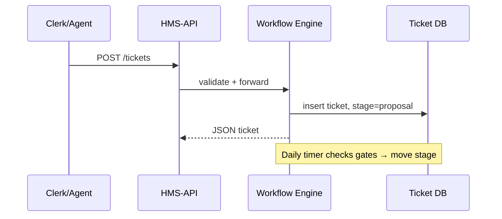

# Chapter 9: Legislative Workflow Engine (HMS-CDF)

*(coming from [AI Capability Marketplace (HMS-MKT)](08_ai_capability_marketplace__hms_mkt__.md))*  

---

> “If policies are **stories**, the Legislative Workflow Engine is the **stage manager**.  
> Every actor—human or AI—must enter, speak, and exit on cue.”

---

## 1. Why turn Parliament into software?

### A concrete use-case

The **Health Resources & Services Administration (HRSA)** wants to raise the federal mileage-reimbursement rate for rural doctors from **62¢ → 65¢ per mile**.  
Two weeks ago an AI agent drafted the change (thanks, [HMS-AGT](06_ai_representative_agent__hms_agt___hms_agx__.md)).  
Great—but U.S. law says:

1. Publish the proposal.  
2. Allow written comments for 7 days.  
3. Let the committee revise.  
4. Hold a vote.  
5. Publish the final rule.

Humans sometimes skip steps; an LLM absolutely would—unless **guard-rails** exist.  
**HMS-CDF** is those guard-rails. It encodes the whole dance so everyone—clerks, senators, AIs—must march through the same arches.

---

## 2. Five key concepts (plain English)

| Term | Analogy | One-line explanation |
|------|---------|----------------------|
| Stage | The room | E.g. “Proposal”, “Committee”, “Floor Vote” |
| Ticket | The bill | A JSON record that travels from stage to stage |
| Gate | Security guard | Code that decides if a ticket may pass (quorum, time window, etc.) |
| Motion | The action | “Approve”, “Amend”, “Table” triggered by humans or agents |
| Ledger | Official journal | Immutable log of every motion, vote, and timestamp |

Remember: **ticket in → check gates → apply motion → next stage**.

---

## 3. Quick tour: mileage rate change in 90 seconds

1. **AI agent** files a *ticket* `"MileageRateUpdate"` to the **Proposal** stage.  
2. After 7 days a *gate* opens → ticket auto-moves to **Committee**.  
3. Two members file an *amendment* (“65¢ → 64¢”).  
4. Committee votes; motion **Approve** passes 5-2.  
5. Ticket enters **Floor Vote**; House votes electronically—data comes from `POST /workflow/vote`.  
6. *Gate* confirms quorum → ticket moves to **Enactment**; HMS-CDF emits `PolicyEnacted` event.  
7. [Outcome Metrics](15_outcome_metrics___monitoring__hms_ops___hms_act__.md) start tracking savings.

---

## 4. Submitting a proposal (client side)

```js
// ui/submitProposal.js   (14 lines)
export async function fileMileageChange(text) {
  const res = await fetch('/api/cdf/tickets', {
    method : 'POST',
    headers: { 'Content-Type':'application/json',
               'Authorization': 'Bearer '+userToken },
    body   : JSON.stringify({
      title   : 'Mileage Rate Update 2025',
      content : text,
      tags    : ['HRSA','Reimbursement'],
      stage   : 'proposal'
    })
  })
  return res.json()             // → { id:'T-851', stage:'proposal' }
}
```

Explanation  
1. Send minimal JSON → HMS-CDF writes a *ticket* with ID `T-851`.  
2. `stage:'proposal'` means the clock for public comments starts now.

---

## 5. Watching the ticket walk

```js
// ui/watch.js   (≤ 15 lines)
export async function getStatus(id) {
  const r = await fetch(`/api/cdf/tickets/${id}`)
  return r.json()               // → { stage:'committee', ledger:[...] }
}
```

Tiny **Vue** badge:

```vue
<StatusBadge :text="status.stage" />
```

You refresh → it will read **committee** after 7 days—no manual push required.

---

## 6. Filing an amendment

```js
await fetch('/api/cdf/motions', {
  method:'POST',
  headers:{'Content-Type':'application/json', Authorization:'Bearer '+userToken},
  body: JSON.stringify({
    ticketId : 'T-851',
    type     : 'amend',
    text     : 'Change 65¢ to 64¢'
  })
})
```

HMS-CDF appends the motion to the *ledger* and waits for committee votes.

---

## 7. Under the hood (step-by-step)



Only 4 actors—easy to trace.

---

## 8. A peek at the Rust rulebook (≤ 20 lines)

```rust
// cdf/stages.rs
stage!("proposal")
    .gate(after_days(7))
    .next("committee");

stage!("committee")
    .gate(quorum(5))
    .motion("amend", apply_patch)
    .motion("approve", move_next("floor_vote"));

stage!("floor_vote")
    .gate(quorum(218))
    .motion("approve", move_next("enactment"));
```

Explanation  
1. `stage!` is a macro that registers a state.  
2. `gate()` attaches checks: time, quorum, etc.  
3. `motion()` lists valid actions and handlers.  
4. If all gates pass, `next()` decides the following stage.

Beginners can read it like plain English.

---

## 9. Internal data model (simplified SQL)

```sql
CREATE TABLE tickets (
  id       TEXT PRIMARY KEY,
  stage    TEXT,
  content  JSONB,
  opened   TIMESTAMPTZ
);

CREATE TABLE ledger (
  ticket_id TEXT,
  motion    TEXT,
  actor     TEXT,
  stamp     TIMESTAMPTZ,
  details   JSONB
);
```

Immutable **ledger** means auditors (or [HMS-ESQ](10_compliance___legal_reasoning_engine__hms_esq__.md)) can replay every decision.

---

## 10. Integration points you already know

• Submitting motions: goes through [Governance API Layer](04_governance_api_layer__hms_svc___hms_api__.md).  
• Long-running timers & batch moves: run as jobs in [HMS-OMS](05_service_orchestration___task_queues__hms_oms__.md).  
• AI assistants drafting text: powered by [HMS-AGT](06_ai_representative_agent__hms_agt___hms_agx__.md).  
• Human overrides for controversial bills: funnel into [HITL Override](11_human_in_the_loop__hitl__override_.md).

---

## 11. FAQ

| Question | Answer |
|----------|--------|
| Can stages differ per agency? | Yes. Each agency loads its own `stages.rs` file at boot. |
| Can we skip *Committee* for typos? | Define a shortcut stage `fast_track` with `gate(only_minor_edits)`. |
| How are tie votes handled? | Write a custom gate: `gate(|state| state.votes.yes > state.votes.no)`. |
| Can citizens watch live votes? | Expose `/api/cdf/ledger/:id` via WebSocket for real-time feeds. |

---

## 12. Recap & next steps

You now know:

✓ Why HMS-CDF is the **digital parliament** that keeps AI speed aligned with legal due-process.  
✓ Five simple concepts: Stage, Ticket, Gate, Motion, Ledger.  
✓ How to file a proposal, amend it, and see it enacted—all with tiny API calls.  
✓ How gates & motions are expressed in a readable Rust DSL.  
✓ Where HMS-CDF plugs into the rest of HMS-GOV.

Next we make sure every motion and amendment is **actually lawful**. Meet the legal brain in [Compliance & Legal Reasoning Engine (HMS-ESQ)](10_compliance___legal_reasoning_engine__hms_esq__.md).

---

Generated by [AI Codebase Knowledge Builder](https://github.com/The-Pocket/Tutorial-Codebase-Knowledge)