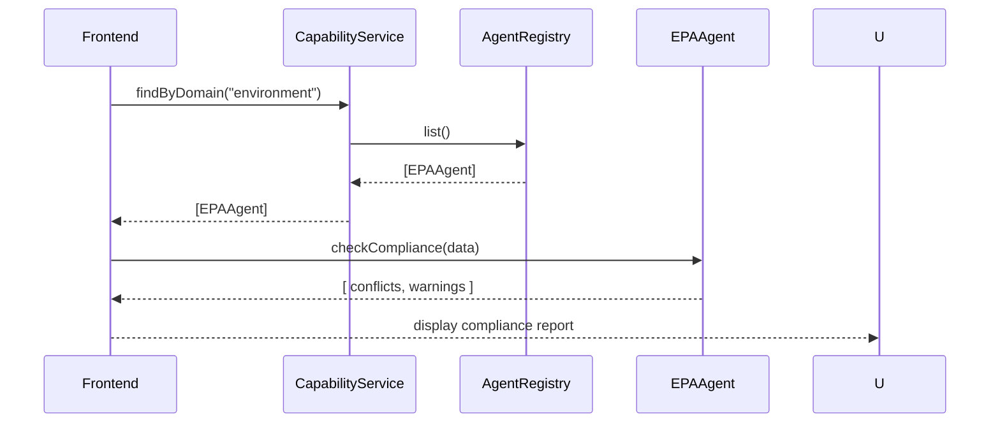

# Chapter 9: Specialized AI Agents

In the last chapter we saw how to wire in a general AI Assistant via [Chapter 8: AI Agent Integration](08_ai_agent_integration_.md). Now let’s focus on **Specialized AI Agents**—domain-tuned modules that deliver targeted insights, compliance checks, and risk assessments for areas like health, finance, education, or the environment.

---

## 9.1 Why Specialized AI Agents?

Imagine two scenarios:

- An **EPA-Focused Agent** reviews draft environmental permits and flags any conflicts with current air-quality regulations.
- An **Education Agent** checks student data workflows for FERPA compliance before files move between schools.

Rather than one size fits all, each agent brings expert rules, models, and checks for its domain. Our system needs a way to:

- **Register** these agents at startup  
- **Discover** what each can do  
- **Invoke** them at runtime when needed  

---

## 9.2 Key Concepts

1. **Agent Registration**  
   Plug your domain agent into the system so it’s known globally.

2. **Capability Discovery**  
   Ask “Which agents handle environmental compliance?” or “Who can do a risk assessment?”

3. **Runtime Integration**  
   Call the right agent method (e.g., `checkCompliance`) with your data and get back results.

---

## 9.3 Registering an Agent

First, we keep a simple registry. Any agent just calls `registerAgent()`.

```js
// File: src/agents/AgentRegistry.js
class AgentRegistry {
  constructor() { this.agents = [] }
  register(agent) { this.agents.push(agent) }
  list() { return this.agents }
}
export default new AgentRegistry()
```

Every agent module can do:

```js
import AgentRegistry from './AgentRegistry'
import EPAAgent from './EPAAgent'

// At app startup
AgentRegistry.register(EPAAgent)
```

Explanation:
- `AgentRegistry` holds all agents in memory.
- Each domain agent calls `register()` once.

---

## 9.4 Discovering Capabilities

To find who can help with “environment,” we filter by a `domain` property:

```js
// File: src/services/CapabilityService.js
import AgentRegistry from '../agents/AgentRegistry'

export function findByDomain(domain) {
  return AgentRegistry.list()
    .filter(a => a.domain === domain)
}
```

Usage example:

```js
const envAgents = findByDomain('environment')
// → [ EPAAgent, AirQualityAgent ]
```

Explanation:
- We look at every registered agent’s `domain` field.
- Returns a list of matching agents.

---

## 9.5 Runtime Integration

Let’s put it all together in a small service that runs compliance checks for environmental data:

```js
// File: src/services/EnvComplianceService.js
import { findByDomain } from './CapabilityService'

export async function runCompliance(payload) {
  const agents = findByDomain('environment')
  const results = []
  for (const agent of agents) {
    // each agent exposes a method like `checkCompliance`
    const res = await agent.checkCompliance(payload)
    results.push({ name: agent.name, issues: res })
  }
  return results
}
```

Explanation:
- We get all “environment” agents.
- We call each one’s `checkCompliance` on our `payload`.
- We collect their findings in an array.

---

## 9.6 Sequence Diagram

Here’s the runtime flow when you invoke environmental checks:



---

## 9.7 Under the Hood: A Sample Agent

Finally, here’s a minimal EPAAgent stub:

```js
// File: src/agents/EPAAgent.js
export default {
  name: 'EPA Agent',
  domain: 'environment',
  async checkCompliance(payload) {
    // pretend we look for regulation codes in the payload
    const conflicts = payload.rules
      .filter(r => r.code.startsWith('AQ-'))
      .map(r => `Conflict with ${r.code}`)
    return conflicts
  }
}
```

Explanation:
- Each agent has `name`, `domain`, and a method like `checkCompliance`.
- You can extend this with more methods (e.g., `riskAssessment`).

---

## 9.8 Conclusion

You’ve learned how to:

- **Register** specialized agents in a global registry  
- **Discover** agents by domain or capability  
- **Invoke** their methods at runtime for targeted checks  

With this pattern, you can plug in domain-specific AI modules—be it for healthcare risk, financial auditing, or educational compliance—cleanly into HMS-GOV.  
Next up: diving into the [Backend API Interface](10_backend_api_interface_.md).

---

Generated by [AI Codebase Knowledge Builder](https://github.com/The-Pocket/Tutorial-Codebase-Knowledge)