# Chapter 10: Legislative Process Engine (HMS-CDF) 🏛️  

*[Coming from the security locks of  
“Security & Authorization Layer (HMS-SYS, Zero-Trust)”](09_security___authorization_layer__hms_sys__zero_trust__.md)*  

---

## 0. Why Do We Need a “Digital Congress”?

Picture the **Veterans Benefits Administration (VBA)**.  
They want to launch a brand-new **“STEM Monthly Stipend”** for vets in science programs.

If the stipend jumps straight into production code…

* Congress might say “Where’s our vote?”
* The Inspector General can’t audit *who* changed *what*.
* A later repeal turns into spaghetti: *Which version was live on August 1?*

**HMS-CDF** is a Rust-powered **Legislative Process Engine** that forces every policy to march through the same constitutional chain-of-custody as a real bill:

```
draft ➜ committee review ➜ floor vote ➜ executive signature ➜ law
```

No stage, no deploy.  
Think of it as a **Capitol Building in software**.

---

## 1. Key Concepts (Beginner Friendly)

| Word | What it Means (Plain English) |
|------|--------------------------------|
| Bill ID | Like a tracking number: `HR-1027-2024` |
| Stage  | Where the bill lives now: `draft`, `committee`, `floor`, `signed` |
| Docket | Database table that lists every bill and its stage |
| Ledger | Append-only log—who moved the bill, when, and why |
| Quorum | Minimum “yes” votes needed for a stage to pass |
| Chain of Custody | Cryptographic proof that each stage happened in order |

---

## 2. First Walk-Through – Passing the STEM Stipend Bill 🎓

Below we’ll:

1. File a draft.  
2. Move it through committee.  
3. Call a floor vote.  
4. Watch the President-bot sign it.

### 2.1  Filing the Draft (CLI, 6 lines)

```bash
hms-cdf bill create \
  --id HR-1027-2024 \
  --title "STEM Monthly Stipend" \
  --author "Rep. Long"
```

Output:

```
Bill HR-1027-2024 created @ stage=draft
```

### 2.2  Committee Review

```bash
hms-cdf bill advance HR-1027-2024 --to committee --notes "VBA funding verified"
```

Explanation:  
The **advance** command asks HMS-CDF to move the bill one square forward.  
If quorum requirements are unmet, the engine rejects the request.

### 2.3  Floor Vote (REST, 9 lines)

```bash
POST /api/cdf/bills/HR-1027-2024/votes
{ "member":"Rep. Patel", "vote":"yes" }
```

Repeat until quorum (e.g., 218 “yes” votes).  
HMS-CDF tallies votes automatically; once quorum hits, the stage flips to `floor_passed`.

### 2.4  Executive Signature

```bash
hms-cdf sign HR-1027-2024 --by "PresidentBot"
```

Engine response:

```
Bill HR-1027-2024 is now LAW 🎉
Snapshot: v2024-10-05-1733
```

The signed snapshot is immediately published to the  
[Backend Policy API](08_backend_policy_api__hms_svc___hms_api__.md) channel **prod**.  
Down-stream micro-services pull the new law like any other policy.

---

## 3. What Happens Under the Hood?

```mermaid
sequenceDiagram
    participant UI as Clerk UI
    participant CDF as HMS-CDF Engine
    participant COM as CommitteeBot
    participant VOT as FloorVoteSvc
    participant EXEC as PresidentBot

    UI->>CDF: create bill
    CDF-->>UI: bill id, stage=draft
    COM->>CDF: approve draft ➜ committee_passed
    VOT->>CDF: yes/no votes
    CDF-->>VOT: quorum met ➜ floor_passed
    EXEC->>CDF: sign bill
    CDF-->>UI: stage=signed, snapshot id
```



Key points:

1. **HMS-CDF** is the single source of truth for *stage* and *ledger*.  
2. Every action appends a row to the **Ledger**, then emits an event  
   (`bill.stage_changed`) which other services (dashboard, monitoring, etc.) listen to.

---

## 4. Peeking Into the Rust Core (18 Lines)

```rust
// File: cdf/src/state.rs
use chrono::Utc;

#[derive(Clone)]
pub enum Stage { Draft, Committee, Floor, Signed }

pub struct Bill {
    pub id:     String,
    pub stage:  Stage,
    pub ledger: Vec<Log>,
}

pub struct Log { ts: i64, actor: String, note: String }

impl Bill {
    pub fn advance(&mut self, actor: &str, note: &str, next: Stage){
        // guardrails: one-direction only
        match (&self.stage, &next) {
            (Stage::Draft, Stage::Committee) |
            (Stage::Committee, Stage::Floor) |
            (Stage::Floor, Stage::Signed) => {
                self.stage = next;
                self.ledger.push(Log{ ts: Utc::now().timestamp(), actor:actor.into(), note:note.into() });
            }
            _ => panic!("Invalid stage jump")
        }
    }
}
```

Beginner explanation:

1. `Stage` is an enum of allowed squares.  
2. `advance()` refuses illegal jumps (e.g., floor → draft).  
3. Each movement adds a **Log** row with timestamp, actor, and notes—our immutable ledger.

---

## 5. Storing & Querying the Docket (SQLite, 11 Lines)

```sql
CREATE TABLE docket (
  id TEXT PRIMARY KEY,
  stage TEXT,
  snapshot TEXT
);

CREATE TABLE ledger (
  id TEXT,
  ts  INTEGER,
  actor TEXT,
  note TEXT
);
```

Every command (`create`, `advance`, `sign`) is just an `INSERT` or `UPDATE` wrapped in a SQL transaction—simple but auditable.

---

## 6. Guards, Vetoes, & HITL

* **Quorum Guard** – `floor` stage auto-fails if yes votes < target.  
* **Veto** – `PresidentBot` (or a human) can veto, which flips the bill back to `floor`.  
* **Manual overrides** route to the [Human-in-the-Loop Oversight](11_human_in_the_loop_oversight__hitl__.md) queue for real staff to decide.

All guard logic lives in tiny Rust functions under `cdf/src/guards.rs`—each <30 lines.

---

## 7. How HMS-CDF Interacts with Other Layers

* **Policy Editor**: authors submit the *draft* text that HMS-CDF stores as `snapshot 0`.  
* **HMS-ACT Workflow Manager**: can embed `advance` commands as workflow steps.  
* **HMS-API**: receives the final signed snapshot for downstream deployment.  
* **Security Layer**: every CLI/API call passes through the Zero-Trust token check you met in [Chapter 9](09_security___authorization_layer__hms_sys__zero_trust__.md).  
* **Metrics & Monitoring**: listens for `bill.stage_changed` to chart legislative velocity.

---

## 8. Tiny “Hello Bill” Example (All Together, 19 Lines)

```js
import { fetchSecure } from '../helpers/fetchSecure.js'   // from Chapter 9

// 1. file draft
await fetchSecure('/api/cdf/bills', {
  method:'POST',
  body: JSON.stringify({ id:'HR-1', title:'Hello', text:'...' })
})

// 2. committee approve
await fetchSecure('/api/cdf/bills/HR-1/advance', {
  method:'POST', body: JSON.stringify({ to:'committee', note:'ok' })
})

// 3. sign immediately (demo)
await fetchSecure('/api/cdf/bills/HR-1/sign', { method:'POST' })
```

Run those three calls and the bill lands in HMS-API as *active policy*—no admin console clicks required.

---

## 9. Quick FAQ

**Q:** Can I skip stages for emergency rules?  
A: Yes—create a special **“Fast-Track” workflow** in HMS-ACT that sets a lower quorum and shorter debate timer. Still logged!

**Q:** Do I need to code in Rust to use HMS-CDF?  
A: No. All public actions are exposed via CLI and REST. Rust only lives inside the container.

**Q:** Is the ledger tamper-proof?  
A: Each log line is hashed with the previous line (block-chain-lite). Any retro edit breaks the hash chain and raises an alarm in Metrics.

---

## 10. Summary & What’s Next

In this chapter you:

1. Saw how HMS-CDF turns **software changes** into **constitutional bills**.  
2. Filed a draft, passed committee, won the floor vote, and received signature.  
3. Peeked at the Rust enum that enforces legal stage order.  
4. Connected HMS-CDF to tokens, workflows, and monitoring.

Next we dive deeper into **how humans can pause, amend, or veto any automated action** in  
[Human-in-the-Loop Oversight (HITL)](11_human_in_the_loop_oversight__hitl__.md).

Happy legislating!

---

Generated by [AI Codebase Knowledge Builder](https://github.com/The-Pocket/Tutorial-Codebase-Knowledge)