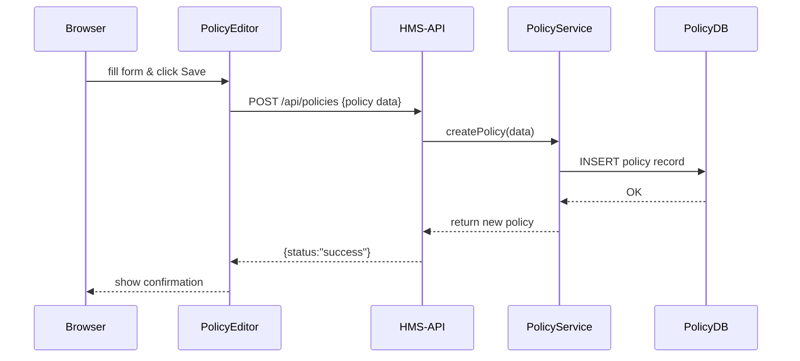

# Chapter 10: PolicyEditor Component

Welcome back! In [Chapter 9: PolicyDashboard Component](09_policydashboard_component_.md), you saw a bird’s-eye view of all policies and workflows. Now let’s zoom in on one policy at a time. The **PolicyEditor** is your focused workspace for **creating** or **editing** a single policy—just like a specialized legislative text editor with built-in validation and contextual help.

---

## 1. Why a PolicyEditor?

Imagine you’re working in the **Federal Highway Administration** drafting a new bridge-inspection rule. You need:

- A clear form for **Policy ID**, **Name**, **Description**, and **Rules**  
- Instant feedback if your JSON logic is malformed  
- Contextual help: “What does `maxSpan` mean?”  
- A live preview of the rule text as it would appear in the official register  

Without a dedicated editor, you’d juggle text files, docs, and external validators. The **PolicyEditor** bundles it all into one friendly UI.

---

## 2. Central Use Case

1. A policy drafter clicks **“New Policy”** in the Dashboard.  
2. The PolicyEditor opens with blank fields.  
3. The drafter fills in:
   - **ID**: `bridge-001`  
   - **Name**: “Bridge Span Limit”  
   - **Description**: “Maximum span between supports”  
   - **Rules** (JSON): `{ "maxSpan": 200 }`  
4. The editor runs **validation** and highlights errors.  
5. Contextual help explains `maxSpan`.  
6. The drafter clicks **Save Draft**.  
7. The new policy appears back in the Dashboard as **Draft**.

---

## 3. Key Concepts

1. **Form Fields**  
   - Inputs for metadata (ID, Name, Description)  
   - A code editor for JSON rules  

2. **Validation**  
   - JSON syntax checks  
   - Business-rule hints (e.g., `maxSpan` must be a number ≥ 0)  

3. **Contextual Help**  
   - Sidebar or tooltips explaining each field  
   - Links to external docs (e.g., Federal Register style guide)  

4. **Live Preview**  
   - Shows how the policy text will look in the “official” layout  

5. **Save & Publish**  
   - **Save Draft**: stays in `Draft`  
   - **Publish**: sets status to `Active` (after running through [Legislative Workflow](07_legislative_workflow_.md))

---

## 4. Using the PolicyEditor

### 4.1 Opening the Editor

```vue
<!-- In Dashboard.vue -->
<button @click="$router.push('/editor')">New Policy</button>
```

Explanation: Clicking **New Policy** navigates to `/editor`, which loads our PolicyEditor component.

### 4.2 Filling the Form

```vue
<!-- In PolicyEditor.vue (template) -->
<template>
  <div class="editor">
    <h1>{{ isEdit ? 'Edit Policy' : 'New Policy' }}</h1>
    <input v-model="policy.id" placeholder="Policy ID" />
    <input v-model="policy.name" placeholder="Policy Name" />
    <textarea v-model="policy.description" placeholder="Description"></textarea>
    <preference-editor v-model="policy.rules" />
    <button @click="saveDraft">Save Draft</button>
    <button @click="publish">Publish</button>
  </div>
</template>
```

Explanation:  
- `v-model` binds form fields to our `policy` data.  
- `<preference-editor>` is a simple JSON editor component (covered below).  
- Two buttons handle saving or publishing.

### 4.3 Saving a Draft

```js
// In PolicyEditor.vue (script)
methods: {
  async saveDraft() {
    try {
      await this.$api.post('/policies', this.policy)
      alert('Draft saved!')
      this.$router.push('/dashboard')
    } catch (e) { alert('Error: ' + e.message) }
  }
}
```

Explanation:  
- Calls `POST /api/policies` on HMS-API.  
- On success, shows a message and returns to the Dashboard.

---

## 5. What Happens Under the Hood



1. The **PolicyEditor** sends your JSON to HMS-API.  
2. HMS-API forwards it to the **PolicyService** ([Chapter 6](06_policy__domain_entity__.md)).  
3. The service saves to the database.  
4. You get a success response.

---

## 6. Internal Implementation

### 6.1 JSON Rules Editor

File: `components/JsonRulesEditor.vue`
```vue
<template>
  <textarea @input="onInput" :value="valueText"></textarea>
</template>
<script>
export default {
  props: ['value'],
  computed: {
    valueText() { return JSON.stringify(this.value, null, 2) }
  },
  methods: {
    onInput(e) {
      try {
        const obj = JSON.parse(e.target.value)
        this.$emit('input', obj)  // valid JSON
      } catch {
        // ignore invalid JSON until next valid change
      }
    }
  }
}
</script>
```

Explanation:  
- Shows a `<textarea>` with pretty-printed JSON.  
- On each change, tries `JSON.parse`. If valid, emits new object to parent.

### 6.2 Contextual Help Sidebar

File: `components/HelpSidebar.vue`
```vue
<template>
  <aside class="help">
    <h3>Field Help</h3>
    <ul>
      <li><strong>maxSpan</strong>: Max span in meters</li>
      <li><strong>inspectionInterval</strong>: Months between inspections</li>
    </ul>
  </aside>
</template>
```

Explanation:  
- A static list of common rule keys and descriptions.  
- You could load this from a central docs API if you like!

---

## 7. Summary and Next Steps

In this chapter you learned how the **PolicyEditor**:

- Provides a simple form for **metadata** and **JSON rules**  
- Offers live **validation** and **contextual help**  
- Saves drafts and publishes policies via HMS-API  

Next up: after publishing, citizens interact with enacted policies in the **[User Portal (HMS-MFE)](11_user_portal__hms_mfe__.md)**.

---

Generated by [AI Codebase Knowledge Builder](https://github.com/The-Pocket/Tutorial-Codebase-Knowledge)