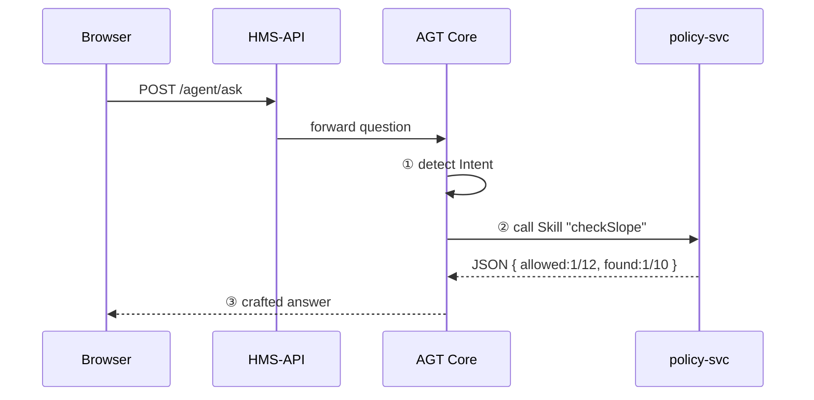

# Chapter 11: AI Representative Agent (HMS-AGT / HMS-AGX)

*(follow-up to [Chapter 10: Universal Health Care Integration (HMS-UHC)](10_universal_health_care_integration__hms_uhc__.md))*  

---

## 1  Why Bother With an “AI Representative”?

Picture this morning at the U.S. Access Board:

1. A citizen named **Jordan** types in a chat box:  
   *“The wheelchair ramps at Riverfront Station are too steep—does this violate § 404.2.4?”*
2. Within seconds the screen shows:  
   *“Yes. The maximum slope allowed is 1:12. Current blueprints show 1:10. A remediation order should be issued.”*
3. A draft **enforcement letter** is already waiting in the Board’s document queue—no human scrolled through the 200-page regulation or hunted for blueprints.

The invisible helper behind the scene is an **AI Representative Agent**:

* HMS-**AGT** = the *standard* agent that reads rules, watches data, and chats.  
* HMS-**AGX** = the *extended* edition that can negotiate across agencies, explain in natural language, and even propose legal text.

> One chat box, endless regulatory super-powers.

---

## 2  Key Concepts (Plain English)

| Concept           | Beginner-friendly meaning                                                    |
|-------------------|------------------------------------------------------------------------------|
| Intent            | What the user wants in one sentence (“check ramp slope”).                    |
| Memory            | Short-term chat history + long-term policy docs already embedded.            |
| Skill             | A small function (API call, SQL query, text generator) the agent can invoke. |
| Guardrail         | A rule that stops the agent from doing illegal or dangerous things.          |
| Persona           | The agent’s “voice” (e.g., formal lawyer vs. casual helper).                 |
| AGT Core          | Base runtime that juggles intents, skills, and guardrails.                   |
| AGX Extension     | Extra pack: cross-agency negotiation, multilingual output, voice synthesis.  |

If you can remember “Intent → Skills → Guardrails,” you already understand 80 % of HMS-AGT.

---

## 3  The 30-Second “Hello Agent” Demo

```javascript
// browser side ─ 18 lines
async function askAgent(question){
  const res = await fetch('/api/agent/ask', {
    method:'POST',
    headers:{'Content-Type':'application/json'},
    body: JSON.stringify({ question })
  })
  const answer = await res.json()          // { reply:"Yes. The slope…" }
  chatBox.append(answer.reply)
}

askAgent("Is 1:10 ramp slope legal for public stations?")
```

Explanation  
1. We POST a question to `/api/agent/ask` (handled by HMS-AGT).  
2. The reply string comes back; we print it in our chat UI.

Zero AI code on the front-end!

---

## 4  What Happens Under the Hood?



1. **Intent** detected: *“check building-code limit.”*  
2. **Skill** `checkSlope` runs in `policy-svc` (our usual micro-service).  
3. **Guardrail** ensures no personal data leaks.  
4. A final, plain-English answer is returned.

---

## 5  Using AGT in Your Own Service

### 5.1 Register a New Skill (backend, 15 lines)

```python
# skills/ramp.py
from hms_agt import register_skill

@register_skill(
  name="checkSlope",
  input_schema={"type":"object","properties":{"station":{"type":"string"}}},
  output_schema={"type":"object","properties":{
      "allowed":{"type":"string"},"found":{"type":"string"}}}
)
def check_slope(payload):
    # pretend we query BIM database here
    slope = "1/10"
    return {"allowed":"1/12","found":slope}
```

Explanation  
• Decorator `@register_skill` tells AGT what the skill does.  
• Any micro-service can host skills; AGT discovers them via the [Service Mesh](01_multi_layered_micro_services_architecture_.md).

### 5.2 Teach the Agent to Use the Skill (8 lines)

```yaml
# agent_config.yaml
skills:
  - name: checkSlope
    description: "Compare ramp slope with ADA limits."
guardrails:
  - deny_if_answer_contains: ["SSN", "DOB"]
persona: "Formal Legal Advisor"
```

Upload this file to HMS-AGT; hot-reload takes < 1 s.

---

## 6  Inside AGT: Five Micro-Files to Know

```
hms-agt/
 ├─ core/
 │   ├─ intent.py        # picks the right skill
 │   ├─ router.py        # calls skill over HTTP
 │   └─ guardrail.py     # redaction & policy checks
 ├─ memory/
 │   └─ vector_store.py  # stores embeddings of docs
 └─ extensions/agx/      # optional super-powers
```

### 6.1 Intent Detector (simplified, 9 lines)

```python
# core/intent.py
def detect(question):
    if "slope" in question: return "checkSlope"
    if "refund" in question: return "issueRefund"
    return "smallTalk"
```

Beginners only need keyword rules; advanced installs can drop in GPT-4.

### 6.2 Guardrail (10 lines)

```javascript
// core/guardrail.js
export function sanitize(text){
  const banned = ["SSN","DOB"]
  for(const b of banned)
     if(text.includes(b)) return "⚠️ Sorry, cannot disclose that."
  return text
}
```

Always runs **after** the skill returns but **before** the user sees text.

---

## 7  What Makes AGX “Extra”?

| AGT (Base)                   | AGX (Extension)                                |
|------------------------------|-----------------------------------------------|
| Skill routing                | Skill *composition* (multi-step plans)        |
| Text chat only               | Speech, sign language, multilingual output    |
| Local policy docs only       | Cross-agency document search via [HMS-A2A](08_secure_inter_agency_communication_layer__hms_a2a__.md) |
| Simple keyword intents       | Large-Language-Model intents with few-shot    |

Install AGX by adding one line to your Helm values:

```yaml
hms-agt:
  features:
    agx: true
```

---

## 8  Hands-On: Drafting a Regulation Update (AGX Feature)

```javascript
// browser ─ 14 lines
const draftBtn = document.getElementById('btnDraft')
draftBtn.onclick = async ()=>{
  const res = await fetch('/api/agent/draft', {
     method:'POST',
     body: JSON.stringify({
        goal:"Update §404.2.4 to allow temporary ramps",
        length:"200 words"
     })
  })
  docEditor.setValue((await res.json()).draft)
}
```

AGX internally:

1. Plans: *“Retrieve current text → Insert clause → Summarize impact.”*  
2. Calls [Policy Editor](05_policy_editor_.md) API to insert the draft.  
3. Sends back markdown ready for human review.

---

## 9  Safety & Oversight

* Every agent answer + underlying skill output is stored in the **Audit Trail** (see [Compliance & Auditing Framework](18_compliance___auditing_framework__hms_ops___hms_esq__.md)).  
* The [Human-in-the-Loop Mechanism](14_human_in_the_loop__hitl__oversight_mechanism_.md) can require manual approval for high-risk actions (e.g., publishing a regulation).  
* Rate limiting: default **30 questions/min** per user via the [API Gateway](02_backend_api_gateway__hms_svc___hms_api__.md).

---

## 10  Beginner FAQ

**Q: Do I need to know machine learning to add a skill?**  
No. A skill is just a REST function. AGT handles the AI bits.

**Q: How big can Memory get?**  
Memory uses embeddings; 100 MB of docs fits in 50 MB of vector store—cheap.

**Q: Can citizens use AGT?**  
Yes, but Guardrails redact sensitive details and throttle heavy tasks.

**Q: Is AGX required?**  
No. Start with AGT; flip on AGX when you need extra features.

---

## 11  What You Learned

• HMS-AGT turns a simple chat box into a **tireless digital policy analyst**.  
• Core flow: **Intent → Skill → Guardrail → Reply**.  
• You add skills in ≤ 15 lines and configure behavior with YAML.  
• HMS-AGX layers on cross-agency super-powers, multilingual output, and auto-drafting.  

Next we’ll see how to pass rich *context* (who, what, why) to any model or agent using the [Model Context Protocol (HMS-MCP)](12_model_context_protocol__hms_mcp__.md).

---

Generated by [AI Codebase Knowledge Builder](https://github.com/The-Pocket/Tutorial-Codebase-Knowledge)