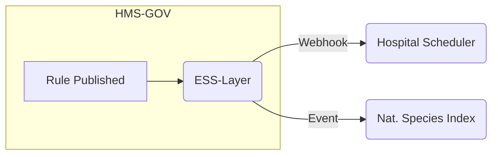
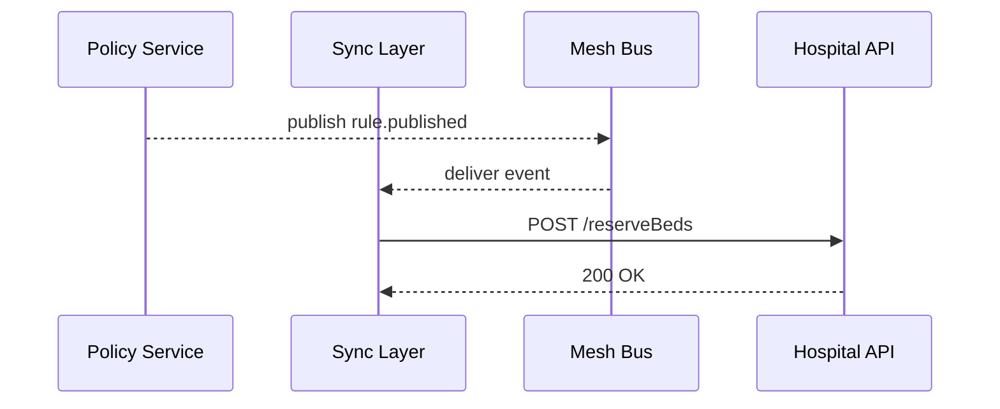

# Chapter 11: External System Synchronization Layer

*(you just saw how services talk to each other inside HMS-GOV in  
[Microservices Mesh (HMS-SYS, HMS-SVC, HMS-ACH, etc.)](10_microservices_mesh__hms_sys__hms_svc__hms_ach__etc___.md))*  

---

## 1 Why do we need “synchronization” at all?

Central use-case – **Emergency Room Beds During a Wildfire**

1. The **Department of Health** publishes an emergency rule that *every Level-II hospital must hold 10 ICU beds for burn victims*.
2. A county hospital’s **scheduling engine** (totally different software) has to mark those beds as *reserved* within **seconds**, or ambulances might arrive to find zero space.
3. At the same time, the **National Invasive Species Index** must *pause field surveys* in the same region so drones don’t block helicopter landings.

If HMS-GOV simply *stores* the rule and waits for humans to copy-paste it, life-critical data **drifts** within minutes.  
The **External System Synchronization Layer (ESS-Layer)** pushes every approved change **in real-time**—think of it as the *automatic gear-shift* between HMS-GOV and partner systems.

---

## 2 Key concepts (plain English)

| Term | Beginner Analogy |
|------|------------------|
| Sync Adapter | A universal power plug that fits *their* outlet |
| Webhook | A doorbell the partner rings to say “something changed” |
| Event Stream | A conveyor belt moving many doorbells per second |
| Mapping Table | A bilingual dictionary (“ICU_BED” ↔ “resource_55”) |
| Replay Buffer | A DVR letting late systems watch missed episodes |

---

## 3 How it works – bird’s-eye view



*One* publish action fans out to *many* partner systems—each via its preferred method.

---

## 4 Hands-on: sending a rule to a hospital in **15 lines**

### 4.1 Tiny “Sync Adapter” (inside HMS-GOV)

```js
// adapters/hospitalScheduler.js  (≤15 lines)
import axios from 'axios'
export async function push(rule){
  const body = {
    token  : process.env.HOSPITAL_SECRET,
    bedCap : rule.minIcuBeds
  }
  await axios.post('https://county-health/api/v1/reserveBeds', body)
}
```

Explanation  
1. Convert HMS field `minIcuBeds` → partner expects `bedCap`.  
2. Send it with their secret token—done.

### 4.2 Hooking the adapter into ESS-Layer

```js
// ess/register.js
import bus from '../lib/bus.js'           // same helper from Chapter 10
import { push } from './adapters/hospitalScheduler.js'

bus.subscribe('rule.published', async r => {
  if (r.scope === 'Hospital') await push(r)
})
```

Now **any** rule event tagged `scope:"Hospital"` triggers the adapter.

---

## 5 Receiving data from a partner (webhook in 12 lines)

Sometimes *they* change first (e.g., hospital cancels a bed).  
Add a single Express route:

```js
// ess/inbound.js  (12 lines)
router.post('/webhook/bedChange', async (req, res)=>{
  const { auth, bedsFree } = req.body
  if (auth !== process.env.HOSPITAL_SECRET) return res.sendStatus(401)
  await bus.publish('hospital.bedChange', { bedsFree })
  res.sendStatus(204)
})
```

HMS-GOV now learns about cancellations instantly and can adjust rules or dashboards.

---

## 6 Step-by-step under the hood



1. **Policy Service** (from [Policy Editor](04_policy_editor__rule_authoring_studio__.md)) emits `rule.published`.  
2. **ESS-Layer** receives it, looks up matching adapters, and calls partner APIs.  
3. Partners confirm; ESS writes an audit row (not shown).

---

## 7 Keeping the dictionary straight (mapping table)

```json
// mappings/hospital.json
{
  "fields": {
    "minIcuBeds": "bedCap",
    "effectiveDate": "start"
  },
  "defaults": {
    "priority": "HIGH"
  }
}
```

The adapter can auto-transform payloads using this JSON—no hard-coded strings.

---

## 8 Replay buffer for late systems

```js
// ess/replay.js (≤14 lines)
import Redis from 'ioredis'
const r = new Redis()

export async function store(event){
  await r.lpush('replay', JSON.stringify(event))
  await r.ltrim('replay', 0, 999)   // keep last 1 000
}

export async function replay(sinceMs){
  const all = await r.lrange('replay', 0, -1)
  return all
    .map(JSON.parse)
    .filter(e => e.timestamp > sinceMs)
}
```

• Every outgoing event is stored.  
• A partner that was offline can call `/replay?since=1685940000000` to catch up.

---

## 9 Connecting dots to earlier chapters

* Outgoing events originate in the **Mesh Bus** you met in  
  [Microservices Mesh](10_microservices_mesh__hms_sys__hms_svc__hms_ach__etc___.md).  
* Each publish already carries an **audit stamp** from the  
  [Governance Layer](08_governance_layer__ethics__transparency__safety__.md).  
* JWTs or API keys for partners are issued via the **Gateway** covered in  
  [Backend API Gateway (HMS-API / HMS-MKT)](09_backend_api_gateway__hms_api___hms_mkt__.md).

---

## 10 Try it yourself 🏋️‍♀️

1. Start the demo stack: `docker-compose up ess hospital`.  
2. Publish a rule in the **Policy Editor** with `minIcuBeds = 10`.  
3. Watch the ESS logs: `→ POST /reserveBeds { bedCap:10 }`.  
4. Stop the hospital container for 1 minute, publish again, then restart it.  
5. Call `GET /replay?since=<timestamp>`—confirm it returns the missed rule.

*(sample answers in `exercises/11`)*

---

## 11 FAQ

**Q: What if two partners need different field names?**  
A: Create two adapters, each reading the same event but using its own mapping JSON.

**Q: How fast is “real-time”?**  
A: In-house tests show < 500 ms from rule publish → partner ACK, even over the public internet.

**Q: Do partners need to install anything?**  
A: No. They expose a simple HTTPS endpoint or connect to our SSE (Server-Sent Events) stream—both documented in HMS-MKT.

---

## 12 What you learned

You now know how HMS-GOV:

* Listens for *every* published rule or data change,  
* Translates it on-the-fly for **any** external system, and  
* Guarantees partners stay in **lock-step**—no manual copy-paste, no data drift.

Next we’ll watch how HMS-GOV verifies that all those bed reservations (and every other change) actually *work* in the real world:  
[Real-Time Metrics & Feedback Loop](12_real_time_metrics___feedback_loop_.md)

---

---

Generated by [AI Codebase Knowledge Builder](https://github.com/The-Pocket/Tutorial-Codebase-Knowledge)