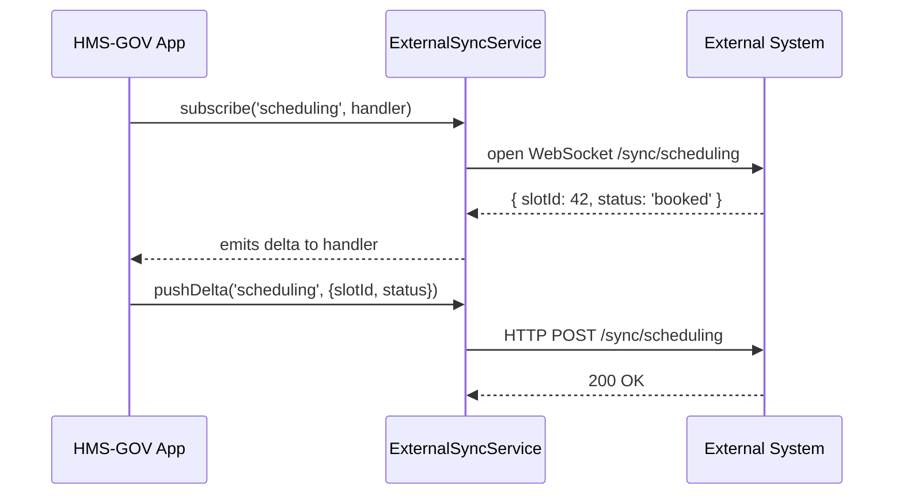

# Chapter 11: External System Synchronization

In [Chapter 10: Backend API Interface](10_backend_api_interface_.md) we learned how our frontend talks to HMS-API. Now we’ll see how HMS-GOV keeps data in sync with other systems—like a courier network delivering policy memos instantly between departments.

---

## 1. Why External System Synchronization?

Imagine the National Park Service uses a third-party scheduling tool for ranger tours, while its legacy habitat database lives in a different system. When a citizen books a tour, we need:

- The **scheduling app** to know the latest ranger availability  
- The **legacy database** to log the booking  
- Our **policy dashboard** to reflect the new reservation immediately  

External System Synchronization is the interagency courier: it tracks changes, sends only the diffs (delta merges), and reconciles conflicts so every system sees the same updated data in real time.

---

## 2. Key Concepts

1. **Connectors (Adapters)**  
   Small modules that speak the external system’s API or database protocol.

2. **Change Events**  
   Notifications emitted whenever data changes (e.g., “TourSlotBooked”).

3. **Delta Merge**  
   We send only what changed (the “delta”) instead of full records, saving bandwidth.

4. **Conflict Reconciliation**  
   When two systems update the same field, we apply rules (e.g., “last writer wins” or “manual review”).

5. **Event Queue / Streams**  
   A real-time pipeline (e.g., Kafka, WebSockets) that delivers change events to all subscribers.

---

## 3. Using the ExternalSyncService

Here’s a beginner-friendly example where we subscribe to changes in the scheduling system and push them into our policy dashboard.

```js
// File: src/services/ExternalSyncService.js
import WebSocketClient from 'ws-client' // simplified

export default {
  subscribe(entity, onChange) {
    const socket = WebSocketClient.connect(`/sync/${entity}`)
    socket.on('delta', onChange)
  },
  pushDelta(entity, delta) {
    return fetch(`/sync/${entity}`, {
      method: 'POST',
      body: JSON.stringify(delta),
      headers: { 'Content-Type': 'application/json' }
    })
  }
}
```

Explanation:
- `subscribe()` opens a WebSocket to listen for deltas on `entity`.  
- `pushDelta()` sends our local change back to the external system.

Usage in a Vue component:

```js
import ExternalSyncService from '../services/ExternalSyncService'

export default {
  mounted() {
    ExternalSyncService.subscribe('scheduling', delta => {
      console.log('New booking:', delta)
      this.updateLocalSchedule(delta)
    })
  },
  methods: {
    async bookSlot(slot) {
      // user books a slot
      const delta = { slotId: slot.id, status: 'booked' }
      await ExternalSyncService.pushDelta('scheduling', delta)
    }
  }
}
```

---

## 4. What Happens Under the Hood?



1. The app **subscribes** and listens for deltas via WebSocket.  
2. The external system sends a **delta** event (only changed fields).  
3. The app handles and **applies** the delta locally.  
4. When we **book** a slot, we `pushDelta()` back to the external system.

---

## 5. Under the Hood: Implementation Details

### 5.1 Connector Registration

```js
// File: src/connectors/SchedulingConnector.js
import ExternalSyncService from '../services/ExternalSyncService'
import ConflictResolver from '../services/ConflictResolver'

ExternalSyncService.subscribe('scheduling', delta => {
  // 1. Merge the delta into our DB
  Database.upsert('tour_slots', delta)
  // 2. Reconcile conflicts if needed
  ConflictResolver.resolve('tour_slots', delta.id)
})
```

Explanation:
- When a delta arrives, we upsert into our local table.  
- We then call `ConflictResolver` to handle any overlapping updates.

### 5.2 Conflict Resolver Stub

```js
// File: src/services/ConflictResolver.js
export default {
  resolve(entity, id) {
    const records = Database.findAll(entity, { id })
    // simple rule: keep the record with the latest timestamp
    const winner = records.sort((a,b) => b.updatedAt - a.updatedAt)[0]
    Database.save(entity, winner)
  }
}
```

Explanation:
- It fetches multiple versions of the same record.  
- Picks the newest one (`updatedAt`) and saves it as the single source of truth.

---

## 6. Summary

In this chapter you learned how HMS-GOV:

- Registers **connectors** to external systems  
- Listens to **change events** via WebSocket or queues  
- Sends **delta merges** instead of full payloads  
- Uses a **ConflictResolver** for overlapping updates  

This “courier network” ensures your scheduling, legacy databases, and third-party services all stay in lockstep. In the next chapter, we’ll see how to build dashboards and controls over these sync jobs in [Chapter 12: Management Layer](12_management_layer_.md).

---

Generated by [AI Codebase Knowledge Builder](https://github.com/The-Pocket/Tutorial-Codebase-Knowledge)