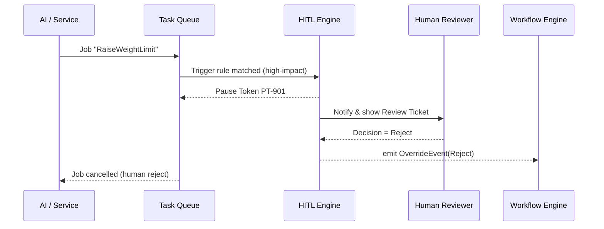

# Chapter 11: Human-in-the-Loop (HITL) Override  

*(coming from [Compliance & Legal Reasoning Engine (HMS-ESQ)](10_compliance___legal_reasoning_engine__hms_esq__.md))*  

---

> “An AI may drive the train, but a conductor still holds the red brake handle.”

The HITL Override lets HMS-GOV **pause** any automatic action, **route** it to human officials, and **record** the final decision.  
It is your emergency brake that balances AI speed with democratic accountability.

---

## 1. Why do we need an emergency brake?

### Concrete use-case:  
The **Transportation Department** AI agent proposes raising the national truck weight limit from **80 000 lbs → 85 000 lbs** to cut shipping costs.

1. Clerk clicks **Submit**.  
2. [HMS-ESQ](10_compliance___legal_reasoning_engine__hms_esq__.md) returns `verdict:"warning"` – the change is *probably* legal but politically sensitive.  
3. Because the weight limit affects **public safety**, HMS-GOV flags it as **High-Impact**.  
4. HITL automatically pauses the rollout and notifies the **Defense Security Cooperation Agency** and **Transportation Department** reviewers.  
5. A deputy secretary logs in, reads the AI’s memo, and chooses **Reject**.  
6. The system resumes workflow, marking the proposal “Stopped by Human Override” in the ledger.

Result: AI efficiency plus a clear human fingerprint.

---

## 2. Key concepts (plain English)

| Term | Analogy | Beginner explanation |
|------|---------|----------------------|
| Trigger | Smoke detector | Rule that decides when human review is required. |
| Pause Token | Parking brake | ID that freezes the original task until cleared. |
| Review Ticket | Sticky note | Record shown to human reviewers with accept / reject buttons. |
| Decision | Thumbs-up / thumbs-down | Human verdict: **Approve**, **Reject**, **Modify**. |
| Audit Trail | Security camera | Immutable log of who decided what, when, and why. |

Keep these five nouns in mind—everything else is glue.

---

## 3. Two-minute tour: from trigger to decision



Five actors, one clear path.

---

## 4. Adding HITL to your code (client view)

### 4.1 Service or agent submits an action

```js
// services/transport/setWeight.js   (≤18 lines)
import { queue } from '../oms/client.js'

export async function proposeWeight(newLimit){
  await queue.add('policy-change', {
    topic   : 'truck_weight',
    newLimit: newLimit
  })
}
```

Exactly the same as before—no extra lines to call HITL.  
The **Trigger** lives server-side and intercepts sensitive jobs.

---

### 4.2 Reviewer UI (micro-frontend)

```vue
<!-- bricks/HitlInbox.vue (simplified) -->
<template>
  <h2>HITL Inbox</h2>
  <div v-for="t in tickets" :key="t.id">
    <p>{{ t.summary }}</p>
    <button @click="decide(t,'approve')">Approve</button>
    <button @click="decide(t,'reject')">Reject</button>
  </div>
</template>

<script setup>
import { ref,onMounted } from 'vue'
const tickets = ref([])

onMounted(async ()=> {
  tickets.value = await fetch('/api/hitl/tickets').then(r=>r.json())
})

async function decide(t,verdict){
  await fetch(`/api/hitl/tickets/${t.id}`,{
    method:'POST',
    headers:{'Content-Type':'application/json'},
    body:JSON.stringify({ verdict })
  })
  tickets.value = tickets.value.filter(x=>x.id!==t.id)
}
</script>
```

What it does:  
1. Lists all open Review Tickets for the logged-in official.  
2. Sends the verdict with one POST call.  
3. Removes the ticket from the list immediately.

Total code: **< 20 lines**.

---

## 5. How the trigger works (server side)

```js
// hitl/trigger.js  (≤16 lines)
export function needsHitl(job){
  const highImpact = ['truck_weight','military_aid','tax_rate']
  return highImpact.includes(job.data.topic)
      || job.data.budgetChange > 1_000_000
}
```

• Called automatically for every new queue job.  
• Returns **true** → create Pause Token.

---

## 6. Pausing and resuming a job

```js
// hitl/pause.js  (≤20 lines)
import { Queue, QueueEvents } from 'bullmq'
const q = new Queue('policy-change')
const events = new QueueEvents('policy-change')

// Pause new job
export async function pause(job){
  await q.pause()               // stop workers
  await job.update({ paused:true })
  return `PT-${job.id}`
}

// Resume when done
export async function resume(){
  await q.resume()
}
```

Explanation  
1. `pause()` halts *all* workers for the queue in <1 ms.  
2. The Pause Token (`PT-…`) is stored on the job as metadata.  
3. `resume()` restarts the queue once a human verdict comes in.

---

## 7. Putting it together: HITL worker

```js
// workers/hitlWorker.js  (≤20 lines)
import { Worker, Queue } from 'bullmq'
import { needsHitl } from '../hitl/trigger.js'
import { pause } from '../hitl/pause.js'

const reviewQ = new Queue('hitl-review')

new Worker('policy-change', async job => {
  if (needsHitl(job)) {
    const token = await pause(job)
    await reviewQ.add('review', {
      ticketId : job.id,
      token,
      summary  : `Weight limit → ${job.data.newLimit} lbs`
    })
    return        // do NOT run the job
  }
  // …execute normal logic here…
})
```

Line-by-line:  
1–2 Import helpers.  
5 Create queue for review tickets.  
8 Worker checks every incoming job.  
9–12 If trigger matches → pause queue + enqueue Review Ticket.  
13 Return early so nothing happens until verdict.

---

## 8. Storing the decision (audit)

```sql
CREATE TABLE hitl_ledger (
  ticket_id   TEXT,
  reviewer_id TEXT,
  verdict     TEXT,   -- approve / reject / modify
  timestamp   TIMESTAMPTZ,
  notes       TEXT
);
```

Every POST from the reviewer UI writes one row.  
Later auditors can prove **who** overrode **what**.

---

## 9. FAQ

| Question | Answer |
|----------|--------|
| Can multiple reviewers see the same ticket? | Yes—HITL assigns to a **pool**; first response wins, others see “resolved”. |
| Is the pause system-wide? | No—only the affected queue is paused; other services remain live. |
| What if no one responds in time? | A timer in [HMS-OMS](05_service_orchestration___task_queues__hms_oms__.md) escalates after `HITL_TIMEOUT_H` hours. |
| Can AI suggest a verdict? | Yes—[HMS-AGT](06_ai_representative_agent__hms_agt___hms_agx__.md) can pre-fill a draft memo; humans still click the button. |

---

## 10. Recap & what’s next

You learned:

✓ Why HITL Override is the **safety switch** for high-impact AI actions.  
✓ Five simple concepts: Trigger, Pause Token, Review Ticket, Decision, Audit Trail.  
✓ How a 20-line worker pauses risky jobs and routes them to humans.  
✓ How officials approve or reject via a super-simple micro-frontend.  
✓ How everything is logged for legal compliance.

When the decision is made, HMS-GOV often needs to notify **external systems** (e.g., state DOT databases, federal registers).  
That is the topic of the next chapter:  
[External System Synchronization (HMS-GOV Connectors)](12_external_system_synchronization__hms_gov_connectors__.md)

---

Generated by [AI Codebase Knowledge Builder](https://github.com/The-Pocket/Tutorial-Codebase-Knowledge)