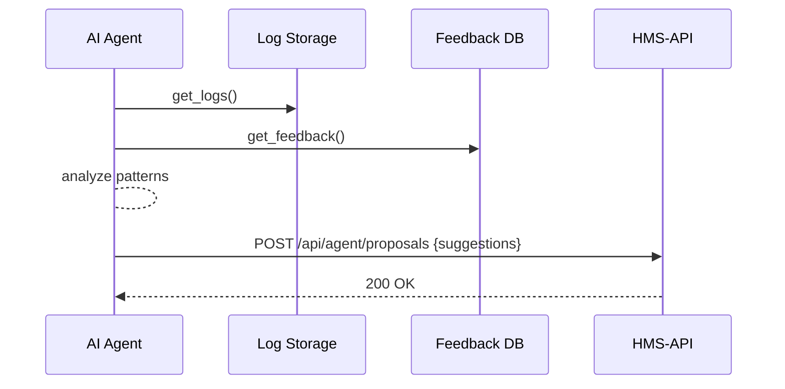

# Chapter 12: AI Representative Agent

In [Chapter 11: User Portal (HMS-MFE)](11_user_portal__hms_mfe__.md), we saw how citizens submit requests and track them. Now let’s meet our **AI Representative Agent**—an autonomous “consulting analyst” that reviews logs, user feedback, and metrics to suggest smarter workflows to our government team.

---

## 1. Why an AI Representative Agent?

Imagine the Bureau of Consular Affairs has a backlog of passport applications. They want to:

- Understand where delays happen  
- Know what citizens complain about  
- Propose specific process fixes (for example, “add a cache for common form data”)

Hiring a human consultant takes weeks and costs a lot. Our **AI Representative Agent** does the same analysis automatically and provides recommendations whenever you ask.

---

## 2. Central Use Case: Optimizing Passport Processing

1. The agent **fetches** operational logs (e.g., request timings).  
2. It **pulls** user feedback scores and comments.  
3. It **analyzes** patterns (like “80% of delays occur in payment validation”).  
4. It **proposes** a process change (for example, “move payment check after identity check”).  
5. The suggestions are sent to the Admin Portal for review.

---

## 3. Key Concepts

- **AI Representative Agent**  
  A software actor that autonomously runs analyses and generates suggestions.

- **Data Sources**  
  Logs, metrics, user feedback, operational counters.

- **Analysis Pipeline**  
  Steps the agent takes: fetch data → detect bottlenecks → rank issues.

- **Proposal Format**  
  A simple JSON list of `{action, rationale, expectedBenefit}` objects.

---

## 4. How to Use the AI Agent

Here’s a very simple example in Python:

```python
# file: agents/ai_representative_agent.py

from clients.log_client import LogClient
from clients.feedback_client import FeedbackClient

# 1. Create the agent with data clients
agent = AIRepresentativeAgent(LogClient(), FeedbackClient())

# 2. Run its analysis
suggestions = agent.run()

# 3. Print out the recommended actions
for s in suggestions:
    print(f"- Action: {s['action']}, Benefit: {s['expectedBenefit']}")
```

When you run this, you might see:

```
- Action: Cache validation results, Benefit: 30% fewer slow requests
- Action: Batch email notifications, Benefit: 50% lower queue time
```

---

## 5. What Happens Under the Hood



1. **Agent** fetches logs and feedback.  
2. It analyzes delays and complaints.  
3. It sends a list of suggestions to the HMS-API.

---

## 6. Internal Implementation

Let’s look at a minimal agent class:

```python
# file: agents/ai_representative_agent.py

class AIRepresentativeAgent:
    def __init__(self, log_client, feedback_client):
        self.logs = log_client
        self.fb = feedback_client

    def run(self):
        # Fetch data
        entries = self.logs.get_logs()
        comments = self.fb.get_all()

        # Simple analysis: count slow requests
        slow = [e for e in entries if e['duration_ms'] > 2000]
        action = 'Cache validation results'
        benefit = f"{len(slow)} fewer slow calls"

        return [{
            'action': action,
            'rationale': 'Many requests take >2s',
            'expectedBenefit': benefit
        }]
```

Explanation:
1. The agent pulls raw data.  
2. It applies basic logic to find “slow” events.  
3. It returns a one-item list with a proposed action.

### Exposing the Agent via API

```javascript
// file: hms-api/routes/agent.js

import express from 'express'
import { AIRepresentativeAgent } from '../../agents/ai_representative_agent.js'
import LogClient from '../../clients/log_client.js'
import FeedbackClient from '../../clients/feedback_client.js'

const router = express.Router()
const agent = new AIRepresentativeAgent(new LogClient(), new FeedbackClient())

router.post('/agent/run', async (req, res) => {
  const suggestions = agent.run()
  res.json({ suggestions })
})

export default router
```

- **POST** `/api/agent/run` triggers the analysis.  
- Returns `{ suggestions: [...] }` to the caller.

---

## Conclusion

In this chapter, you learned how the **AI Representative Agent** acts like a virtual consultant—analyzing logs and feedback, then suggesting process improvements automatically. Next, we’ll see how those suggestions become formal **Process Proposals** in [Chapter 13: Process Proposal](13_process_proposal_.md).

---

Generated by [AI Codebase Knowledge Builder](https://github.com/The-Pocket/Tutorial-Codebase-Knowledge)