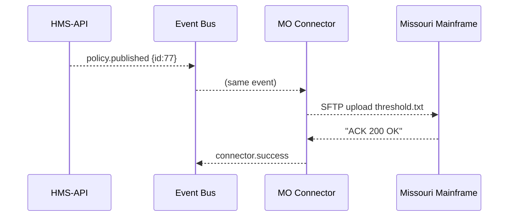

# Chapter 12: External System Synchronization (HMS-GOV Connectors)


*[Arriving from **[Human-in-the-Loop Oversight (HITL)](11_human_in_the_loop_oversight__hitl__.md)**?  
Perfect—you just saw how humans approve an action.  
Now let’s push that approved change into the maze of legacy systems that still run government services.]*

---

## 0. Why Do We Need “Power-Cord Converters” for Data?

Picture the **Centers for Medicare & Medicaid Services (CMS)**.  
A clerk just approved a rule change that raises the **Medicaid income ceiling** from `$1 750 → $1 900`.

Inside HMS-GOV the rule is stored as clean JSON:

```json
{ "policyId": 77, "incomeThreshold": 1900, "effective": "2024-10-01" }
```

But the 1984 COBOL mainframe in *State of Missouri Health Net* expects **fixed-width text**:

```
INCOME-THRSHLD:0000001900EFFECT:20241001
```

If we dump raw JSON into that mainframe, it will choke faster than a fax machine fed a TikTok video.  

**HMS-GOV Connectors** are the *power-cord converters* that:

1. Detect an internal change,  
2. Translate it to the external system’s native format, and  
3. Confirm the remote system really accepted it.

Result: CMS, Missouri, and citizens stay in *real-time* sync.

---

## 1. Key Concepts (Plain English)

| Term | Think “Beginner” |
|------|------------------|
| Connector | A plug-in that knows **one** external system’s language. |
| Trigger Event | “Something changed!” — e.g., policy `77` published. |
| Mapping Function | Code that turns internal JSON → external format. |
| Delivery Channel | How we send data (`REST`, `SFTP`, `Kafka`, etc.). |
| Ack (Acknowledgement) | Proof the external system stored the update. |

---

## 2. Use Case Walk-Through – Updating a Medicaid Threshold

We will:  

1. Listen for the **publish** event from [Backend Policy API](08_backend_policy_api__hms_svc___hms_api__.md).  
2. Map the JSON into Missouri’s fixed-width spec.  
3. Push via *secure SFTP*.  
4. Write a success log entry visible in the Dashboard.

### 2.1 Minimal Connector Skeleton (Node, 18 lines)

```js
// File: connectors/mo_medicaid.js
import { on } from '../bus.js'      // tiny event bus helper
import { sftpPut } from '../lib/sftp.js'

on('policy.published', async evt => {
  if(evt.policyId !== 77) return            // only our policy
  const payload = map(evt.payload)          // 1️⃣ translate
  await sftpPut('/in/threshold.txt', payload) // 2️⃣ deliver
  console.log('✅ Missouri threshold synced')
})

function map(p){                            // 8 lines
  return `INCOME-THRSHLD:${p.incomeThreshold.toString().padStart(10,'0')}`
       + `EFFECT:${p.effective.replace(/-/g,'')}`
}
```

**What it does**

1. Subscribes to the event `policy.published`.  
2. Filters to policy `77`.  
3. Transforms JSON → fixed-width line.  
4. Drops the file onto Missouri’s SFTP inbox.  
5. Prints success (later we’ll emit a log event).

### 2.2 Registering the Connector (2 lines)

```js
// File: connectors/index.js
import './mo_medicaid.js'     // add more lines as you write connectors
```

HMS-GOV loads this file at startup; any `import` auto-registers.

---

## 3. What Happens Under the Hood?



1. **HMS-API** emits the event after the clerk’s approval reaches production.  
2. **Connector** listens, converts, and uploads.  
3. On ACK, it fires `connector.success` for metrics or alerts.

---

## 4. Deep-Dive Code Snippets

### 4.1 Tiny Event Bus (6 lines)

```js
// File: bus.js
const subs = {}
export function on(event, fn){ (subs[event] ||= []).push(fn) }
export function emit(event, data){
  (subs[event]||[]).forEach(fn => fn(data))
}
```

Beginner friendly: `on()` to listen, `emit()` to broadcast.

### 4.2 Mock SFTP Helper (11 lines)

```js
// File: lib/sftp.js
export async function sftpPut(path, data){
  /* ✂️ real connection code skipped */
  console.log(`(fake SFTP) PUT ${path} ->`, data)
  return 'ACK 200 OK'
}
```

It only logs for demo; swap with `ssh2-sftp-client` in production.

### 4.3 Logging Success to Dashboard (12 lines)

```js
// File: connectors/logger.js
import { on, emit } from '../bus.js'
on('connector.success', e => {
  emit('dashboard.notify', {
    message: `Connector ${e.name} synced OK`,
    time: Date.now()
  })
})
```

A micro-frontend widget in the Dashboard listens to `dashboard.notify` and shows a green toast.

---

## 5. Handling Failures & Retries

1. Wrap `sftpPut()` in `try…catch`.  
2. On error, emit `connector.failure`.  
3. A *retry worker* (5 lines) listens and requeues with exponential back-off.

> Tip: set `maxRetries: 5`; after that route to the [HITL queue](11_human_in_the_loop_oversight__hitl__.md) so a human can phone Missouri IT.

---

## 6. Adding More Connectors in 3 Steps

1. **Create** `connectors/<system>.js`.  
2. **Write** `map()` from internal JSON → target syntax (CSV, XML, SOAP…).  
3. **Register** it in `connectors/index.js`.

Repeat for **Court Docket Scheduler**, **Fulbright Applicant DB**, or **NIDCD Clinical Trial Registry**—each in its own file, no core change required.

---

## 7. Relationship to Other HMS-GOV Layers

* Source events come from [Backend Policy API](08_backend_policy_api__hms_svc___hms_api__.md).  
* Delivery status feeds **Metrics & Monitoring** (see [Chapter 14](14_metrics___monitoring__hms_ops___hms_act_telemetry__.md)).  
* Critical failures escalate via [HITL](11_human_in_the_loop_oversight__hitl__.md).  
* For connectors talking **between agencies** rather than legacy systems, you’ll soon meet the  
  **[Inter-Agency Communication Bus (HMS-A2A)](13_inter_agency_communication_bus__hms_a2a__.md)**.

---

## 8. Quick FAQ

**Q: Real-time or batch?**  
A: Up to you—listen to `policy.published` (real-time) *or* schedule a nightly batch that pulls `/api/policies?changedSince=…`.

**Q: How do I test without touching production?**  
A: Pass `X-Channel: test` when publishing, and point the connector to Missouri’s **UAT** SFTP box.

**Q: What if the external spec changes?**  
A: Update *only* the `map()` function in that connector—no other system breaks.

---

## 9. Summary & Next Stop

You learned:

1. Why HMS-GOV needs connectors to talk to decades-old external systems.  
2. The five ingredients—Trigger, Mapping, Delivery, Ack, Log.  
3. Wrote a full Medicaid threshold connector in <20 lines of code.  
4. Saw error handling, retries, and dashboard notifications.  
5. Understood how connectors glue into the broader HMS-GOV architecture.

Next we’ll see how **agencies** talk **to each other** over a shared bus, not just to legacy boxes.  
➡️ Continue to **[Inter-Agency Communication Bus (HMS-A2A)](13_inter_agency_communication_bus__hms_a2a__.md)**.

---

Generated by [AI Codebase Knowledge Builder](https://github.com/The-Pocket/Tutorial-Codebase-Knowledge)