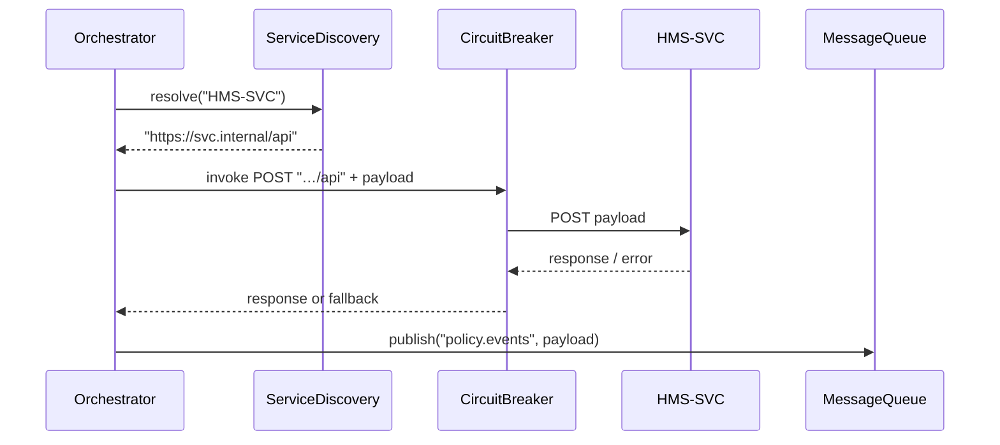

# Chapter 12: Management Layer

In [Chapter 11: External System Synchronization](11_external_system_synchronization_.md), we learned how to keep our data in sync with third-party tools and legacy databases. Now it’s time to look “under the hood” at how all our microservices talk to each other, stay healthy, and recover from failures. This is the **Management Layer**—the interagency operations center orchestrating HMS-SVC, HMS-A2A, HMS-ACH and more.

---

## 12.1 Why a Management Layer?

Imagine the Department of Homeland Security coordinating border security, customs, and immigration checks—each handled by its own microservice. The Management Layer is like the command center:

- It **discovers** which services are up and where they live  
- It sends messages between them using **queues**  
- It watches health metrics and **alerts** on errors  
- It uses **circuit breakers** to prevent cascading failures  

Without this layer, each microservice would need custom glue code and risk traffic jams or single points of failure.

---

## 12.2 Key Concepts

1. **Service Discovery**  
   How we find the network address of HMS-SVC, HMS-A2A, or HMS-ACH at runtime.

2. **Message Queues**  
   A broker (e.g., RabbitMQ or Kafka) that holds events like “New Permit Submitted” until a consumer picks them up.

3. **Monitoring & Alerts**  
   Tracking request counts, latencies, and failures; firing alerts when thresholds exceed safe limits.

4. **Circuit Breaker**  
   A protective wrapper around remote calls that stops calling a failing service for a time, allowing it to recover.

---

## 12.3 Using the Management Layer

Here’s a minimal example of how a “Service Orchestrator” component might send a request to HMS-SVC, publish an event to HMS-ACH, and handle retries:

```js
// File: management/ServiceOrchestrator.js
import Discovery from './ServiceDiscovery'
import MessageQueue from './MessageQueue'
import CircuitBreaker from './CircuitBreaker'
import Monitor from './Monitoring'

export default {
  async callService(name, payload) {
    // 1. Find the right endpoint
    const url = Discovery.resolve(name)
    // 2. Wrap the call in a circuit breaker
    const invoke = () => fetch(url, {
      method:'POST',
      headers:{'Content-Type':'application/json'},
      body: JSON.stringify(payload)
    })
    const safeCall = CircuitBreaker.wrap(invoke)
    // 3. Monitor the request
    Monitor.logRequest(name, payload)
    const res = await safeCall()
    const data = await res.json()
    Monitor.logResponse(name, data)
    return data
  },
  publishEvent(topic, message) {
    Monitor.logPublish(topic, message)
    MessageQueue.publish(topic, message)
  }
}
```

Explanation:  
- We **resolve** the service name to an endpoint.  
- We **wrap** the HTTP call with a circuit breaker to stop calls if failures spike.  
- We **log** every request and response for visibility.  
- We **publish** domain events (`topic`) via a message queue.

---

## 12.4 What Happens Under the Hood?



1. The orchestrator **discovers** the HMS-SVC endpoint.  
2. It **invokes** the service via a circuit breaker.  
3. It **receives** a successful response (or fallback).  
4. It **publishes** an event to the queue for HMS-ACH or other consumers.

---

## 12.5 Inside the Management Components

### 12.5.1 Service Discovery

```js
// File: management/ServiceDiscovery.js
const registry = {
  'HMS-SVC': 'https://svc.api.internal',
  'HMS-A2A': 'https://a2a.api.internal',
  'HMS-ACH': 'https://ach.api.internal'
}
export default {
  resolve(name) {
    // In production, this might query Consul or Eureka
    return registry[name]
  }
}
```

Explanation:  
A simple lookup table. In real life you’d use a dynamic registry like Consul.

---

### 12.5.2 Message Queue

```js
// File: management/MessageQueue.js
import amqp from 'amqplib'  // RabbitMQ client

const conn = await amqp.connect('amqp://broker')
const channel = await conn.createChannel()
export default {
  publish(topic, msg) {
    channel.assertExchange(topic, 'fanout')
    channel.publish(topic, '', Buffer.from(JSON.stringify(msg)))
  }
}
```

Explanation:  
We connect to RabbitMQ, assert an exchange per topic, and publish JSON messages.

---

### 12.5.3 Circuit Breaker

```js
// File: management/CircuitBreaker.js
export default {
  wrap(fn, threshold = 5) {
    let failures = 0, open = false
    return async () => {
      if (open) throw new Error('Circuit is open')
      try {
        const result = await fn()
        failures = 0
        return result
      } catch (e) {
        failures++
        if (failures >= threshold) open = true
        throw e
      }
    }
  }
}
```

Explanation:  
After `threshold` failures, we open the circuit and stop trying until a manual reset.

---

### 12.5.4 Monitoring

```js
// File: management/Monitoring.js
export default {
  logRequest(service, payload) {
    console.log(`[REQUEST] ${service}`, payload)
  },
  logResponse(service, data) {
    console.log(`[RESPONSE] ${service}`, data)
  },
  logPublish(topic, msg) {
    console.log(`[PUBLISH] ${topic}`, msg)
  }
}
```

Explanation:  
A placeholder for real dashboards (Prometheus, Grafana) or alerting tools.

---

## 12.6 Summary

In this chapter you learned how the **Management Layer**:

- Performs **service discovery** to locate microservices  
- Uses **message queues** to decouple producers and consumers  
- Monitors traffic and logs via a **Monitoring** module  
- Applies **circuit-breaking** to guard against cascading failures  

This orchestration plane keeps HMS-SVC, HMS-A2A, and HMS-ACH working together reliably—just like a government operations center directing interagency traffic. 

Next up, we’ll see how to break out individual microservices in more detail in [Chapter 13: Microservices Architecture](13_microservices_architecture_.md).

---

Generated by [AI Codebase Knowledge Builder](https://github.com/The-Pocket/Tutorial-Codebase-Knowledge)