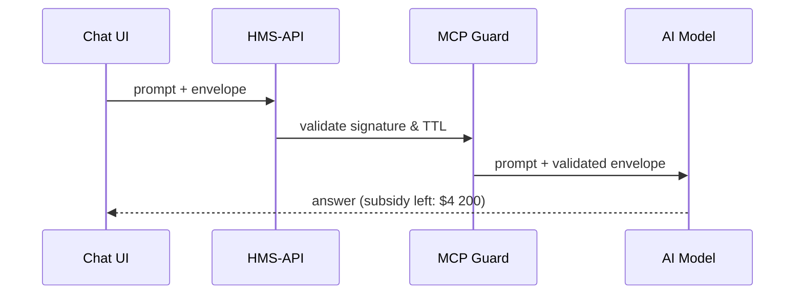

# Chapter 12: Model Context Protocol (HMS-MCP)

*(Follow-up to [AI Representative Agent (HMS-AGT / HMS-AGX)](11_ai_representative_agent__hms_agt___hms_agx__.md))*  

---

## 1. Why Do We Need a “Rosetta Stone” for AI?

A real-world day at the U.S. Department of Agriculture (**USDA**):

1. Farmer **Ella** asks the HMS chat bot:  
   *“How much of my 2024 corn subsidy is left?”*
2. The bot must see **her USDA subsidy record**, *not* her **IRS tax return** (also stored in HMS for another program).
3. At the same time, the bot is allowed to use the **Calculator skill** but **not** the **ACH Refund skill**.

If we rely on free-text prompts like  
> “You are an assistant working for USDA. Only answer with subsidy info…”  
we will **eventually leak** something.

**Model Context Protocol (HMS-MCP)** turns that fragile sentence into a *governed, machine-readable envelope*:

```
{
  "who":    "Farmer Ella (user-123)",
  "agency": "USDA",
  "skills": ["calculator"],
  "data":   ["subsidy.*"],
  "expires":"2024-05-01T12:00Z"
}
```

The AI model receives this envelope along with the prompt.  
Nothing outside the envelope can be touched or revealed—problem solved.

---

## 2. Key Concepts (Picture Five Colored Folders)

| MCP Term | What It Means (Beginner Version) |
|----------|----------------------------------|
| **Actor**   | Who is speaking (citizen, clerk, agent). |
| **Scope**   | The folder(s) of data the actor may open. |
| **Tool List** | Which skills / APIs the model may call. |
| **Time-to-Live (TTL)** | When the envelope self-destructs. |
| **Signature** | Cryptographic stamp proving the envelope is intact. |

Think of an MCP envelope as **five colored folders** clipped together and stamped.  
The AI cannot reach outside the folders.

---

## 3. Building an Envelope — 17 Lines of Code

```python
# mcp_demo.py
from hms_mcp import Envelope, sign, send_to_model

env = Envelope(
  actor="user-123",
  agency="USDA",
  scopes=["subsidy.*"],
  tools=["calculator"],
  ttl="5m"                    # 5 minutes
)

signed = sign(env)            # 🔏 adds signature & timestamp
reply  = send_to_model(
          prompt="How much subsidy is left?",
          envelope=signed
        )
print(reply)
```

Explanation  
1. Create an `Envelope` with allowed data and tools.  
2. `sign()` prevents tampering.  
3. `send_to_model` attaches the envelope to the prompt; HMS-AGT handles the rest.  

---

## 4. What Happens Under the Hood?



If **any** check fails (wrong signature, expired TTL, disallowed tool) the request dies at MCP and the user sees a polite “Access denied.”

---

## 5. Internals in 3 Tiny Files

```
hms-mcp/
 ├─ envelope.py    # data class + JSON marshal
 ├─ guards.py      # validation logic
 └─ signer.py      # HMAC or RSA signatures
```

### 5.1  Envelope Object (envelope.py – 12 lines)

```python
class Envelope(dict):
    def __init__(self, actor, agency, scopes, tools, ttl):
        super().__init__(
            actor=actor, agency=agency,
            scopes=scopes, tools=tools,
            expires=iso_now_plus(ttl)
        )
```

### 5.2 Guard Check (guards.py – 15 lines)

```python
def validate(env_json):
    if now() > env_json["expires"]:
        raise Expired()
    if not verify_sig(env_json):
        raise BadSig()
    caller_scopes = token_scopes()          # from JWT
    if not set(env_json["scopes"]) <= caller_scopes:
        raise ScopeError()
```

### 5.3 Model Injection (pseudo, 10 lines)

```javascript
// router.js
function toLLM(prompt, env){
  const systemMsg = `CTX:${Buffer.from(JSON.stringify(env)).toString('base64')}`
  return llm.chat([ {role:"system", content:systemMsg},
                    {role:"user",   content:prompt} ])
}
```

The model only sees the **base64 context blob plus the prompt**—no free-floating secrets.

---

## 6. Using MCP with HMS-AGT Skills

Add this decorator to an existing skill (Chapter 11):

```python
@requires_scope("subsidy.*")
def calc_remaining_subsidy(...):
    ...
```

If the envelope lacks `subsidy.*`, MCP blocks the call **before** the skill runs.

---

## 7. Adding MCP to Your Micro-service (8 lines)

```javascript
// express middleware
import { validate } from 'hms-mcp'

app.post('/agent/ask', (req, res, next)=>{
  try { validate(req.body.envelope); next() }
  catch(e){ res.status(403).send(e.message) }
})
```

Paste, protect—done.

---

## 8. Safety Rails You Get for Free

* **Data Leak Prevention** – Answer text is scanned; if it contains tokens not in `scopes`, it is blurred (`██`).  
* **Replay Attack Block** – Signature includes nonce; reused envelopes are rejected.  
* **Audit Trail** – Envelope JSON and decision outcome are stored by the [Compliance Framework](18_compliance___auditing_framework__hms_ops___hms_esq__.md).  

No extra code from you!

---

## 9. Beginner FAQ

**Q: Is MCP only for AI models?**  
Mostly, but any tool (e.g., report generator) can consume envelopes to enforce the same rules.

**Q: Who signs envelopes?**  
The front-end gateway signs on behalf of the logged-in user using its service key.

**Q: Does this slow things down?**  
Signature + scope check adds ~1 ms.

---

## 10. What You Learned

• HMS-MCP wraps every AI prompt in a **governed envelope**: actor, scopes, tools, TTL, signature.  
• It replaces fragile “prompt engineering” with a reproducible API.  
• Adding MCP protection is a few lines of code or middleware.  
• Guardrails stop leaks *before* they happen and every decision is auditable.

➡️ In the next chapter we’ll see how developers **share and monetize** their freshly MCP-compliant agents in the [Agent Marketplace (HMS-MKT)](13_agent_marketplace__hms_mkt__.md).

---

Generated by [AI Codebase Knowledge Builder](https://github.com/The-Pocket/Tutorial-Codebase-Knowledge)