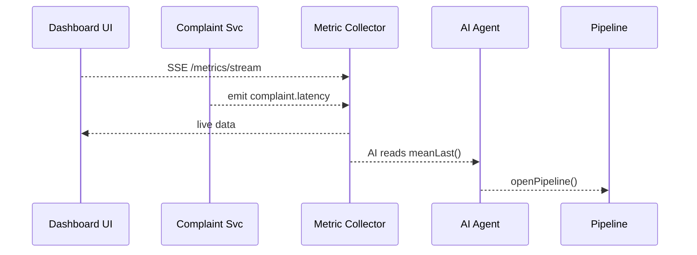

# Chapter 12: Real-Time Metrics & Feedback Loop
*(continuing right after the data-sync magic of the  
[External System Synchronization Layer](11_external_system_synchronization_layer_.md))*  

---

## 1 Why stare at live numbers?

Imagine the **Indoor Air Quality Division (EPA-IAQ)** just published a rule that forces every federal building to answer citizen mold complaints **within 48 hours**.  
Great!  …but:

* What if complaint volume *triples* overnight?  
* What if the syncing adapter to a legacy ticket-system hiccups?  
* What if the average response time is already drifting above 48 h?

Without a speedometer, IAQ staff won’t notice the rule is failing until the next annual report—too late for coughing workers.

The **Real-Time Metrics & Feedback Loop** is that speedometer.  
It streams Key Performance Indicators (KPIs) like *complaints/hour* and *average response latency* back into HMS-GOV **every few seconds**, so humans *and* the [AI Representative Agent](05_ai_representative_agent__a2a_service__.md) can tune the rule long before it derails.

---

## 2 Key ideas (plain English)

| Term | Friendly Analogy | What it means in HMS-GOV |
|------|------------------|--------------------------|
| KPI | A car’s speedometer | “complaints today”, “mean response time” |
| Metric Emitter | Fitness tracker on your wrist | Service that *sends* numbers (`emit(…)`) |
| Metric Collector | Doctor’s clipboard | Service that *stores & aggregates* numbers |
| Live Dashboard | Heart-rate monitor | Tiny UI widget that auto-updates |
| Feedback Trigger | Cruise-control pedal | Code (often the AI Agent) that acts when a KPI crosses a line |

---

## 3 Central use-case: keeping response time < 48 h

Goal: show a **red light** if average latency climbs past 48 hours for more than 30 minutes, then automatically open a *Process Proposal Pipeline* (see [Chapter 6](06_process_proposal_pipeline_.md)) suggesting “Hire 2 temp agents”.

---

## 4 How to send a metric (3 lines!)

```js
// any micro-service ─ e.g. complaintService/onNewComplaint.js
import { emit } from '../lib/metrics.js'
await emit('complaint.received')            // ① count = +1
```

Explanation  
1. One call `emit(topic)` ships a tiny message onto the mesh bus you met in [Microservices Mesh](10_microservices_mesh__hms_sys__hms_svc__hms_ach__etc___.md).  
2. No waiting—fire-and-forget.

---

### 4.1 Sending a numeric value

```js
await emit('complaint.latency',  26 * 60)   // 26 min in seconds
```

The 2-parameter form lets you track averages, percentiles, etc.

---

## 5 Building a live chart in the Dashboard (18 lines)

```vue
<!-- src/components/LatencySpark.vue -->
<template><canvas ref="c"></canvas></template>

<script setup>
import { onMounted, ref } from 'vue'
import Chart from 'chart.js/auto'
const c = ref(null)

onMounted(() => {
  const chart = new Chart(c.value, { type:'line', data:{datasets:[{data:[]}]}})
  const sse = new EventSource('/metrics/stream?topic=complaint.latency')
  sse.onmessage = e => {
    const { ts, value } = JSON.parse(e.data)
    chart.data.datasets[0].data.push({ x: ts, y: value })
    chart.update('none')
  }
})
</script>
```

What’s happening?  
* The component opens a **Server-Sent Events** (SSE) stream `/metrics/stream…`.  
* Every new latency point animates onto the chart—no page refresh.

*(In real life you’d add throttling and a red “48 h” threshold line, but the core idea fits in 18 lines.)*

---

## 6 Inside the Metric Collector (≤ 20 lines)

```js
// metrics/collector.js
import bus from '../lib/bus.js'      // same helper from Chapter 10
import Redis from 'ioredis'
const r = new Redis()

bus.subscribe('complaint.*', async ({ _topic, value = 1 }) => {
  const ts = Date.now()
  await r.zadd(_topic, ts, JSON.stringify({ ts, value }))
  await r.zremrangebyscore(_topic, 0, ts - 1000*60*60)  // keep 1 h
})
```

Explanation  
1. Collector listens to any topic that starts with `complaint.`.  
2. Stores each point in a Redis **sorted set** keyed by timestamp.  
3. Keeps only the last hour—perfect for spark-lines, light on RAM.

---

## 7 Streaming data out (SSE endpoint, 17 lines)

```js
// metrics/streamRoute.js
router.get('/metrics/stream', (req, res)=>{
  const { topic } = req.query
  res.setHeader('Content-Type','text/event-stream')
  res.flushHeaders()

  const loop = setInterval(async ()=>{
    const pts = await r.zrangebyscore(topic, Date.now()-5000, '+inf')
    pts.forEach(p => res.write(`data:${p}\n\n`))
  }, 5000)

  req.on('close', () => clearInterval(loop))
})
```

*Every 5 s the route pulls fresh points from Redis and streams them to listeners like `LatencySpark.vue`.*

---

## 8 Feedback Trigger (AI auto-opens a pipeline)

```js
// aiAgent/watchLatency.js   (19 lines)
import { meanLast } from '../lib/metricsQuery.js'
import { openPipeline } from '../lib/pipeline.js'

setInterval(async ()=>{
  const avg = await meanLast('complaint.latency', 30*60) // past 30 min
  if (avg > 48*60*60) {                 // 48 hours
    await openPipeline({
      title : 'Response time breach',
      suggestion : 'Hire 2 temp agents',
      kpi : avg
    })
  }
}, 60*1000)   // check every minute
```

• Runs in the **AI Representative Agent**.  
• When the KPI breaches, it kicks off the exact conveyor belt you met in [Process Proposal Pipeline](06_process_proposal_pipeline_.md).  
• The new pipeline lands in the *Human-in-the-Loop* inbox (see [Chapter 7](07_human_in_the_loop_oversight_workflow_.md)) for approval.

---

## 9 End-to-End: who talks to whom?



Less than five moving parts, all re-using things you already know.

---

## 10 Frequently asked questions

**Q: Do I need Prometheus or Grafana?**  
A: You *can* add them later; the in-chapter Redis + SSE combo is plenty for prototypes and stays under 100 MB RAM.

**Q: What about historical analytics?**  
A: A nightly cron copies Redis data into Postgres for long-term queries—same pattern as other chapters: small now, swap later.

**Q: Can partners subscribe to metrics?**  
A: Yes. Expose `/mkt/metrics/stream` via the public gateway (see [Backend API Gateway](09_backend_api_gateway__hms_api___hms_mkt__.md)) with vendor-specific API keys.

---

## 11 Try it yourself 🏋️‍♀️

1. Spin up the demo stack: `docker-compose up metrics ai dashboard`.  
2. Hit the “File Complaint” button 10 times.  
3. Watch `complaints/hour` spark-line shoot upward.  
4. Temporarily modify `meanLast()` threshold to 10 minutes; see the AI open a *Response time breach* pipeline almost instantly.

*(Walk-through + sample output in `exercises/12`.)*

---

## 12 What you learned

You now own the full feedback loop:

1. **Emit** a metric from any service in one line.  
2. **Collect & stream** it with a 20-line Redis helper.  
3. **Visualize** it live in the Dashboard.  
4. **React** automatically—AI (or humans) proposes fixes before citizens notice a slowdown.

With this chapter, HMS-GOV graduates from *write-once laws* to **self-healing policy**.

> 🎉 Congratulations—this was the final core building block!  
> Revisit any chapter to deepen or customize, and feel free to plug in richer observability tools as your agency’s needs grow.  

Thank you for following along, and happy policy tuning!

---

Generated by [AI Codebase Knowledge Builder](https://github.com/The-Pocket/Tutorial-Codebase-Knowledge)