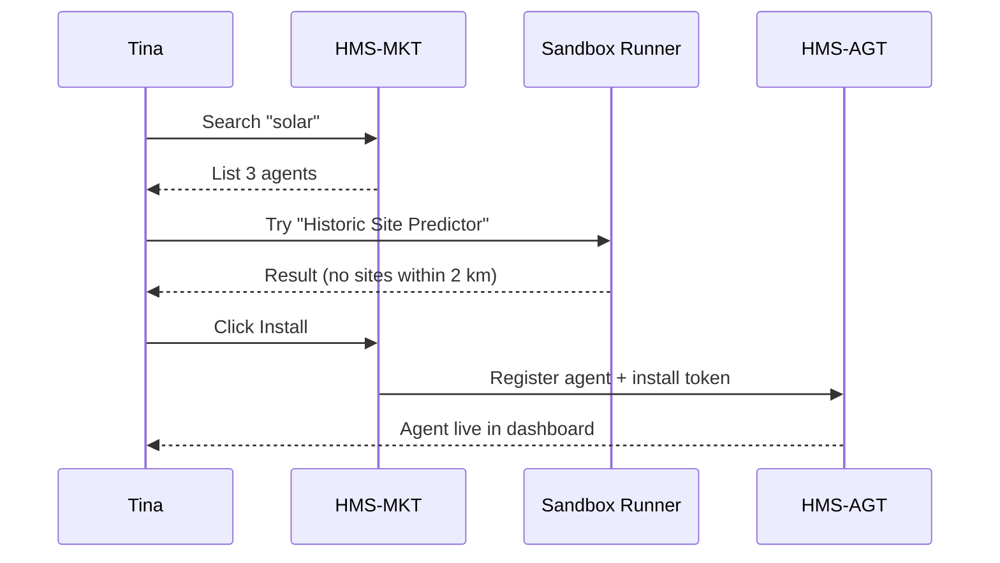

# Chapter 13: Agent Marketplace (HMS-MKT)

*(Follow-up to [Model Context Protocol (HMS-MCP)](12_model_context_protocol__hms_mcp__.md))*  

---

## 1. Why Do We Need an “App Store for AI Agents”?

Imagine **Tina**, a zoning clerk at the **Bureau of Reclamation** in a small Western county.

1. A citizen submits plans for a solar farm.  
2. Tina must calculate permit fees, check for protected historic sites, and verify veteran-owned business discounts.  
3. Her 4-person IT team has **no time or budget** to build three separate AI tools.

Tina opens the **Agent Marketplace (HMS-MKT)**, searches *“Solar Farm Permit”*, clicks **Install**, and—within minutes—three pre-vetted agents appear in her dashboard:

```
✔ Permit Fee Calculator        · $0.01 / run
✔ Historic Site Predictor       · $0.005 / run
✔ Veterans Benefit Optimizer    · free (VA grant)
```

No procurement marathon, no custom coding.  
**HMS-MKT** puts niche expertise at every agency’s fingertips—exactly like an app store, but for **policy-aware, MCP-secured AI agents**.

---

## 2. Key Concepts (Plain English)

| Concept               | Friendly Meaning                                                   |
|-----------------------|--------------------------------------------------------------------|
| Listing               | The “app-store page” for one agent (description, price, docs).     |
| Sandbox               | A safe playground that lets you test the agent with fake data.     |
| Rating                | 1–5 ⭐ from other agencies (“Works great for building permits!”).   |
| License               | Usage contract (free, pay-per-use, annual flat fee).               |
| Install Token         | Signed proof that your agency may run the agent in production.     |
| Billing Meter         | Counter that records each agent invocation for later invoicing.    |

Keep these six words in mind; the rest of MKT is just plumbing that glues them together.

---

## 3. Two-Minute Tour – Browsing, Testing, Installing



Tina never touches YAML, Docker, or billing invoices—the Marketplace handles it all.

---

## 4. Hands-On: Installing an Agent in < 20 Lines

### 4.1 Browse & Install (CLI)

```bash
# 1) Find an agent
hms-mkt search "permit fee"

# 2) Install it for your agency (auto-checks budget & license)
hms-mkt install permit-fee-calculator@2.3.1
```

CLI output:

```
✅ Installed permit-fee-calculator@2.3.1
   Install-Token: MKT-7fd2…d8
   Sandbox URL : https://sandbox.hms.gov/run/7fd2…d8
```

### 4.2 Call the Agent From Your Code

```javascript
import { callAgent } from 'hms-agt-sdk'

const fee = await callAgent({
  name: 'permit-fee-calculator',
  version: '2.3.1',
  input: { projectSize: 2.5, zone: 'RURAL' }   // MW & zoning class
})
console.log(`💰 Permit fee = $${fee.total}`)
```

Explanation  
1. `callAgent` looks in HMS-AGT’s registry.  
2. The **Install Token** proves you’re licensed.  
3. Billing Meter adds $0.01 to the monthly invoice.

---

## 5. What Happens Behind the Curtain?

### 5.1 Step-by-Step

1. **Install**  
   * HMS-MKT verifies license & budget → issues **Install Token** (JWT).  
   * Registers the agent’s Docker image in your cluster.

2. **Execution**  
   * Your service calls HMS-AGT with the token.  
   * MCP envelope (from Chapter 12) is attached automatically.  
   * Agent runs in a **Sandbox Pod** with CPU/RAM limits.

3. **Billing & Rating**  
   * Billing Meter logs the call (`agent-id`, `cost`, `timestamp`).  
   * Tina can leave a ⭐ rating that helps others pick quality agents.

### 5.2 Micro-Service Map

```
hms-mkt/
 ├─ api/           REST routes (search, install, rate)
 ├─ catalog/       JSON files for every listing
 ├─ sandbox/       spins up temp pods for tests
 ├─ billing/       counts usage
 └─ ratings/       1–5 star DB table
```

---

## 6. Internal Code Nuggets (All ≤ 20 Lines)

### 6.1 Listing Format (`catalog/permit-fee-calculator.json`)

```json
{
  "name": "permit-fee-calculator",
  "version": "2.3.1",
  "price": 0.01,
  "schema": {
    "input":  { "projectSize": "number", "zone": "string" },
    "output": { "total": "number" }
  },
  "sandboxCmd": ["node", "run.js"]
}
```

### 6.2 Install Route (`api/install.js`)

```javascript
router.post('/install/:name', async (req,res)=>{
  const { name } = req.params
  const listing = catalog.get(name)
  checkBudget(req.user.agency, listing.price)
  const token = makeInstallToken(req.user.agency, listing)
  await agt.register(listing, token)       // talks to HMS-AGT
  res.json({ ok:true, token })
})
```

*Checks budget → creates token → tells AGT to pull the image → returns JSON.*

### 6.3 Billing Meter (`billing/hook.js`)

```python
def on_agent_called(agent_id, cost, agency):
    db.insert('billing', {
      'agent':agent_id, 'cost':cost,
      'agency':agency, 'ts':now()})
```

One hook; every call is billable or free (cost = 0).

---

## 7. Adding **Your** Agent to the Marketplace

1. **Scaffold**

```bash
npx hms-mkt new-agent solar-profit-estimator
cd solar-profit-estimator
```

2. **Implement** `main.py` (≤ 20 lines):

```python
def run(projectSize, zone):
    base = 500
    multiplier = 200 if zone=="URBAN" else 100
    return { "total": base + projectSize*multiplier }
```

3. **Describe & Publish**

```bash
hms-mkt publish --price 0.005 --tag "solar,finance"
```

CI checks:
* passes unit tests  
* no PHI or PII leak (static scan)  
* schema valid  

Once approved, your agent appears in the catalog for every agency.

---

## 8. Safety Rails & Governance

* **Sandbox** = read-only file-system + outbound-only network.  
* **MCP Enforcement** = agents see only the scopes in the caller’s envelope.  
* **Human-in-the-Loop** (next chapter) can force manual approval for high-risk agents.  
* **Open Ratings** = one-star bombs ignored; only verified installs count.  
* **Auto-Patch** = critical CVEs trigger automatic image rebuilds and notifications.

---

## 9. Beginner FAQ

**Q: Do I pay upfront?**  
No. Monthly invoice combines all pay-per-use totals; free agents cost $0.

**Q: Can I run an agent on-prem?**  
Yes—Marketplace pushes images to your private registry; nothing leaves your firewall.

**Q: What if an update breaks my workflow?**  
You pin a version (`permit-fee-calculator@2.3.1`). Upgrades are manual unless you enable “auto-minor.”

**Q: How large can an agent image be?**  
Max 1 GB. Bigger images are rejected to keep cold-start times low.

---

## 10. What You Learned

• **HMS-MKT** is an *app store* for AI agents and data services.  
• Browse → Sandbox test → Install → Call via HMS-AGT, all in minutes.  
• Install Tokens, MCP envelopes, and Sandboxes keep licensing and security simple.  
• You can publish your own agent in three quick steps—scaffold, code, publish.

➡️ Next we’ll see how humans stay **in control** of these powerful agents through the [Human-in-the-Loop (HITL) Oversight Mechanism](14_human_in_the_loop__hitl__oversight_mechanism_.md).

---

Generated by [AI Codebase Knowledge Builder](https://github.com/The-Pocket/Tutorial-Codebase-Knowledge)