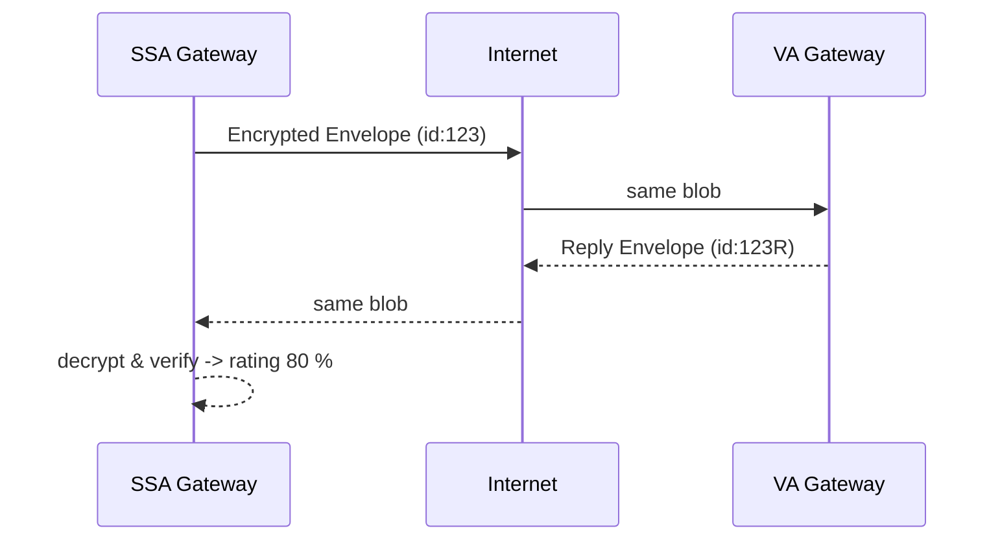

# Chapter 13: Inter-Agency Communication Bus (HMS-A2A) ✉️🔒

*(Just finished [External System Synchronization (HMS-GOV Connectors)](12_external_system_synchronization__hms_gov_connectors__.md)?  
Great—those connectors push rules to **old** machines.  
Now we’ll learn how **modern federal agencies talk to each other in milliseconds** without exposing citizens’ private data.)*  

---

## 0. Why Do We Need a “Digital Diplomatic Pouch”?

Imagine a **Purple-Heart veteran** in Missouri applying for **Social Security Disability**:

1. The **Social Security Administration (SSA)** must confirm the veteran’s disability rating held by the **Department of Veterans Affairs (VA)**.  
2. Paper forms can take **weeks**; phone calls expose sensitive medical info.  
3. Privacy law says SSA may *see* only the **rating**, **not** the entire medical history.

**Inter-Agency Communication Bus (HMS-A2A)** works like the State-Department’s **diplomatic pouch**—a sealed, tamper-evident envelope:

* VA drops an encrypted answer inside.  
* The pouch travels over any network (even e-mail).  
* SSA opens it **only** if the signature matches and the request is allowed.

Round-trip: **< 500 ms**, zero leaked data.

---

## 1. Key Concepts (Plain English)

| Word | Beginner Meaning |
|------|------------------|
| Envelope | A JSON object wrapped in encryption + signature. |
| Claim | The tiny piece of data requester needs (e.g., `disabilityRating`). |
| Sender & Receiver ID | Agency short-codes (`VA`, `SSA`) baked into the envelope header. |
| A2A Gateway | Tiny service each agency runs that sends/receives envelopes. |
| Pouch TTL | “Time-to-live” minutes before an unopened pouch self-destructs. |

*(If you understand “sealed envelope with an address label,” you already get 80 % of A2A!)*  

---

## 2. Five-Minute Use-Case: SSA Asks VA for Disability Rating

We will:

1. Build a **request** envelope at SSA.  
2. See VA **respond** with the rating only.  
3. Verify the pouch at SSA and print the value.

### 2.1  SSA Creates the Request (Node, 14 lines)

```js
// File: ssa/request.js
import { createEnvelope, send } from 'hms-a2a'

const req = {
  veteranId: 'VET-44-991',
  need: 'disabilityRating'
}

const env = createEnvelope({
  sender: 'SSA',
  receiver: 'VA',
  ttlMin: 5,
  body: req
})

await send(env)            // goes to VA gateway
console.log('📨 Sent pouch', env.id)
```

Explanation  
1. `createEnvelope()` encrypts `req`, adds IDs & TTL, signs it with SSA’s private key.  
2. `send()` POSTS the blob to VA’s A2A Gateway URL (stored in config).  

### 2.2  VA Gateway Handles the Pouch (Express, 19 lines)

```js
// File: va/gateway.js
import { verifyEnvelope, reply } from 'hms-a2a'
import express from 'express'; const app = express()
app.use(express.json())

app.post('/inbox', async (req, res) => {
  const env = req.body
  if(!verifyEnvelope(env)) return res.status(400).end()

  const rating = lookupRating(env.body.veteranId)  // pretend DB call
  await reply(env, { disabilityRating: rating })   // sends back pouch
  res.end()
})

app.listen(9000)
```

Explanation  
1. `verifyEnvelope()` checks signature & TTL.  
2. `lookupRating()` fetches only the needed field.  
3. `reply()` flips sender/receiver, encrypts new body, and ships it home.

### 2.3  SSA Receives & Opens (Listener, 11 lines)

```js
// File: ssa/inbox.js
import { verifyEnvelope, decryptBody } from 'hms-a2a'
import express from 'express'; const app = express()
app.use(express.json())

app.post('/inbox', (req,res)=>{
  const env = req.body
  if(!verifyEnvelope(env)) return res.status(400).end()

  const data = decryptBody(env)
  console.log('✅ VA says rating is', data.disabilityRating)
  res.end()
})

app.listen(8000)
```

**Total round-trip code: 44 lines!**

---

## 3. What Actually Happens? (Step-by-Step)



Things to notice:

1. **Network can be anything**; content is unreadable without keys.  
2. Envelope ID lets both sides match request & response.  
3. If TTL expires mid-flight, gateways discard the pouch.

---

## 4. Under the Hood (Code Peek ≤ 18 Lines Each)

### 4.1  `createEnvelope()` Helper

```js
// File: lib/envelope.js
import { v4 as uuid } from 'uuid'
import { encrypt, sign } from './crypto.js'

export function createEnvelope({sender, receiver, ttlMin, body}){
  const cipher = encrypt(JSON.stringify(body), receiver) // receiver’s public key
  const env = {
    id: uuid(),
    sender, receiver,
    ttl: Date.now() + ttlMin*60*1000,
    payload: cipher
  }
  env.sig = sign(JSON.stringify({...env, sig:null}))      // sender’s private key
  return env
}
```

### 4.2  `verifyEnvelope()`

```js
export function verifyEnvelope(env){
  if(Date.now() > env.ttl) return false
  return verify(JSON.stringify({...env, sig:null}), env.sig, env.sender)
}
```

*(`encrypt`, `sign`, `verify` are thin wrappers around Node’s `crypto` module—details skipped.)*

---

## 5. Security & Compliance Goodies

* **End-to-End Encryption** – only VA & SSA keys can open.  
* **Tamper Evident** – any edit breaks signature.  
* **Scoped Claims** – envelope header lists allowed data fields; VA gateway refuses to include anything else.  
* **Audit Trail** – Both gateways append one line to `a2a.log` with `id`, `sender`, `receiver`, and checksum.  

These features piggy-back on the global Zero-Trust system from [Security & Authorization Layer](09_security___authorization_layer__hms_sys__zero_trust__.md).

---

## 6. Where A2A Touches Other HMS-GOV Pieces

* **Triggers** often come from [HMS-ACT Workflows](07_agent_orchestrated_workflow_manager__hms_act__.md) when a step needs external confirmation.  
* **Connectors** (Chapter 12) handle legacy *intra-agency* sync; A2A handles *inter-agency* secure messages.  
* **Monitoring** of success/failure counts flows into [Metrics & Monitoring](14_metrics___monitoring__hms_ops___hms_act_telemetry__.md).  
* **HITL** can veto an outgoing envelope if it contains sensitive payload.

---

## 7. Quick FAQ

**Q: Why not just call a VA REST API?**  
A: REST would expose raw endpoints; A2A hides them, enforces encryption, and guarantees symmetric audit logs on both ends.

**Q: How big can a pouch be?**  
A: Default limit 64 KB. For large files use A2A to exchange a *signed URL* to a secure blob instead.

**Q: Do both sides need Internet?**  
A: No. Gateways can drop envelopes into a shared SFTP folder or even a USB drive. The cryptographic envelope stays the same.

---

## 8. Summary & Next Steps

You learned:

1. HMS-A2A is the **sealed digital pouch** for inter-agency data.  
2. Built a full SSA→VA round-trip in under 50 lines of code.  
3. Saw how encryption, signatures, and TTL protect citizen data.  
4. Connected A2A with workflows, security, connectors, and monitoring.

Ready to **count how many pouches succeed, fail, or get delayed**?  
➡️ Continue to [Metrics & Monitoring (HMS-OPS / HMS-ACT telemetry)](14_metrics___monitoring__hms_ops___hms_act_telemetry__.md).

---

---

Generated by [AI Codebase Knowledge Builder](https://github.com/The-Pocket/Tutorial-Codebase-Knowledge)