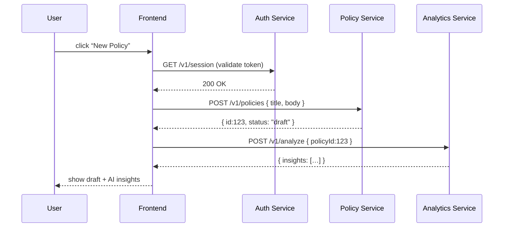

# Chapter 13: Microservices Architecture

Welcome back! In [Chapter 12: Management Layer](12_management_layer_.md) we saw how services discover each other, publish events, and stay healthy. Now we’ll zoom out and look at the big picture: dividing HMS into **small, independent services**—authentication, policy management, AI analytics—each with its own code, deploy pipeline, and runtime. This is the essence of **Microservices Architecture**.

---

## 13.1 Why Microservices Architecture?

Imagine a large federal agency where each bureau has its own team, budget, and IT stack—and they all need to work together. If one bureau’s system crashes, you don’t want the entire government portal going down. Microservices let us:

- **Deploy** each service on its own schedule  
- **Scale** only the busy parts (e.g. analytics on peak days)  
- **Isolate faults** so errors in AI suggestions don’t kill your authentication  

Just like stovepipes in government agencies, microservices communicate over well-defined interfaces (APIs), but run independently.

---

## 13.2 Key Concepts

1. **Service Boundary**  
   Each service owns its data and logic (e.g. `auth-service`, `policy-service`, `analytics-service`).

2. **API Contract**  
   Services expose REST or gRPC interfaces; consumers only care about request/response shapes.

3. **Independent Deployability**  
   Build, test, and release each service on its own—no coordinated “big bang” deploy.

4. **Scalability & Fault Isolation**  
   Scale out just the services under heavy load; if one fails, others keep running.

5. **Inter-Service Communication**  
   Synchronous calls (HTTP/REST) or asynchronous messages (queues, events).

---

## 13.3 Using Microservices in HMS-GOV

### 13.3.1 Calling the Policy Service

In your frontend you invoke the policy microservice directly:

```js
// File: src/services/PolicyApi.js
import axios from 'axios'

const client = axios.create({ baseURL: 'https://policy.internal/api' })

export function listPolicies() {
  return client.get('/v1/policies').then(r => r.data)
}
```
This code ignores other services—you only dial the policy “extension” at `policy.internal`.

### 13.3.2 Flow of a Policy Creation



1. Frontend checks auth  
2. Creates a policy in `policy-service`  
3. Sends it to `analytics-service` for AI hints  
4. Displays results—all without a monolith!

---

## 13.4 Under the Hood

### 13.4.1 Service Folder Layout

Each microservice lives in its own repo or folder:

```
/auth-service
  ├── index.js
  ├── package.json
  └── Dockerfile

/policy-service
  ├── index.js
  ├── package.json
  └── Dockerfile

/analytics-service
  ├── index.js
  ├── package.json
  └── Dockerfile
```

### 13.4.2 Example: Policy Service (index.js)

```js
// File: policy-service/index.js
import express from 'express'
const app = express()
app.use(express.json())

let policies = []

app.get('/v1/policies', (req, res) => {
  res.json(policies)
})

app.post('/v1/policies', (req, res) => {
  const id = policies.length + 1
  const record = { id, ...req.body, status: 'draft' }
  policies.push(record)
  res.status(201).json(record)
})

app.listen(3000, () => console.log('Policy service up'))
```
This tiny service owns only policy data and runs on port 3000.

### 13.4.3 Dockerfile

```dockerfile
# File: policy-service/Dockerfile
FROM node:18-alpine
WORKDIR /app
COPY package.json ./
RUN npm install --production
COPY . .
CMD ["node","index.js"]
```
Each service builds its own container—so you can scale or upgrade them independently.

---

## 13.5 Summary

You’ve learned how HMS-GOV breaks into **microservices** for authentication, policy management, and AI analytics. We saw:

- Why small, independent services pay off (scaling, isolation)  
- The **API contracts** that tie them together  
- A simple **sequence diagram** of a policy flow  
- The folder layout, Express code, and Docker setup for one microservice  

In the next chapter we’ll talk about how to enforce policies across these services in the [Governance Layer](14_governance_layer_.md).

---

Generated by [AI Codebase Knowledge Builder](https://github.com/The-Pocket/Tutorial-Codebase-Knowledge)