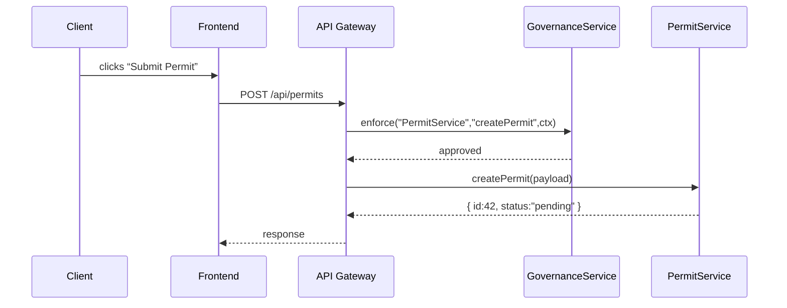

# Chapter 14: Governance Layer

In [Chapter 13: Microservices Architecture](13_microservices_architecture_.md) we learned how HMS breaks into small, independent services. Now it’s time to add the top‐tier guardrails that keep the whole system honest and transparent. Welcome to the **Governance Layer**—our Office of Management and Budget for HMS-GOV, enforcing compliance, ethics, privacy, and transparency across every module.

## 14.1 Why the Governance Layer?

Imagine the OMB issuing a directive: every federal agency must protect citizen privacy, log every decision, and apply uniform ethics checks. In HMS-GOV, the Governance Layer sits above your UI, backend APIs, AI agents, and microservices. It makes sure:

- Privacy rules are enforced (e.g., no personal data leaks)  
- Ethics checks run before any automated action  
- All policy changes are logged for auditing  
- Central configuration ensures one source of truth  

Without it, each team might interpret “privacy” differently—just like agencies could pick their own budgets if OMB didn’t set standards.

## 14.2 Key Concepts

1. Rule Evaluators  
   Small functions that check a request or action against a policy (e.g., “Is the user allowed to see SSNs?”).

2. Policy Engine  
   A core service that loads rules from the central store and decides pass/fail.

3. Central Configuration Store  
   Where all governance policies live (JSON or database), so updates apply everywhere instantly.

4. Logging & Audit Trail  
   Every decision—approved or blocked—is written to a tamper-resistant log for compliance reviews.

---

## 14.3 Using the Governance Layer

Let’s say your “Permit Service” needs to check privacy rules on every API request. You can hook into your request pipeline:

```js
// File: src/services/GovernanceService.js
export default {
  async enforce(moduleName, action, context) {
    const rules = await ConfigStore.loadRules(moduleName)
    for (const rule of rules) {
      if (!RuleEvaluator.check(rule, action, context)) {
        Logger.warn(moduleName, action, context.user, rule.id)
        throw new Error(`Governance violation: ${rule.message}`)
      }
    }
    Logger.info(moduleName, action, context.user, 'approved')
  }
}
```

- `moduleName`: e.g. `"PermitService"`  
- `action`: e.g. `"createPermit"`  
- `context`: contains user info, payload, etc.  
- If any rule fails, we log a warning and block the action.

### How it works in a request



1. API Gateway calls the Governance Layer before any business logic.  
2. If approved, the request proceeds. Otherwise it’s blocked and logged.

---

## 14.4 Inside the Governance Layer

### 14.4.1 Central Configuration Store

```js
// File: src/services/ConfigStore.js
const rulesDb = {
  PermitService: [
    { id: 'GOV-001', action: 'createPermit',
      condition: ctx => ctx.user.role === 'Clerk',
      message: 'Only Clerks can create permits.' },
    { id: 'GOV-002', action: 'createPermit',
      condition: ctx => !ctx.payload.ssn, 
      message: 'SSN must not be included.' }
  ]
}

export default {
  loadRules(module) {
    // In real life fetch from DB or secure API
    return Promise.resolve(rulesDb[module] || [])
  }
}
```

Explanation: we store rules in a simple in‐memory map. In production this would be a secure database.

### 14.4.2 Rule Evaluator

```js
// File: src/services/RuleEvaluator.js
export default {
  check(rule, action, context) {
    return rule.action === action && rule.condition(context)
  }
}
```

Explanation: this tiny helper matches the action and runs the rule’s condition.

### 14.4.3 Logger

```js
// File: src/services/Logger.js
export default {
  info(module, action, user, msg) {
    console.log(`[GOV-INFO] ${module}.${action} by ${user.id}: ${msg}`)
  },
  warn(module, action, user, ruleId) {
    console.warn(`[GOV-WARN] Violation ${ruleId} on ${module}.${action} by ${user.id}`)
  }
}
```

Explanation: all decisions go to the console or a central audit log.

---

## 14.5 Summary

In this chapter you learned how the Governance Layer:

- Loads **policies** from a central store  
- Uses **Rule Evaluators** to approve or block actions  
- Logs every decision for **transparency**  
- Acts like an OMB issuing directives across all HMS modules  

With these guardrails, your HMS-GOV system enforces uniform standards—privacy, ethics, and compliance—no matter which microservice or AI agent you build. Congratulations on completing the core architecture of HMS-GOV!

---

Generated by [AI Codebase Knowledge Builder](https://github.com/The-Pocket/Tutorial-Codebase-Knowledge)