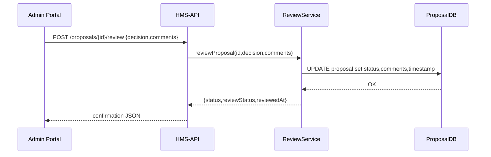

# Chapter 14: Human-in-the-Loop (HITL) Review

In [Chapter 13: Process Proposal](13_process_proposal_.md) we saw how AI suggestions become formal _Process Proposals_. In this chapter, we add the critical **Human-in-the-Loop (HITL) Review** step—where a senior official gives a final sign-off on any AI-generated or drafted regulation before it goes live.

---

## 1. Why HITL Review?

Automated agents and services can draft or propose new regulations, but government rules need a trusted human check. A HITL Review lets an official:

- **Override** or adjust AI proposals  
- **Annotate** or comment on suggested changes  
- **Approve** the final text before publication  

Think of it like the Secretary of State stamping “APPROVED” on a new treaty draft.

### Central Use Case

1. The AI Agent creates a Process Proposal (e.g., “Enable online pre-uploads of citizen documents”).  
2. The Admin Portal shows the proposal in the **HITL Review Queue**.  
3. A Director opens the review page, reads the proposal text, and sees AI rationale.  
4. They click **Approve**, or **Request Changes** with comments.  
5. Once approved, HMS-GOV publishes the change and notifies stakeholders.

---

## 2. Key Concepts

- **Review Status**  
  – `Pending`: waiting for human check  
  – `Approved`: ready to publish  
  – `ChangesRequested`: sent back to AI or drafters

- **Reviewer Comments**  
  Free-text notes explaining why changes were requested.

- **Final Sign-Off**  
  A timestamped approval that triggers publication workflows.

---

## 3. How to Use HITL Review

### 3.1 Front-End Snippet (React)

```jsx
// components/HITLReview.jsx
export default function HITLReview({ proposal }) {
  const [comments, setComments] = useState('')
  async function submitReview(decision) {
    await fetch(`/api/proposals/${proposal.id}/review`, {
      method: 'POST',
      headers: {'Content-Type':'application/json'},
      body: JSON.stringify({ decision, comments })
    })
    alert('Review submitted: ' + decision)
  }
  return (
    <div>
      <h2>Review Proposal: {proposal.title}</h2>
      <pre>{proposal.description}</pre>
      <textarea
        placeholder="Your comments"
        onChange={e => setComments(e.target.value)} />
      <button onClick={()=>submitReview('Approved')}>Approve</button>
      <button onClick={()=>submitReview('ChangesRequested')}>
        Request Changes
      </button>
    </div>
  )
}
```
*This UI posts the reviewer’s decision and optional comments to our API.*

#### Request Example

POST `/api/proposals/PP-2024-007/review`
```json
{ "decision":"Approved", "comments":"Looks great!" }
```

#### Response Example

```json
{ "status":"success", "reviewStatus":"Approved", "reviewedAt":"2024-06-01T12:00Z" }
```

---

## 4. What Happens Under the Hood



1. **Portal** sends decision & comments to **HMS-API**.  
2. **HMS-API** delegates to **ReviewService**.  
3. Service updates the **Proposal** record in the database.  
4. API returns confirmation and updated status.

---

## 5. Internal Implementation

### 5.1 Extend the Proposal Entity

_File: domain/entities/process_proposal.py_
```python
class ProcessProposal:
    def __init__(self, ...):
        # existing fields...
        self.reviewStatus = 'Pending'
        self.reviewerComments = None
        self.reviewedAt = None
```

### 5.2 Review Service

_File: domain/services/process_proposal_service.py_
```python
def review_proposal(self, id, decision, comments):
    p = self.repo.get(id)
    p.reviewStatus = decision
    p.reviewerComments = comments
    p.reviewedAt = datetime.utcnow()
    self.repo.save(p)
    return p
```

### 5.3 API Route

_File: hms-api/routes/proposals.js_
```javascript
router.post('/:id/review', async (req, res) => {
  const { decision, comments } = req.body
  const proposal = await svc.review_proposal(
    req.params.id, decision, comments
  )
  res.json({
    status:'success',
    reviewStatus: proposal.reviewStatus,
    reviewedAt: proposal.reviewedAt
  })
})
```

---

## Conclusion

You’ve learned how the **HITL Review** layer ensures that every AI-generated or drafted regulation receives a final human check. We saw:

- The reviewer UI and API calls  
- Status transitions (`Pending` → `Approved` / `ChangesRequested`)  
- Underlying code in the **ReviewService** and data model  

Next up, we’ll explore how systems automatically swap agents when hit approval thresholds in [Chapter 15: Agent Replacement Trigger](15_agent_replacement_trigger_.md).

---

Generated by [AI Codebase Knowledge Builder](https://github.com/The-Pocket/Tutorial-Codebase-Knowledge)