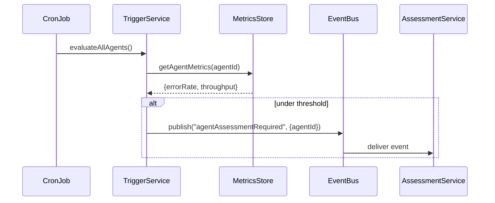

# Chapter 15: Agent Replacement Trigger

In [Chapter 14: Human-in-the-Loop (HITL) Review](14_human_in_the_loop__hitl__review_.md), we learned how a senior official signs off on AI-generated or drafted proposals. Now let’s make sure our decision-makers—whether human clerks or AI agents—are doing their job well. The **Agent Replacement Trigger** is a governance mechanism that watches performance, flags under-performers, and kicks off an assessment process to decide if they should be replaced—much like a civil-service performance review.

---

## 1. Motivation & Central Use Case

Imagine the **Federal Railroad Administration** uses an AI agent to approve track-safety inspections. Over time, that agent’s responses slow down, or it makes more mistakes. To keep safety high, we need to:

1. Continuously track each agent’s performance metrics (speed, accuracy).  
2. Automatically detect when an agent falls below a threshold (e.g., 90% accuracy).  
3. Trigger a formal assessment workflow to decide whether to retrain, replace, or retire the agent.

This ensures accountability: underperformers don’t linger unnoticed, and replacements happen before real damage occurs.

---

## 2. Key Concepts

1. **Performance Metrics**  
   Quantitative measures (e.g., “requests handled per minute,” “approval error rate”).

2. **Thresholds**  
   Pre-defined values that, when crossed, indicate underperformance.

3. **Trigger Service**  
   A component that polls metrics and raises an “agentAssessmentRequired” event.

4. **Assessment Workflow**  
   A follow-up process (like a mini legislative workflow) to evaluate and replace the agent.

---

## 3. How to Use the Agent Replacement Trigger

### 3.1 Configuration Example

Define thresholds in a simple JSON file:

```json
// config/agent_thresholds.json
{
  "maxErrorRate": 0.10,
  "minThroughputPerMinute": 50
}
```
This says:  
- If an agent’s error rate exceeds 10%, or  
- If it handles fewer than 50 requests per minute,  
then flag it for assessment.

### 3.2 Trigger Invocation

A scheduled job calls our Trigger Service every hour:

```javascript
// jobs/checkAgents.js
import TriggerService from '../services/agent_trigger_service.js'

setInterval(async () => {
  await TriggerService.evaluateAllAgents()
}, 60 * 60 * 1000)  // every 1 hour
```
This simple loop runs the performance check on all agents.

---

## 4. What Happens Under the Hood



1. **CronJob** kicks off `evaluateAllAgents()`.  
2. **TriggerService** fetches each agent’s metrics from our [Real-Time Metrics Monitoring](05_real_time_metrics_monitoring_.md).  
3. If metrics violate any threshold, **TriggerService** publishes `agentAssessmentRequired`.  
4. **AssessmentService** (downstream) receives the event and starts a formal review.

---

## 5. Internal Implementation

### 5.1 Trigger Service

_File: services/agent_trigger_service.js_

```javascript
import EventBus from '../events/event-bus-client.js'
import MetricsStore from '../metrics/metrics_store.js'
import thresholds from '../config/agent_thresholds.json'

class TriggerService {
  static async evaluateAllAgents() {
    const agents = ['agentA','agentB']  // list from AgentRepository
    for (let id of agents) {
      const m = await MetricsStore.getMetrics(id)
      if (m.errorRate > thresholds.maxErrorRate
          || m.throughput < thresholds.minThroughputPerMinute) {
        EventBus.publish('agentAssessmentRequired', { agentId: id })
      }
    }
  }
}

export default TriggerService
```

- We load our **thresholds**.  
- We loop through each agent (from a simple list).  
- We fetch metrics (error rate and throughput).  
- If an agent fails, we fire an event.

### 5.2 Metrics Store Stub

_File: metrics/metrics_store.js_

```javascript
class MetricsStore {
  static async getMetrics(agentId) {
    // In reality, call your metrics database or
    // reuse the /metrics endpoint from [Chapter 5](05_real_time_metrics_monitoring_.md)
    return { errorRate: 0.12, throughput: 45 }
  }
}

export default MetricsStore
```

This stub returns dummy metrics. In production, you’d query Prometheus or your time-series DB.

### 5.3 Assessment Subscriber

_File: services/assessment_service.js_

```javascript
import EventBus from '../events/event-bus-client.js'

EventBus.subscribe('agentAssessmentRequired', async (msg) => {
  const { agentId } = JSON.parse(msg)
  console.log(`Starting assessment for ${agentId}`)
  // ... code to kick off a workflow, notify HR, etc. ...
})
```

When the trigger event arrives, this subscriber starts an assessment (human or automated).

---

## Conclusion

You’ve learned how the **Agent Replacement Trigger** keeps your system’s decision-makers accountable by:

- Defining **performance thresholds**  
- Regularly **evaluating** metrics from our monitoring system  
- **Publishing** an event (`agentAssessmentRequired`) when someone underperforms  
- **Kicking off** an assessment process to retrain or replace the agent

With this in place, your governance system ensures that both human clerks and AI agents stay on their toes—just like regular performance reviews in civil service.

Next up, we’ll wrap up our tutorial and look at best practices for deploying HMS-GOV in production.

---

Generated by [AI Codebase Knowledge Builder](https://github.com/The-Pocket/Tutorial-Codebase-Knowledge)