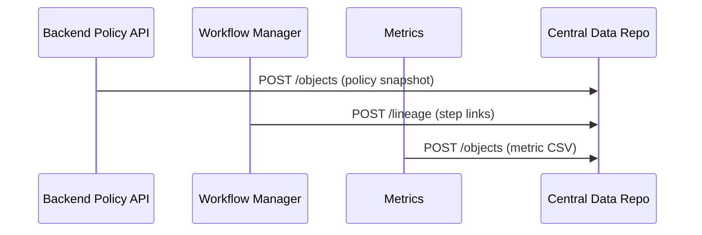

# Chapter 15: Central Data Repository (HMS-DTA) 🗄️✨
*(Coming from [Metrics & Monitoring (HMS-OPS / HMS-ACT telemetry)](14_metrics___monitoring__hms_ops___hms_act_telemetry__.md)?  
Great—OPS shows today’s heartbeat. HMS-DTA is where yesterday, last month, and last decade live.)*

---

## 0. Why Do We Need a “National Archives” for Code & Policy?

Imagine a journalist files a **FOIA request**:

> “Show every change that affected the Broadband Affordability Program between  
> June 1 2020 and May 31 2024—plus who signed off and what impact metrics followed.”

If your answer is “Let me search Slack,” the agency will miss the 20-day deadline (and land on the evening news).

**HMS-DTA** is the **Central Data Repository**—think *Library of Congress* for machine-readable policy:

* Every **version** of a rule is stored as an immutable object.
* Every **comment, metric, and approval** links back to the exact bytes of that version.
* Auditors, historians, or courts can replay the full timeline years later—no guessing.

---

## 1. Key Concepts (Plain English)

| Term | Beginner Meaning |
|------|------------------|
| Object Store | Giant folder that keeps every file forever (like AWS S3). |
| Metadata Index | Tiny SQLite table that says **what** each file is. |
| Lineage Link | Pointer that says “file B came from file A at *this* workflow step.” |
| Provenance Chain | Un-breakable chain of lineage links—tampering is obvious. |
| Audit Bundle | Zip file with all versions + signatures for a FOIA request. |

*(If you know “Google Docs revision history,” HMS-DTA is that—plus cryptographic receipts.)*

---

## 2. Quick Use-Case – FOIA Request for Broadband Rule

Goal: Produce a **single ZIP** that contains:

1. All policy snapshots for **Rule #42**  
2. All comments left by reviewers  
3. Impact metrics 30 days after each snapshot

We’ll do this in three baby steps.

### 2.1  Store a New Snapshot

Every component (editor, workflow, etc.) just makes **one POST**.

```bash
curl -X POST /dta/objects \
  -H "Authorization: Bearer $TOKEN" \
  -F "file=@rule42_v3.json" \
  -F "meta={
       \"type\":\"policy\",
       \"policyId\":42,
       \"version\":\"v3\",
       \"source\":\"HMS-API\"
     }"
```

Beginner explanation  
1. `file` is the bytes.  
2. `meta` is JSON that DTA indexes.  
3. DTA returns:

```json
{ "objId":"b7f2…", "stored":true }
```

### 2.2  Link Lineage

```bash
curl -X POST /dta/lineage \
  -H "Authorization: Bearer $TOKEN" \
  -d '{"parent":"b7f2…", "child":"c9a1…", "step":"committee_passed"}'
```

Tells DTA: **child** came from **parent** during *committee_passed*.  
One row, big audit win.

### 2.3  Build the FOIA Bundle

```bash
curl /dta/foia/bundle?policyId=42&from=2020-06-01&to=2024-05-31 \
     -H "Authorization: Bearer $TOKEN" \
     -o broadband_foia.zip
```

DTA walks the index, pulls every object & lineage row, zips, signs, and streams the file.

---

## 3. What Travels Into DTA?



Three feeds, one archive. Each call under 20 lines of code in earlier chapters!

---

## 4. Inside the Repository (Under-the-Hood Tour)

### 4.1  Folder Layout

```
/dta
  /objects
    /b7/f2   rule42_v3.json
    /c9/a1   rule42_v4.json
  meta.db      # tiny SQLite
```

*Path is just the first four hex chars of `objId`, preventing huge folders.*

### 4.2  Metadata Table (SQL ≤10 lines)

```sql
CREATE TABLE meta (
  objId TEXT PRIMARY KEY,
  type  TEXT,          -- policy, comment, metric
  key   TEXT,          -- policyId or ticketId
  ver   TEXT,
  ts    INTEGER,       -- Unix ms
  src   TEXT           -- who sent
);
```

### 4.3  Lineage Table

```sql
CREATE TABLE lineage (
  parent TEXT,
  child  TEXT,
  step   TEXT,
  ts     INTEGER
);
```

Every `INSERT` is wrapped in a transaction; failure means *nothing* is committed.

### 4.4  Provenance Check (Node, 15 lines)

```js
// File: dta/verify.js
import crypto from 'crypto'
export async function checkChain(childId){
  let id = childId
  while(id){
    const row = db.get('SELECT parent FROM lineage WHERE child=?', [id])
    const ok  = await verifySig(id)         // hashes file + meta
    if(!ok) throw Error('Tampered object '+id)
    id = row?.parent
  }
}
```

*Beginner view*: Follow links backward, verify each checksum—like stepping back in time frame-by-frame.

---

## 5. Minimal API Server (Express, ≤18 lines each)

### 5.1  Upload Route

```js
router.post('/objects', auth('write:dta'), async (req,res)=>{
  const file = req.files.file      // via express-fileupload
  const meta = JSON.parse(req.body.meta)
  const objId= crypto.createHash('sha256').update(file.data).digest('hex')
  await fs.writeFile(`/dta/objects/${objId.slice(0,2)}/${objId.slice(2,4)}`, file.data)
  db.run('INSERT INTO meta VALUES (?,?,?,?,?,?)',
        [objId, meta.type, meta.policyId||meta.ticketId, meta.version, Date.now(), meta.source])
  res.json({ objId })
})
```

### 5.2  FOIA Bundle Endpoint (pseudo, 18 lines)

```js
router.get('/foia/bundle', auth('read:dta'), async (req,res)=>{
  const { policyId, from, to } = req.query
  const objs = db.all(`
       SELECT objId FROM meta
       WHERE type='policy' AND key=? AND ts BETWEEN ? AND ?`,
       [policyId, +new Date(from), +new Date(to)])
  const zip = new AdmZip()
  for(const o of objs){
     zip.addLocalFile(pathFor(o.objId))
     zip.addFile(`${o.objId}.json`, JSON.stringify(metaFor(o.objId)))
  }
  const buf = zip.toBuffer()
  res.set('Content-Type','application/zip').send(buf)
})
```

*(Real code streams, but buffer keeps demo short.)*

---

## 6. How Other Chapters Touch DTA

* **Policy snapshots** arrive straight from [Backend Policy API](08_backend_policy_api__hms_svc___hms_api__.md).  
* **Workflow lineage** is pushed by [Agent-Orchestrated Workflow Manager](07_agent_orchestrated_workflow_manager__hms_act__.md).  
* **Telemetry roll-ups** from [Metrics & Monitoring](14_metrics___monitoring__hms_ops___hms_act_telemetry__.md) land nightly as CSV objects.  
* **Security layer** (Chapter 9) guards every `/objects` and `/foia` call with `read:dta` / `write:dta` scopes.  

---

## 7. Beginner Cheat-Sheet

| Want to… | Call |
|----------|------|
| Store any file | `POST /dta/objects` (multipart) |
| Link two files | `POST /dta/lineage` |
| Get one file   | `GET  /dta/objects/{objId}` |
| Build FOIA ZIP | `GET  /dta/foia/bundle?...` |
| Verify chain   | `GET  /dta/verify/{objId}` |

*(Everything else is sugar on these four verbs.)*

---

## 8. Quick FAQ

**Q:** How big can the repository grow?  
**A:** Object store is append-only and cheap (S3, Azure Blob). 10 years of U.S. rules ≈ few TB—well within cloud free tiers for agencies.

**Q:** Can someone delete by mistake?  
**A:** No. DELETE is disabled. Instead mark `meta.deleted = 1`; auditors still see it.

**Q:** Is this “blockchain”?  
**A:** No cryptocurrency involved, but the provenance chain provides similar immutability for lineage.

---

## 9. What You Learned

1. HMS-DTA is the **long-term memory** of HMS-GOV.  
2. One simple **object + metadata** pattern stores snapshots, comments, metrics—anything.  
3. **Lineage links** let auditors replay decisions exactly.  
4. A 3-step workflow produced a full FOIA bundle in minutes.  
5. Under-the-hood tables and 15-line Express routes keep it beginner-friendly.

🎉 **Congratulations**—you’ve reached the end of the core HMS-GOV journey!  
From the Policy Dashboard to the National Archives, you now have every brick to build transparent, accountable, AI-assisted government software.  

*Happy governing!*

---

Generated by [AI Codebase Knowledge Builder](https://github.com/The-Pocket/Tutorial-Codebase-Knowledge)