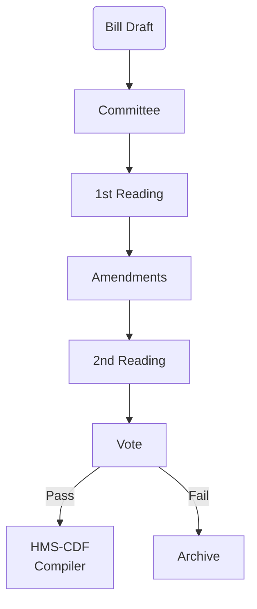
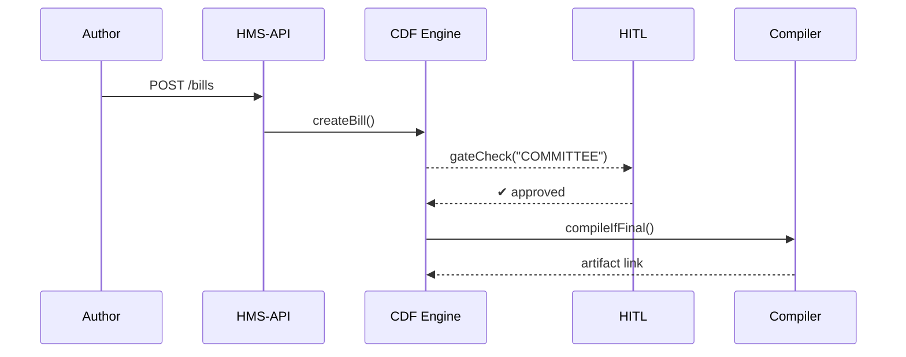

# Chapter 15: Legislative Workflow Engine (HMS-CDF)

*(Follow-up to [Human-in-the-Loop (HITL) Oversight Mechanism](14_human_in_the_loop__hitl__oversight_mechanism_.md))*  

---

## 1. Why Bother With a “Parliament-in-a-Box”?

A Tuesday on Capitol Hill:

1. Representative **Lee** uploads the **“Green Trails Act”**—a 14-page proposal to expand national-park trails.  
2. By law the bill must:  
   ① be assigned to the **Parks Committee**,  
   ② pass **Three Readings**,  
   ③ allow **amendments**,  
   ④ record every vote, and  
   ⑤ turn into executable policy code if adopted.  
3. Any shortcut (e.g., skipping the 2nd reading) would violate Article I rules.

HMS-**CDF** automates the entire track: *one guarded conveyor belt* that every bill—whether about **cyber-security** or **corn subsidies**—must ride from **idea** to **enforceable code**.

> No side doors, no lost amendments, no constitutional mishaps.

---

## 2. Big Picture in 20 Seconds



• Each arrow is a **gate** enforced by HMS-CDF.  
• The final compiler turns the clean text into **machine-readable rules** consumed by downstream services like the [Policy Editor](05_policy_editor_.md) or [HMS-ACH](09_financial_transaction_clearinghouse__hms_ach__.md).

---

## 3. Key Concepts (Beginner-Friendly Glossary)

| Term            | What It Really Means |
|-----------------|----------------------|
| **Bill**        | JSON object holding title, text, sponsor, and status. |
| **Gate**        | Hard stop where humans (or HITL) must approve before moving. |
| **Reading**     | A checkpoint that copies the bill to the public journal. |
| **Amendment**   | Patch that cleanly diff-inserts text—never free-typed. |
| **Snapshot**    | Immutable copy of the bill after each gate (think Git tag). |
| **Compiler**    | Rust job that transforms final text → executable policy JSON. |

Keep “Bill → Gates → Snapshots → Compiler” in mind—the rest is plumbing.

---

## 4. A 3-Step Walk-Through: Passing the “Green Trails Act”

### 4.1 Author Submits the Draft

```bash
curl -X POST /api/cdf/bills \
  -H "Content-Type:application/json" \
  -d '{"title":"Green Trails Act",
       "sponsor":"Rep. Lee",
       "text":"Section 1. Funding..."}'
```

**CDF** replies:

```json
{ "billId":"B-1021", "state":"DRAFT", "next":"COMMITTEE" }
```

*Beginner note:* Only *state* changes; the text is stored untouched.

---

### 4.2 Committee Review & Amend

```javascript
// 1. move to committee
await cdf.advance('B-1021','COMMITTEE')

// 2. propose amendment (add $ funding line)
await cdf.amend('B-1021',{
  section:1,
  insert:"$12,000,000 shall be appropriated..."
})
```

After each call **CDF** creates a **Snapshot** (`snap-003`) and updates the `state`.

---

### 4.3 Readings, Vote, Compile

```javascript
await cdf.advance('B-1021','READING_1')
await cdf.advance('B-1021','READING_2')
await cdf.vote('B-1021',{ yeas:312, nays:105 })  // passes
```

When the vote passes, CDF automatically triggers the **compiler**:

```json
{ "compile":"OK", "artifact":"s3://cdf-builds/B-1021/vFinal.json" }
```

Downstream systems (e.g., [Policy Management Dashboard](04_policy_management_dashboard_.md)) pick up `vFinal.json` and roll it into production.

---

## 5. What Happens Behind the Curtain?



• **HMS-API** routes calls.  
• **HITL** ensures humans sign at each gate (see Chapter 14).  
• **Compiler** runs only when `state === FINAL`.

---

## 6. Peeking Inside the Code (All ≤ 20 Lines)

### 6.1 Finite-State Machine (`states.rs` — Rust, 15 lines)

```rust
pub enum State { Draft, Committee, Reading1, Reading2, Vote, Final }

impl State {
    pub fn next(&self)->State{
        use State::*;
        match self {
            Draft      => Committee,
            Committee  => Reading1,
            Reading1   => Reading2,
            Reading2   => Vote,
            Vote       => Final,
            Final      => Final
        }
    }
}
```

**Explanation:** One function decides the **only** legal next state—no shortcuts.

---

### 6.2 HTTP Handler (`routes.rs`, 18 lines)

```rust
#[post("/advance/<id>/<target>")]
fn advance(id:String, target:String){
    let mut bill = db::get(id);
    let want = State::from(target);
    if want != bill.state.next() { abort(400,"Bad gate") }
    hitl::require_signoff(&bill.id, want);          // Chapter 14
    bill.state = want;
    db::save(bill);
    if want==State::Final { compiler::queue(bill); } // async job
}
```

Plain English: **Validate gate → ask HITL → save → maybe compile.**

---

### 6.3 Amendment Patch (`amend.js`, 14 lines)

```javascript
export function amend(billId, patch){
  const bill = db.get(billId)
  if(bill.state !== 'COMMITTEE') throw 'Too late to amend'
  const snap = clone(bill.text)
  applyPatch(snap, patch)             // tiny diff insert
  db.saveSnapshot(billId, snap)
}
```

*No string surgery—`applyPatch` enforces structured diffs.*

---

## 7. File Map for Curious Minds

```
hms-cdf/
 ├─ routes/            HTTP endpoints (advance, amend, vote)
 ├─ state_machine/     Rust FSM (states.rs)
 ├─ compiler/          turns final text → policy JSON
 ├─ snapshots/         WORM storage of every version
 └─ tests/             constitutional rule tests
```

---

## 8. Safety Rails (You Get These “For Free”)

1. **Snapshots are WORM** (Write-Once-Read-Many); nobody can rewrite history.  
2. **HITL Sign-Off**: Each gate requires a human badge swipe.  
3. **Constitution Tests** in `tests/` run on every pull request (`cargo test`).  
4. **Auto-Rollback**: If compiler fails, bill state flips back to `VOTE` with error notes.

---

## 9. Frequently Asked Beginner Questions

| Question | Quick Answer |
|----------|--------------|
| “Can I skip Reading 2 for emergency bills?” | Yes—`advance(...,'READING_2',{ emergency:true })` but HITL enforces a super-majority vote rule. |
| “Where does the compiled JSON go?” | To an S3 bucket; URL is returned in the compile result. |
| “Can agencies outside Congress use CDF?” | Absolutely—any organization with rule workflows (e.g., **CIGIE** audit guidelines) can adopt the same gates. |

---

## 10. What You Learned

• HMS-CDF is a **constitution-safe conveyor belt** that turns bill drafts into executable policy.  
• Core idea: **Finite-State Machine + Snapshots + Compiler**, guarded by [HITL](14_human_in_the_loop__hitl__oversight_mechanism_.md).  
• Developers interact through tiny HTTP calls (`advance`, `amend`, `vote`); under the hood Rust enforces every rule.  

Next we’ll see how these legislative events trigger follow-up tasks (public notices, fiscal scoring, etc.) using the [Activity Orchestration Service (HMS-ACT)](16_activity_orchestration_service__hms_act__.md).

---

Generated by [AI Codebase Knowledge Builder](https://github.com/The-Pocket/Tutorial-Codebase-Knowledge)