# Chapter 15: Outcome Metrics & Monitoring (HMS-OPS / HMS-ACT)

*(just landed from [Data Stewardship & Privacy Layer (HMS-DTA)](14_data_stewardship___privacy_layer__hms_dta__.md))*  

---

> “A policy that nobody checks is like a fire-alarm without batteries.” 
> HMS-OPS is the **heart-monitor**, HMS-ACT is the **nurse** who nudges staff when the pulse goes wild.

---

## 1 . Why watch the pulse at all?

### A true-to-life story — FEMA disaster-aid backlog

1. Congress tells **FEMA** to shorten their disaster-aid approval time to **48 hours**.  
2. The new rule is drafted, legally vetted, shipped through [HMS-CDF](09_legislative_workflow_engine__hms_cdf__.md).  
3. On day 1 citizens submit 2 000 claims.  
4. Day 3 a reporter tweets:  
   > “Still waiting after 96 h. Did the promise fail?” 
5. **Outcome Metrics Dashboard** shows an ugly red spike:  
   *Median processing time = 72 h*  

Because HMS-OPS had eyes on the pulse, FEMA sees the spike **before** it becomes tomorrow’s headline. HMS-ACT automatically:

* Sends an *Alarm* to the FEMA duty officer.  
* Opens an *Investigation Ticket* assigning two analysts.  
* Suggests an AI fix (“reroute low-risk claims to fast-track queue”).

Without HMS-OPS / HMS-ACT, FEMA would learn from the newspaper.

---

## 2 . Key Concepts (plain English)

| Term          | Everyday Analogy                         | One-line meaning |
|---------------|------------------------------------------|------------------|
| **Metric**    | Heart-beat                               | Number you track (e.g., `medianProcessingTime`) |
| **Dashboard** | Heart monitor screen                     | Live page that plots metrics |
| **Threshold** | Beep-level knob                          | Value that, if crossed, triggers an alarm |
| **Alarm**     | Monitor beep                             | Event emitted when metric ≥ threshold |
| **Investigation Ticket** | Nurse’s clipboard             | Task in HMS-ACT for a human or AI to dig in |

Remember: *Metric → Threshold → Alarm → Ticket.*

---

## 3 . Registering your very first Metric

### 3.1 Tell the system what to watch

```js
// metrics/register.js  (≤16 lines)
import { registerMetric } from '@hms-gov/ops'

registerMetric({
  id        : 'medianProcessingTime',
  label     : 'Median Aid-Claim Processing Time',
  unit      : 'hours',
  source    : 'aidService',          // name of API/service emitting data
  threshold : 48                     // beep if ≥ 48 h
})
```

Explanation  
1. `id` must be unique.  
2. `source` is any service that can emit numbers (see below).  
3. `threshold` = 48 triggers an alarm.

---

### 3.2 Emit numbers from your service

```js
// aidService/emitMetric.js  (≤14 lines)
import { push } from '@hms-gov/ops'

export async function recordClaimTime(hours){
  await push('medianProcessingTime', hours)
}
```

Call `recordClaimTime()` every time you compute a new median.  
The helper **queues** the value; HTTP stays fast.

---

## 4 . What shows up in the Dashboard?

Open `/ops` in the admin UI:  

* A green line wiggles below 48 h.  
* If it crosses, the tile flashes red and an **Alarm** appears in the sidebar.

No code needed—HMS-OPS auto-generates the tile from the registration.

---

## 5 . Life of an Alarm (step-by-step)

```mermaid
sequenceDiagram
    participant SRC as aidService
    participant OPS as HMS-OPS
    participant ACT as HMS-ACT
    participant HLT as Human / AI Investigator

    SRC->>OPS: metric value = 72
    OPS->>OPS: 72 ≥ 48 ? yes
    OPS-->>ACT: emit Alarm A-192
    ACT->>HLT: create Investigation Ticket
    HLT-->>ACT: root cause found / fix applied
```



Only **4** actors—easy to follow.

---

## 6 . Inside the Engine (code-light peek)

### 6.1 Alarm detector (≤18 lines)

```js
// ops/alarmLoop.js
import { poll } from './store.js'        // fetch latest values
import { raise } from './bus.js'         // send event to ACT

setInterval(async ()=>{
  const points = await poll()
  for (const p of points) {
    if (p.value >= p.threshold && !p.openAlarm)
      await raise('alarm', { metricId:p.id, value:p.value })
  }
}, 10_000)   // every 10 s
```

**What it does:**  
1. Every 10 s read fresh numbers.  
2. If value crosses the threshold **and no alarm is already open**, raise one.

### 6.2 Ticket creator in HMS-ACT (≤18 lines)

```js
// act/alarmHandler.js
import { on } from './bus.js'
import { newTicket } from './tickets.js'

on('alarm', async a => {
  await newTicket({
    alarmId : a.metricId,
    summary : `🚨 ${a.metricId} = ${a.value}`,
    assignee: pickInvestigator(),   // simple round-robin
    tags    : ['performance','urgent']
  })
})
```

Creates an *Investigation Ticket* the moment an alarm arrives.

---

## 7 . Closing the feedback loop

Once the analyst fixes the root cause (e.g., adds more workers to [HMS-OMS](05_service_orchestration___task_queues__hms_oms__.md)) they click **Resolve** in the ACT UI.  

The ticket posts `resolution:"scaled queue workers"` → HMS-OPS auto-closes Alarm A-192.  
Green line, happy team.

---

## 8 . Mini API Reference (just 4 calls)

| Call                                 | What it does                            |
|--------------------------------------|-----------------------------------------|
| `registerMetric(cfg)`                | Add a new metric & dashboard tile       |
| `push(metricId, value)`              | Send one data point                     |
| `on('alarm', handler)`               | Listen for alarms                       |
| `newTicket({summary,assignee,…})`    | Open investigation in HMS-ACT           |

That’s 90 % of daily needs.

---

## 9 . Where Metrics come from

* **Queues** in [HMS-OMS](05_service_orchestration___task_queues__hms_oms__.md) auto-emit `job.waitTime` & `failRate`.  
* **Connectors** (Chapter 12) emit `syncLagSeconds`.  
* **Gateways** in [HMS-A2A](13_secure_inter_agency_messaging__hms_a2a__.md) emit `tunnelHealth`.  
* Custom services can emit anything via `push()`.

---

## 10 . Security & Privacy Notes

* Raw citizen data **never** enters HMS-OPS—only aggregated numbers.  
* Alarms & tickets reference **metric IDs**, not PII.  
* Dashboards obey badges from [HMS-DTA](14_data_stewardship___privacy_layer__hms_dta__.md) → restricted metrics remain hidden unless user has role `privacy_clearance`.

---

## 11 . FAQ

| Question | Answer |
|----------|--------|
| Can I watch percentiles, not just averages? | Yes—register with `type:'p95'`. |
| Multiple thresholds (warn vs critical)? | Provide `threshold:{ warn:30, crit:48 }`. |
| Delete a metric? | Call `DELETE /ops/metrics/:id`; historical data stays for audit. |
| Long-term trends? | HMS-OPS writes to TimescaleDB; Grafana board `/ops/trends` auto-shows yearly charts. |

---

## 12 . Recap and what’s next

You learned:

✓ Why HMS-OPS / HMS-ACT are the **eyes and reflexes** of HMS-GOV.  
✓ Five core nouns: Metric, Dashboard, Threshold, Alarm, Investigation Ticket.  
✓ How to register a metric, emit data, and auto-open tickets in < 20 lines each.  
✓ The simple internal loops that watch, beep, and assign work.  
✓ How this monitoring layer links to queues, connectors, gateways, and privacy badges.

Congratulations—your policies now have a **pulse**!  
There is no next chapter in this series, but you now possess the full toolkit to design, ship, watch, and refine digital government services with confidence.

---

---

Generated by [AI Codebase Knowledge Builder](https://github.com/The-Pocket/Tutorial-Codebase-Knowledge)