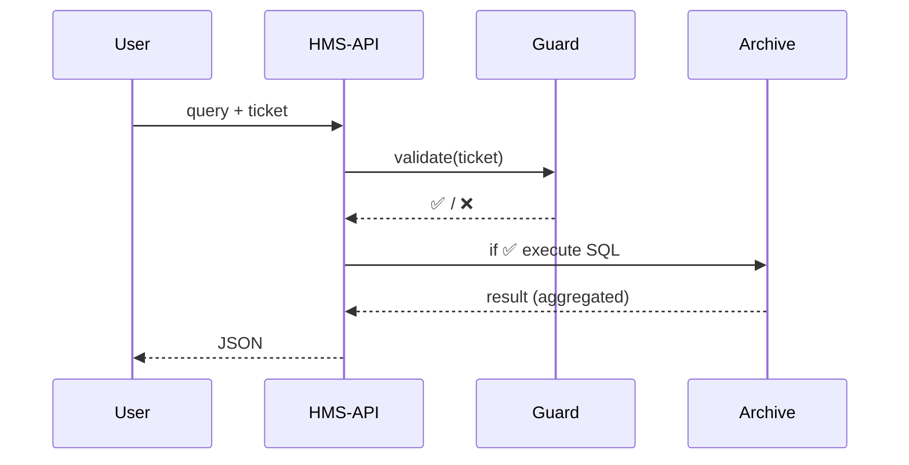

# Chapter 17: Data Governance & Privacy Framework (HMS-DTA + HMS-ESQ)

*(follow-up to [Activity Orchestration Service (HMS-ACT)](16_activity_orchestration_service__hms_act__.md))*  

---

## 1  Why Do We Need a “Library Card System” for Data?

A true story from the **National Cemetery Administration (NCA)**:  

1. A journalist files a **FOIA request**:  
   *“List how many veterans were buried, by state, in 2024.”*  
2. NCA certainly **may** share aggregate numbers, but **must not** leak any veteran’s name, SSN, or medical history.  
3. Six months later a veteran’s family invokes the **right-to-delete** a record.  
4. By law, NCA must prove the data was deleted everywhere, including backups, within 30 days.

Manually checking every query and hunting for stale copies would be like giving every visitor the **keys to the whole archive**.

**The Data Governance & Privacy Framework** fixes this:

* **HMS-DTA** (Data Trust Archive) – the *boxes & shelves* that hold every dataset.  
* **HMS-ESQ** (eSquire Guard) – the *librarian* that decides who may open which box, sees only the right pages, and for how long.  

> Think national archive rules, but enforced by code.

---

## 2  Key Concepts – In Plain English

| Word / Acronym          | Simple Meaning |
|-------------------------|----------------|
| **Dataset**             | One labeled box on a shelf (e.g., “Burial Records 2024”). |
| **Catalog**             | Card index describing every Dataset (owner, sensitivity). |
| **Access Ticket**       | Time-limited pass that says *who* may read *what* & *why*. |
| **Retention Schedule**  | “Recycle this box after 7 years” rule, per agency. |
| **Right-to-Delete Job** | Automated shredder that wipes a record on citizen request. |
| **Breach Sentinel**     | Alarm that shouts if an Access Ticket is mis-used. |

Remember: **DTA = boxes & shelves**. **ESQ = tickets, rules, and alarms**.

---

## 3  A 3-Step Walk-Through – FOIA Query Done Right

### 3.1 Ask for a Ticket

```bash
curl -X POST /api/esq/ticket \
  -d '{ "dataset":"burial_2024",
        "purpose":"FOIA aggregation",
        "fields":["state","id"],
        "aggregate":"count" }'
```

ESQ replies:

```json
{ "ticket":"T-9c4f", "expires":"5m" }
```

### 3.2 Use the Ticket to Query

```bash
curl /api/dta/query \
  -H "X-ESQ-Ticket: T-9c4f" \
  -d '{ "groupBy":"state" }'
```

Returns safe answer:

```json
[
  { "state":"CA", "count":4123 },
  { "state":"TX", "count":3888 }
]
```

Names, SSNs, DOBs never leave the vault.

### 3.3 Ticket Self-Destructs

After 5 minutes ESQ marks `T-9c4f` **expired**.  
Any further call gets HTTP 403 “ticket stale.”

---

## 4  How Does It Work Behind The Curtain?



*If ESQ says “no,” DTA never even hears the query.*

---

## 5  Under-the-Hood Files (Bird’s-Eye)

```
hms-dta/
 ├─ api/            # /query endpoint
 ├─ catalog/        # YAML files per dataset
 └─ jobs/retention/ # nightly purge scripts

hms-esq/
 ├─ api/            # /ticket, /validate
 ├─ policies/       # FOIA, HIPAA, GDPR rules (Rego)
 ├─ breach/         # sentinel & alert hooks
 └─ jobs/delete/    # right-to-delete workers
```

---

## 6  Tiny Code Nuggets (≤ 20 Lines Each)

### 6.1 Issue Ticket (ESQ, 15 lines)

```python
# esq/api/ticket.py
@router.post("/ticket")
def ticket(req: TicketRequest, user=Depends(auth)):
    ds   = catalog.get(req.dataset)
    if not policy.allows(user, ds, req):        # FOIA/HIPAA check
        raise HTTP_403
    tid  = new_id("T")
    cache.set(tid, dict(user=user.id, req=req), ttl=300)  # 5 min
    return {"ticket": tid, "expires":"5m"}
```

*Checks policy ➜ stores ticket in Redis ➜ returns ID.*

---

### 6.2 Validate Ticket (ESQ, 8 lines)

```python
def validate(tid, query):
    meta = cache.get(tid)            # Redis lookup
    if not meta:        raise Expired()
    if forbidden_fields(meta["req"], query):
        raise Violation()
```

---

### 6.3 Execute Query (DTA, 14 lines)

```javascript
// dta/api/query.js
router.post('/query', async (req,res)=>{
  const ticket = req.get('X-ESQ-Ticket')
  await esq.validate(ticket, req.body)
  const sql = buildSql(req.body)         // SELECT state, COUNT(*)
  const rows = await db.query(sql)
  res.json(rows)
})
```

---

### 6.4 Retention Purge Job (DTA, 10 lines)

```bash
# nightly_cron.sh
for ds in $(dta list-datasets); do
  ttl=$(catalog ttl $ds)      # years
  dta delete-older-than $ds $ttl
done
```

---

### 6.5 Right-to-Delete Worker (ESQ, 18 lines)

```javascript
// jobs/delete.js
queue.process('delete_request', async job=>{
  const { dataset, recordId } = job.data
  await dta.deleteRecord(dataset, recordId)   // soft delete
  await dta.wipeBackups(dataset, recordId)    // background
  audit.log('delete', dataset, recordId)
})
```

---

## 7  Handling a Data-Breach Alarm

1. **Sentinel** sees Ticket `T-ff3a` used 10 000× in 30 s.  
2. Triggers `POST /api/esq/breach` → creates **HITL** ticket (“possible extraction”).  
3. Breach email auto-sent to CIO & Privacy Officer.  
4. HMS-ACT (Chapter 16) launches *Incident Workflow*: revoke keys, notify users, legal review.

All automatic; no midnight code patching.

---

## 8  Adding a New Dataset – 3 Easy Steps

1. **Describe it**

```yaml
# catalog/burial_2025.yaml
id: burial_2025
owner: NCA
fields:
  - name: id         ; pii: true
  - name: state
  - name: burialDate ; pii: false
retentionYears: 10
sensitivity: PHI
```

2. **Load the data**

```bash
dta import burial_2025 burial_2025.csv
```

3. **Done!** ESQ enforces HIPAA automatically because `sensitivity: PHI`.

---

## 9  Beginner FAQ

| Question | Answer |
|----------|--------|
| **How big can a dataset be?** | Up to 1 TB per box; DTA chunks & compresses. |
| **Can analysts bypass ESQ for speed?** | No—internal calls also need a ticket. Use longer TTL (**max 60 min**) for batch jobs. |
| **What about real-time streams?** | Request a **stream ticket**; ESQ wraps a Kafka ACL with the same scope rules. |
| **How are retention schedules enforced for backups?** | Delete worker walks S3 Glacier inventories nightly and expires objects. |

---

## 10  What You Learned

• **HMS-DTA** safely stores every dataset; **HMS-ESQ** guards every peek.  
• FOIA, HIPAA, or agency-specific rules are enforced **before** the query runs.  
• Retention, breach alerts, and right-to-delete workflows are automatic.  
• Adding a new dataset = YAML + import; the framework does the hard parts.

➡️ Next we’ll see how these same guardrails power deep-dive **auditing & compliance** reports in the [Compliance & Auditing Framework (HMS-OPS + HMS-ESQ)](18_compliance___auditing_framework__hms_ops___hms_esq__.md).

---

Generated by [AI Codebase Knowledge Builder](https://github.com/The-Pocket/Tutorial-Codebase-Knowledge)