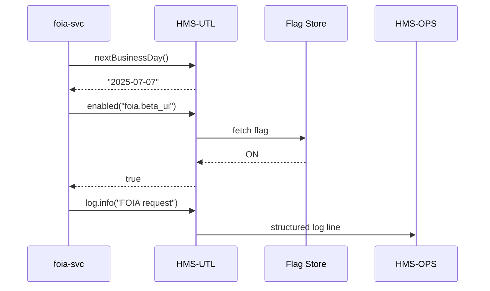

# Chapter 20: Shared Utilities Library (HMS-UTL)

*(Follow-up to [Simulation & Training Environment (HMS-ESR)](19_simulation___training_environment__hms_esr__.md))*  

---

## 1. Why Do We Need Yet *Another* Library?

A true story from the **Defense Intelligence Agency (DIA)** pilot team:

> “We finished a tiny micro-service that redacts classified text—but it took us two days just to add JSON logging, calculate the next federal work-day, and wire a feature flag for the new UI.  
> Didn’t the Passport Service already solve those exact problems?”

Re-writing “plumbing” for every service is like asking every federal office to design its **own** *name/address/SSN* form.  
**HMS-UTL** is the **standard form drawer**:

* It ships one **logging sticker**, one **date calculator**, one **feature-flag switch**, and a handful of other helpers.  
* Every micro-service, from `permit-svc` to `wildfire-drone-svc`, calls the **same** functions—no wheel-re-inventing, no disjoint audit logs.

---

## 2. High-Level Use Case – “The FOIA Mini-Service”

Imagine you are writing `foia-svc`, a 120-line Express app that:

1. Receives FOIA requests,  
2. Stamps them with the next **federal business day**,  
3. Emits an audit log, and  
4. Shows a **beta** UI only to pilot users at the **U.S. International Development Finance Corporation (DFC)**.

With HMS-UTL you can do all of that in **16 lines** instead of 60.

---

## 3. Key Concepts – The Three Most Used Helpers

| Helper        | One-Line Summary | Example |
|---------------|------------------|---------|
| `log()`       | Structured, HMS-OPS-ready logger. | `log.info("request received", req.id)` |
| `nextBusinessDay()` | Returns the next work-day, skipping weekends & federal holidays. | `nextBusinessDay("2025-07-03")  // 2025-07-07` |
| `enabled()`   | Checks if a feature flag is ON for this user, service, or agency. | `if(enabled("foia.beta_ui", user)) { … }` |

*That’s really it—three words you’ll call dozens of times a day.*

---

## 4. Installing HMS-UTL

```bash
# Node.js / TypeScript service
npm install @hms/utl
# or Python service
pip install hms-utl
```

No extra config—the library auto-discovers the cluster, current agency, and time-zone through environment variables.

---

## 5. Using HMS-UTL in the FOIA Mini-Service (18 Lines)

```javascript
// foia-svc/index.js
import express from "express"
import { log, nextBusinessDay, enabled } from "@hms/utl"

const app = express()
app.use(express.json())

app.post("/foia", (req, res) => {
  const due     = nextBusinessDay()          // 1️⃣ date helper
  const pilotUI = enabled("foia.beta_ui", req.user)

  log.info("FOIA request", { id: req.id, due })   // 2️⃣ logger

  res.status(202).json({
    ticket: req.id,
    ui:     pilotUI ? "beta" : "classic",
    due
  })
})

app.listen(4000, () => log.info("foia-svc up on 4000"))
```

**What just happened?**

1. `nextBusinessDay()` looked up the federal holiday calendar stored in HMS-UTL.  
2. `enabled()` checked a flag stored in **ConfigMap** and overridden for DFC pilot users.  
3. `log.info()` produced a JSON line already formatted for [HMS-OPS](18_compliance___auditing_framework__hms_ops___hms_esq__.md); no manual `console.log`.

---

## 6. Under the Hood – 5-Step Walkthrough



Three helpers, three tiny internal hops—no network calls hit your code path.

---

## 7. Peeking Inside HMS-UTL (All ≤ 20 Lines)

### 7.1 Logger (`utl/log.js` – 15 lines)

```javascript
import crypto from "crypto"
import udp    from "dgram"

const sock = udp.createSocket("udp4")
export function info(msg, extra={}){
  const log = {
    ts:  new Date().toISOString(),
    lvl: "INFO",
    svc: process.env.SVC_NAME,
    msg, ...extra
  }
  log.sig = crypto
      .createHmac("sha256", process.env.UTL_KEY)
      .update(JSON.stringify(log)).digest("hex")
  sock.send(Buffer.from(JSON.stringify(log)), 5140, "ops-collector")
}
```

*Signs the line, ships via UDP to HMS-OPS; your service stays non-blocking.*

---

### 7.2 Date Helper (`utl/date.js` – 10 lines)

```javascript
import holidays from "./holidays_usa.json"

export function nextBusinessDay(from = Date.now()){
  let d = new Date(from)
  do {
    d.setDate(d.getDate() + 1)
  } while (d.getDay() > 4 || holidays.includes(d.toISOString().slice(0,10)))
  return d.toISOString().slice(0,10)
}
```

*Loops until it finds a weekday **not** in the holiday list.*

---

### 7.3 Feature Flag (`utl/flag.js` – 18 lines)

```javascript
import { get } from "./cache.js"   // wraps Redis w/ 1-min TTL

export async function enabled(key, user){
  const flag = await get(`flag:${key}`)   // e.g., "ON", "OFF", "PILOT"
  if(flag === "ON")    return true
  if(flag === "OFF")   return false
  if(flag === "PILOT") return user.agency === "DFC"
  return false
}
```

*Flags live in a central Redis set by the DevOps team or the [Policy Management Dashboard](04_policy_management_dashboard_.md).*

---

## 8. File Map for the Curious

```
hms-utl/
 ├─ log.js          structured logger
 ├─ date.js         business-day math
 ├─ flag.js         feature flags
 ├─ holidays_usa.json
 ├─ cache.js        Redis helper (30 lines)
 └─ README.md       full API list (hash, uuid, retry, etc.)
```

---

## 9. Where Does HMS-UTL Plug Into The Bigger Picture?

| HMS Topic | How HMS-UTL Helps |
|-----------|------------------|
| [HMS-OPS](18_compliance___auditing_framework__hms_ops___hms_esq__.md) | `log()` formats & signs CCM logs automatically. |
| [HMS-ACT](16_activity_orchestration_service__hms_act__.md) | Workers call `retry()` & `backoff()` from HMS-UTL. |
| [HMS-A2A](08_secure_inter_agency_communication_layer__hms_a2a__.md) | `hashSha256()` helper used when sealing diplomatic pouches. |
| [HMS-MFE](03_front_end_micro_frontend_framework__hms_mfe__.md) | `flag()` switches micro-frontend bricks on/off per agency. |

---

## 10. Beginner FAQ

**Q: Does HMS-UTL slow my service?**  
No. Helpers are in-process; network work (Redis, UDP) is async and buffered.

**Q: Can I add *my* helper?**  
Yes—fork the repo, add a file under `src/`, open a pull request. CI enforces <100 lines and 80 % unit-test coverage.

**Q: Where is the holiday list updated?**  
In the same repo; a cron bot opens a PR each October using OPM’s official holiday XML.

**Q: What about Python or Go?**  
Polyglot! The key helpers exist in **ts**, **py**, and **go** packages generated from the same template.

---

## 11. What You Learned

• HMS-UTL is the **federal form drawer**—one place for logging, date math, feature flags, hashes, retries, and more.  
• Importing three helpers (`log`, `nextBusinessDay`, `enabled`) shrinks boiler-plate from dozens of lines to just a few.  
• The helpers are wired into the larger HMS ecosystem—logs go to **OPS**, flags come from **Dashboard**, hashes protect **A2A** pouches.  
• Adding or updating helpers is community-friendly and CI-guarded.

---

## 🎉 Congratulations — You’ve Completed the Core HMS-GOV Journey!

From **Chapter 1’s** city-map overview to this **Chapter 20** toolbox, you now have a starter kit to build, secure, audit, simulate, and ship modern government software.

Keep coding, keep serving, and may your logs always be green!

---

Generated by [AI Codebase Knowledge Builder](https://github.com/The-Pocket/Tutorial-Codebase-Knowledge)