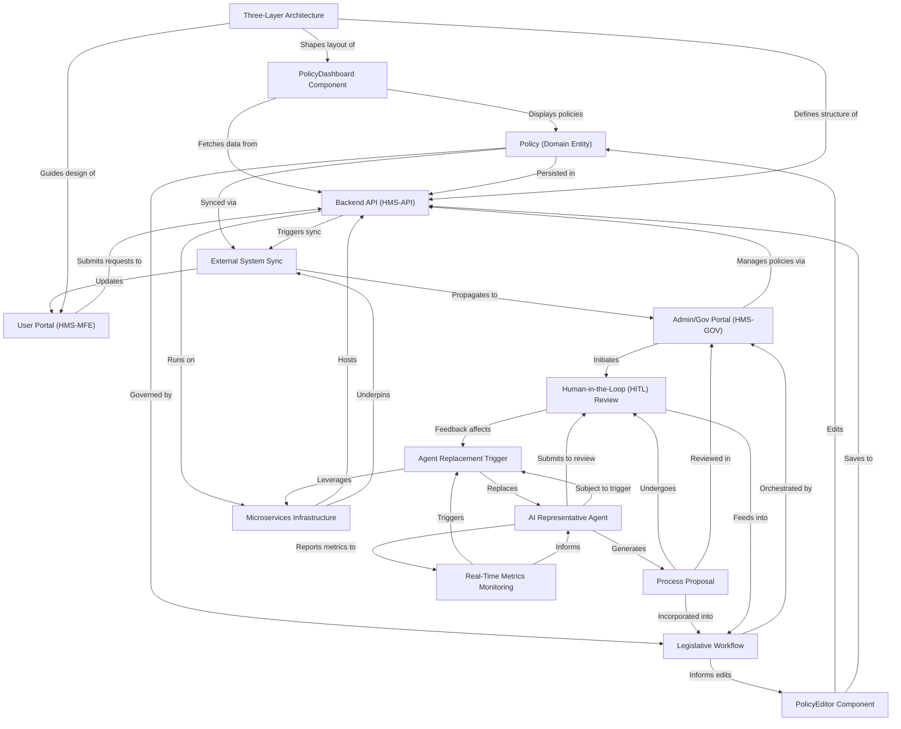

# Tutorial: HMS-GOV

The HMS-GOV project is an **AI-driven governance platform** that empowers government agencies to *create*, *review*, and *manage* policies in real time.  
Administrators use a **central dashboard** and a **rich editor** to codify rules, while autonomous agents propose optimizations under human oversight.  
It seamlessly integrates with backend APIs, microservices, external systems, and a high-speed legislative engine for *transparent*, *efficient* policy workflows.

**Source Repository:** [None](None)

## Chapters

1. [Three-Layer Architecture
](01_three_layer_architecture_.md)
2. [Microservices Infrastructure
](02_microservices_infrastructure_.md)
3. [Backend API (HMS-API)
](03_backend_api__hms_api__.md)
4. [External System Sync
](04_external_system_sync_.md)
5. [Real-Time Metrics Monitoring
](05_real_time_metrics_monitoring_.md)
6. [Policy (Domain Entity)
](06_policy__domain_entity__.md)
7. [Legislative Workflow
](07_legislative_workflow_.md)
8. [Admin/Gov Portal (HMS-GOV)
](08_admin_gov_portal__hms_gov__.md)
9. [PolicyDashboard Component
](09_policydashboard_component_.md)
10. [PolicyEditor Component
](10_policyeditor_component_.md)
11. [User Portal (HMS-MFE)
](11_user_portal__hms_mfe__.md)
12. [AI Representative Agent
](12_ai_representative_agent_.md)
13. [Process Proposal
](13_process_proposal_.md)
14. [Human-in-the-Loop (HITL) Review
](14_human_in_the_loop__hitl__review_.md)
15. [Agent Replacement Trigger
](15_agent_replacement_trigger_.md)

---

Generated by [AI Codebase Knowledge Builder](https://github.com/The-Pocket/Tutorial-Codebase-Knowledge)