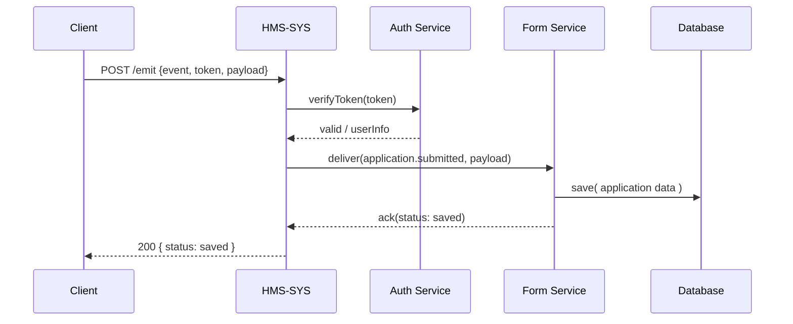

# Chapter 1: Core System Platform (HMS-SYS)

## 1. Motivation & Central Use Case

Imagine you’re a U.S. International Development Finance Corporation (DFC) engineer. Citizens around the world submit grant applications through an online portal. Behind the scenes, several microservices must work together:

- Authentication (is this a real user?).  
- Form validation (is the application complete?).  
- Notification (send confirmation emails).  
- Data storage (save to the database securely).

Without a “central utility plant,” each service would need to know how to talk to every other service—quickly becoming a tangled mess.

**Enter HMS-SYS**, our “central utility plant” that:

- Orchestrates service registration and discovery.  
- Routes messages and events safely.  
- Ensures security, logging, and retries for reliability.  
- Scales effortlessly as traffic grows.

In this chapter, you’ll learn how HMS-SYS solves this orchestration problem for our DFC grant-application flow (or any government service).

---

## 2. Key Concepts of HMS-SYS

1. **Service Registry**  
   A directory where every microservice (Auth, Form, Notification…) announces itself.

2. **Event Bus**  
   A message-passing backbone. Services emit events (e.g., `application.submitted`) and subscribe to the ones they care about.

3. **Security & Authentication**  
   Centralized token validation and role-based access, so each service doesn’t need its own user store.

4. **Scalability & Health Checks**  
   Automatic load-balancing, service instance health monitoring, and auto-restart of failed services.

5. **Logging & Metrics**  
   Unified logs and metrics feed into a dashboard for monitoring.

---

## 3. Using HMS-SYS: A Minimal Example

We’ll register two services (Auth and Form) and then submit a “grant application” event.

### 3.1 Configuration (config.yml)

```yaml
# config.yml
core:
  port: 4000
services:
  auth:
    host: http://localhost:5001
  form:
    host: http://localhost:5002
```

> This file tells HMS-SYS where services live.

### 3.2 Bootstrapping HMS-SYS (index.js)

```js
// index.js
const CoreSystem = require('./hms-sys/core');
const config     = require('./config.yml');

const core = new CoreSystem(config.core);

// Register services by name and URL
core.registerService('auth', config.services.auth.host);
core.registerService('form', config.services.form.host);

// Start the core platform
core.start();
```

> We create a `CoreSystem` instance, register each service, then call `start()` to spin up the central bus.

### 3.3 Submitting an Application (app.js)

```js
// app.js
const CoreClient = require('./hms-sys/client');
const client     = new CoreClient('http://localhost:4000');

async function submitApplication(userToken, formData) {
  // Emit an event; HMS-SYS will route to "form" service
  const result = await client.emit('application.submitted', {
    token:    userToken,
    payload:  formData
  });
  console.log('Submission result:', result.status);
}

submitApplication('eyJ…', { name: 'Alice', amount: 50000 });
```

> We send an `application.submitted` event. HMS-SYS ensures the Form Service receives it, after checking the token with Auth Service.

---

## 4. Under the Hood: Step-by-Step Flow

Below is a simplified sequence of what happens when a citizen submits:



1. **Client** requests **HMS-SYS** to emit an event.  
2. **HMS-SYS** asks **Auth Service** to verify the token.  
3. If valid, **HMS-SYS** forwards the event to **Form Service**.  
4. **Form Service** writes to the **Database**, then replies.  
5. **HMS-SYS** returns the final acknowledgment to the client.

---

## 5. Core System Implementation

### 5.1 Core Class (hms-sys/core.js)

```js
// hms-sys/core.js
const express = require('express');
const bodyParser = require('body-parser');

class CoreSystem {
  constructor({ port }) {
    this.port      = port;
    this.registry  = {};        // serviceName -> URL
    this.app       = express();
    this.app.use(bodyParser.json());
    this.setupRoutes();
  }

  registerService(name, url) {
    this.registry[name] = url;
    console.log(`Registered ${name} @ ${url}`);
  }

  setupRoutes() {
    // One endpoint to accept all events
    this.app.post('/emit', async (req, res) => {
      const { event, token, payload } = req.body;
      // 1. validate token
      // 2. look up target service
      // 3. forward payload
      // (Implementation details skipped)
      res.json({ status: 'ok' });
    });
  }

  start() {
    this.app.listen(this.port, () => {
      console.log(`HMS-SYS running on port ${this.port}`);
    });
  }
}

module.exports = CoreSystem;
```

> We use Express to expose a single `/emit` endpoint. Inside, we’ll verify tokens, find the right service in `registry`, and proxy the payload.

### 5.2 Client Helper (hms-sys/client.js)

```js
// hms-sys/client.js
const fetch = require('node-fetch');

class CoreClient {
  constructor(coreUrl) { this.coreUrl = coreUrl; }

  async emit(event, data) {
    const resp = await fetch(`${this.coreUrl}/emit`, {
      method: 'POST',
      headers: { 'Content-Type': 'application/json' },
      body: JSON.stringify({ event, ...data })
    });
    return resp.json();
  }
}

module.exports = CoreClient;
```

> A small helper to call HMS-SYS without repeating URLs and fetch logic.

---

## 6. Summary & Next Steps

In this chapter you learned:

- Why a **central orchestrator** is vital for microservice communication (our “utility plant”).  
- How to **register** services and **emit** events through HMS-SYS.  
- The **step-by-step** flow for a grant application submission.  
- A peek at the **internal code** of the `CoreSystem` and its `client`.

Up next, we’ll build on this by exposing user-friendly APIs and UIs in the [Interface Layer](02_interface_layer_.md).

---

Generated by [AI Codebase Knowledge Builder](https://github.com/The-Pocket/Tutorial-Codebase-Knowledge)