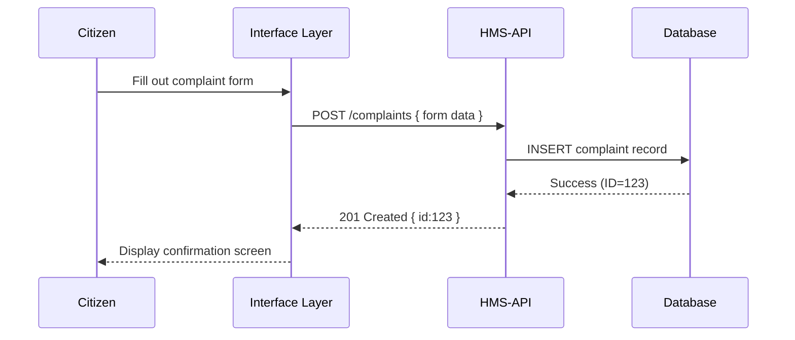

# Chapter 1: Interface Layer

Welcome to the first chapter of HMS-DOC! In this chapter, we’ll explore the **Interface Layer**—the “front-desk” of our system where citizens, agency staff, and administrators interact with HMS.

---

## 1. Why an Interface Layer? (Motivation)

Imagine you’re a citizen filing an environmental complaint with the EPA:

1. You open a friendly web portal.
2. You complete a “Water Quality Complaint” form.
3. You click **Submit** and immediately see a confirmation screen.

Behind the scenes, HMS-MFE (the end-user portal) captures your data and routes it to backend services. The **Interface Layer** makes these steps possible—just like a government customer-service desk that routes your paper forms to the right office.

---

## 2. Key Concepts

1. **Web Portals**  
   - HMS-MFE for citizens and staff  
   - HMS-GOV for administrators and program managers  

2. **UI Components**  
   - Reusable buttons, input fields, tables  
   - Allows consistency across forms and screens  

3. **Form & Workflow Configuration**  
   - Program managers tailor online forms  
   - Define which fields appear, validation rules, and approval steps  

---

## 3. Solving the EPA Complaint Use Case

### 3.1. Step-by-Step Walkthrough

Non-code overview:

1. Citizen visits **EPA Complaint Portal**.  
2. Portal loads a **ComplaintForm** component.  
3. Citizen fills in fields like name, location, description.  
4. On submit, the UI sends a POST request to HMS-API.  
5. Backend saves the complaint and returns a confirmation.  
6. UI shows “Complaint Received!” message.

### 3.2. Sequence Diagram



---

## 4. Beginner-Friendly Code Example

Below is a minimal React form component that represents how HMS-MFE might render and submit a complaint.

```jsx
// File: src/components/ComplaintForm.jsx
import React, { useState } from 'react';
import axios from 'axios';

export default function ComplaintForm() {
  const [data, setData] = useState({ name: '', description: '' });

  function handleChange(e) {
    setData({ ...data, [e.target.name]: e.target.value });
  }

  async function handleSubmit(e) {
    e.preventDefault();
    // Send form to backend API
    const response = await axios.post('/api/complaints', data);
    alert('Complaint ID: ' + response.data.id);
  }

  return (
    <form onSubmit={handleSubmit}>
      <label>Name</label>
      <input name="name" onChange={handleChange} required />
      <label>Description</label>
      <textarea name="description" onChange={handleChange} required />
      <button type="submit">Submit</button>
    </form>
  );
}
```

> This small component:
> - Holds form state in `data`.  
> - Sends a POST when you click **Submit**.  
> - Alerts you with the new complaint ID.

---

## 5. Under the Hood: How the Interface Layer Works

### 5.1. High-Level Steps

1. **Load Configuration**  
   - The form layout is defined in a JSON file (e.g., `complaint.json`).  
2. **Render Components**  
   - A generic form renderer reads the config and builds inputs.  
3. **Handle Input & Validation**  
   - UI checks required fields before allowing submission.  
4. **Submit to API**  
   - The UI layer calls HMS-API endpoints.  
5. **Display Results**  
   - Success or error messages guide the user.

### 5.2. File Structure (Example)

```
hms-interface/
├── src/
│   ├── components/
│   │   └── ComplaintForm.jsx    # Renders UI
│   └── config/
│       └── complaint.json       # Defines fields & labels
└── package.json
```

### 5.3. Form Configuration Snippet

```json
// File: src/config/complaint.json
{
  "title": "Water Quality Complaint",
  "fields": [
    { "name": "name", "label": "Your Name", "type": "text", "required": true },
    { "name": "description", "label": "Description", "type": "textarea", "required": true }
  ],
  "submitEndpoint": "/api/complaints"
}
```

> The UI renderer reads this JSON and creates the form automatically!

---

## 6. Analogy Recap

Think of the Interface Layer as:

- A **reception desk** in a public building—friendly, guides you, and routes you to the right office.  
- A **toolkit** for program managers to define forms without writing code.  
- The **face** of HMS for both citizens and administrators.

---

## Conclusion

In this chapter, you learned:

- What the **Interface Layer** is and why it matters.  
- How to build a simple form in HMS-MFE.  
- The step-by-step flow from user input to backend storage.  

Up next, we’ll explore the reusable building blocks that make these forms easy to create and maintain: the **[UI Component Library (HMS-MFE)](02_ui_component_library__hms_mfe__.md)**.

---

Generated by [AI Codebase Knowledge Builder](https://github.com/The-Pocket/Tutorial-Codebase-Knowledge)